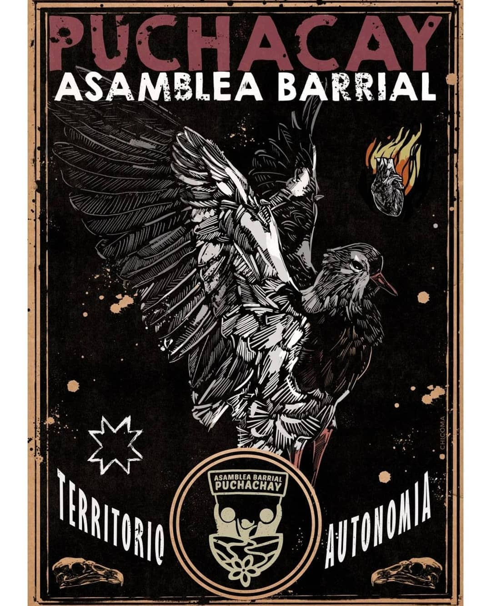

#### FOLIO: 
# Asamblea Barrial Puchacay

[instagram](https://www.instagram.com/barriopuchacay/)
[facebook](https://www.facebook.com/Asamblea-Barrio-Puchacay-107798757380065)
[twitter]()
<asambleabarrialpuchacay@gmail.com>
---

### Representantes
#### (Nombres o emails de voceros o representantes).

---
### Interacciones frecuentes
#### (listar otras organizaciones que habitualmente)

### Redes sociales
#### ¿Para qué se utiliza la red social?
| Instagram | Facebook | Twitter | Otra 
|---|---|---|---|
|0|0|0|0|

### **Instagram**
| seguidores | seguidos | publicaciones | hashtag |
|---|---|---|---|
|1904|370|295|4|

---

* **Actividad:**   

* Primera Publicación IG 5 de noviembre del 2019

---
### Frecuencia de publicación.

Publicaciones:

Actividades:

---
### Ubicación
* Sector de la comuna/ciudad:

---
### Describir temas de interés y/o trabajo

* Conflicto Mapuche
* Proceso constituyente
* Feria libre
* Voluntariado para limpieza de áreas verdes
* Urbanización y problemática habitacional
* Voluntariado 
* Red de abastecimiento 
* Crisis sanitaria 
* Recuperación de la memoria
* Libertad para lxs presxs de la revuelta

---
### Describir la imagen ideal por la cual se trabaja.
#### (El horizonte hacia el cual se quiere avanzar.)

* El buen vivir

---
### ¿Que se hace?
#### (Manifestaciones, marchas, intervenciones, actividades culturales, conversatorios, intercambio de saberes, actividades solidarias o de apoyo mutuo, abastecimiento, contra información, emplazamiento a autoridades etc.)

* Asambleas 
* Actividades culturales
* Charlas y actividades formativas
* Muralismo
* Velatón 
* Caminatas
* Divulgación científica
* Bingo
* Campaña solidaria por incendios 
* Muralismo
* Centro de acopio

---
### Describir y distinguir demandas más reivindicativas de espacios sin relación con lo contencioso o con lo político mas prefigurativo
#### (lo contencioso; demanda al Estado, a alguna autoridad, privados, etc), (prefigurativo, transformación desde lo cotidiano, etc.).

---
### Tipo de organización interna.
#### (Vocerías, asambleísmo, horizontalidad, etc.; *se entiende que esta dimensión es más difícil de captar vía análisis de redes sociales, pero quizás se puede vislumbrar a través de roles/cargos*)

---
### Describir los temas / imágenes- iconos / conceptos mas habitualmente presentes en sus publicaciones. Describir cambios/ transformaciones en los contenidos desde Octubre.

**Iconos:**

**Banderas:**

**Diseño estético:**

> Párrafo tipo cita 

---
### Percepciones que se tiene del Estado
#### (Aparato burocrático)
> resumen de lo encontrado

| Declaraciones | infografía | 
|---|---|
| |  |
| ||
| | |
| ||
| ||

---
### Percepciones que se tiene de las Fuerzas de Orden
#### (Aparato represivo)
> resumen de lo encontrado

| Declaraciones | infografía | 
|---|---|
| ||
| ||
| ||
| || 
| ||
| ||
| ||

---
### Incorporar aca notas, citas textuales, links, etc. extra a los ya incorporados, que sean de interés para comprender tanto la forma como los contenidos asociados a la organización.

* Bingo Solidario online 

