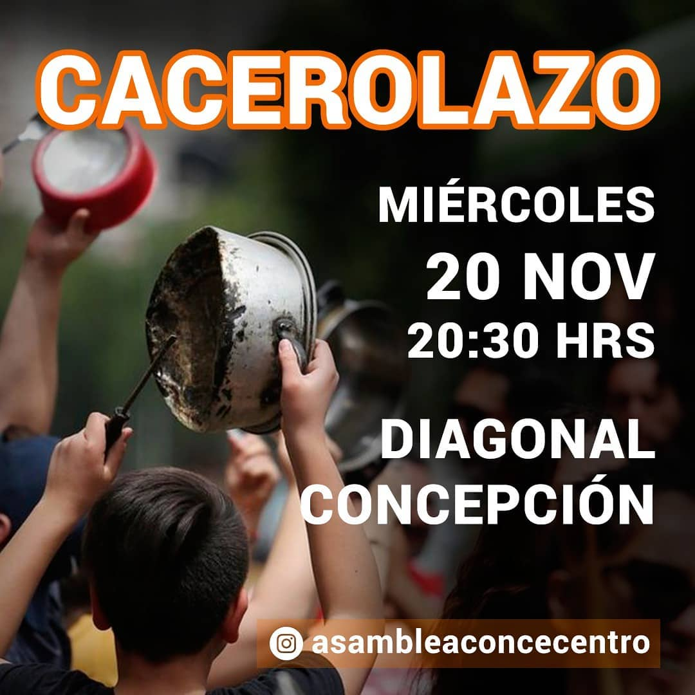
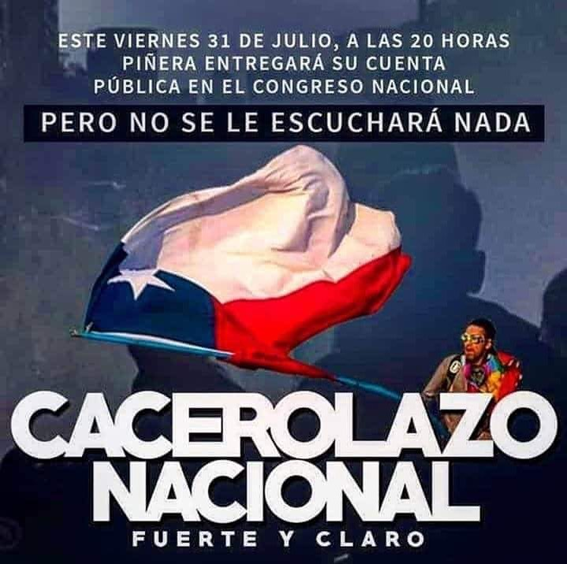
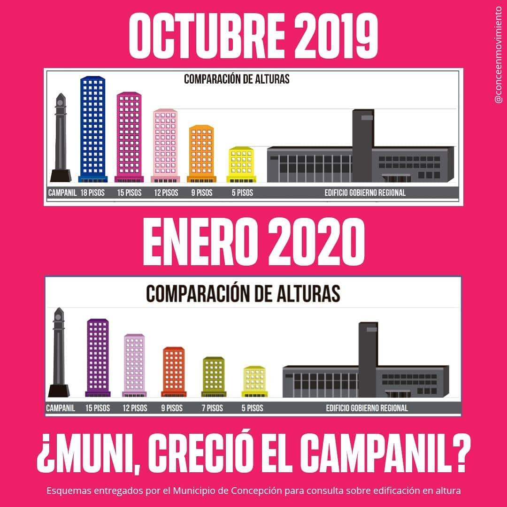

#### FOLIO: CON07
# Asamblea Conce Centro

[instagram](https://www.instagram.com/asambleaconcecentro/)
[facebook](https://www.facebook.com/asambleaconcecentro)
[twitter]()
<difusionasambleaconcecentro@gmail.com>

---

### Representantes
#### (Nombres o emails de voceros o representantes).

---
### Interacciones frecuentes
#### (listar otras organizaciones que habitualmente)

### Redes sociales
#### ¿Para qué se utiliza la red social?
| Instagram | Facebook | Twitter | Otra 
|---|---|---|---|
|Difusión de información y eventos|0|No tiene|[Pagina web propia](http://asambleaconcecentro.cl/)|

### **Instagram**
| seguidores | seguidos | publicaciones | hashtag |
|---|---|---|---|
|1163|145|85|0|

---

* **Actividad:**   

* Primera Publicación IG 6 de Nov del 2019

---
### Frecuencia de publicación.

Publicaciones: Existen periodos de no publicación intermitentes de al menos una semana, y luego multiples publicaciones en un solo dia 

Actividades: Las actividades son asi mensuales y principalmente destinada a actividades culturales al aire libre. Luego de la cuarentena se limitan a usar plataformas de video llamada.  

---
### Ubicación
* Sector de la comuna/ciudad: Comuna de Concepción, zona centro. 

---
### Describir temas de interés y/o trabajo

* Urbanización y conflicto habitacional. (plan regulador de Concepción)
* Proceso constituyente
* Red de oficios. 

---
### Describir la imagen ideal por la cual se trabaja.
#### (El horizonte hacia el cual se quiere avanzar.)

---
### ¿Que se hace?
#### (Manifestaciones, marchas, intervenciones, actividades culturales, conversatorios, intercambio de saberes, actividades solidarias o de apoyo mutuo, abastecimiento, contra información, emplazamiento a autoridades etc.)

* Asambleas
* Cacerolazo 
* Musica en vivo
* Marcha
* actividades de contraiformación
* Ciclos de discusión y formación
* Centro de acopio

---
### Describir y distinguir demandas más reivindicativas de espacios sin relación con lo contencioso o con lo político mas prefigurativo
#### (lo contencioso; demanda al Estado, a alguna autoridad, privados, etc), (prefigurativo, transformación desde lo cotidiano, etc.).

* Ambientalismo y protección del entorno. 

---
### Tipo de organización interna.
#### (Vocerías, asambleísmo, horizontalidad, etc.; *se entiende que esta dimensión es más difícil de captar vía análisis de redes sociales, pero quizás se puede vislumbrar a través de roles/cargos*)

---
### Describir los temas / imágenes- iconos / conceptos mas habitualmente presentes en sus publicaciones. Describir cambios/ transformaciones en los contenidos desde Octubre.

**Iconos:**

**Banderas:**

**Diseño estético:**

> El diseño estético de las imágenes es mas que nada simplista, donde se posiciona la comunidad a través de diferentes capturas de colectividades tanto en asambleas como en protesta. 

---
### Percepciones que se tiene del Estado
#### (Aparato burocrático)

> No existe ningún tipo de comunicado con al respecto, solo se da a entender en una infografía un sentimiento de desconfianza con respecto a la información que entrega la Municipalidad de Concepción. 

| Declaraciones | infografía | 
|---|---|
|Anotar los comunicados |  |

---
### Percepciones que se tiene de las Fuerzas de Orden
#### (Aparato represivo)

> No existe ningun tipo de comunicado, o infografia que se refiera a fuerzas del orden propia, sin embargo se comparte los comunicados de la asamblea provincial al respecto. 

| Declaraciones | infografía | 
|---|---|
|Anotar los comunicados |  |

---
### Incorporar aca notas, citas textuales, links, etc. extra a los ya incorporados, que sean de interés para comprender tanto la forma como los contenidos asociados a la organización.
