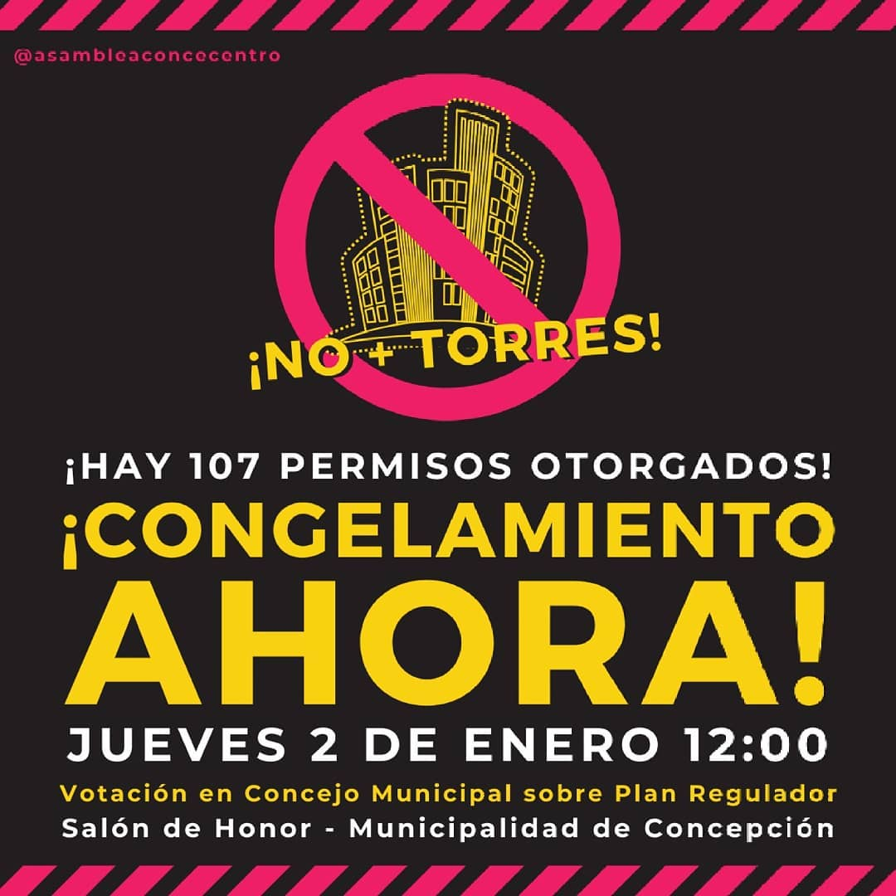
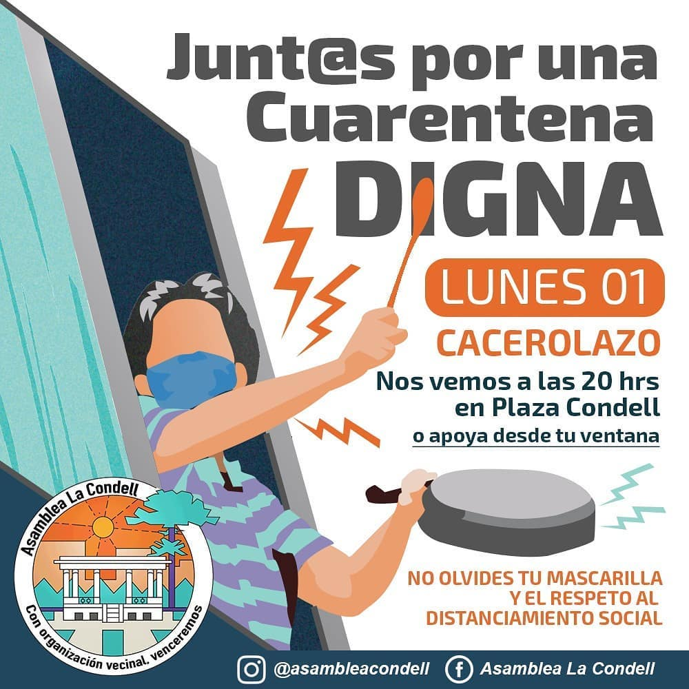
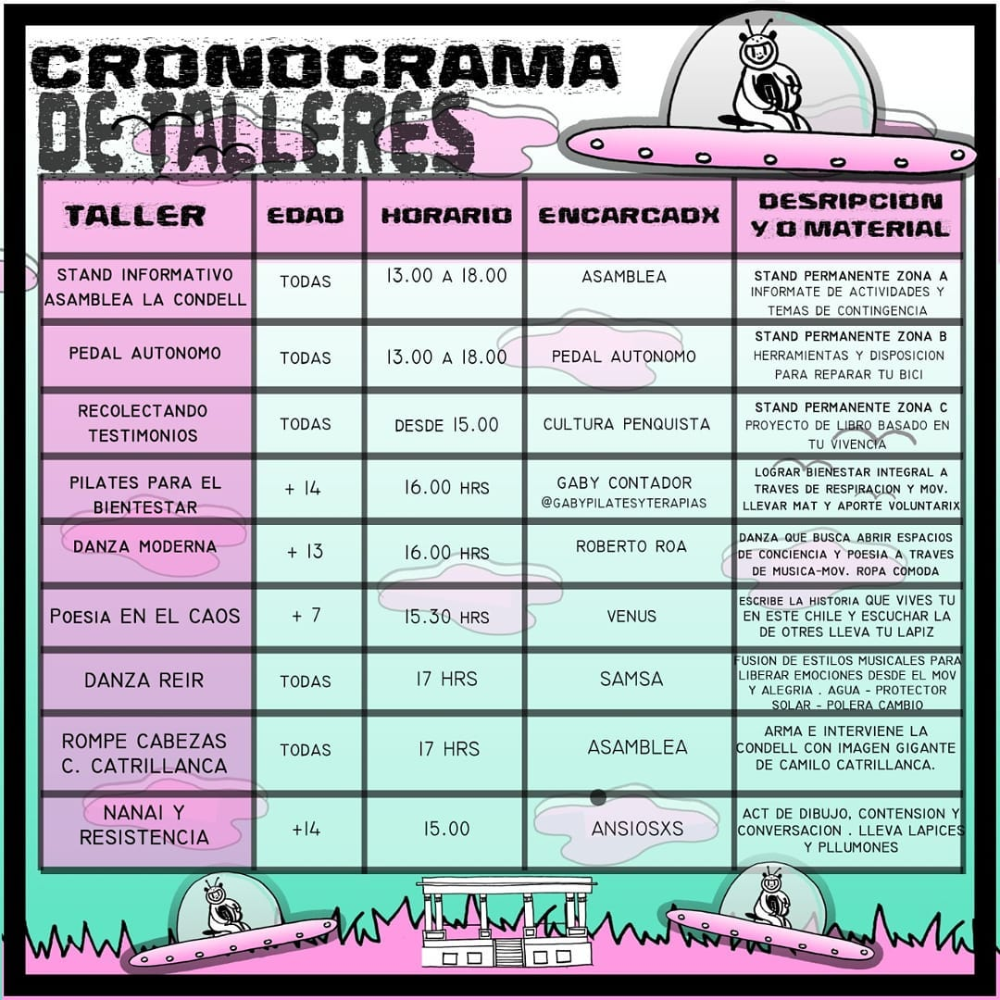
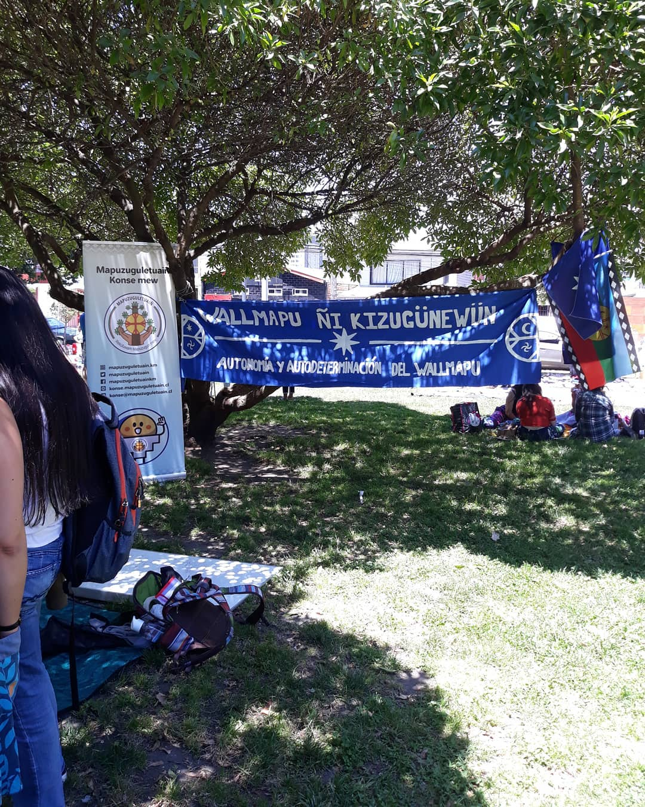
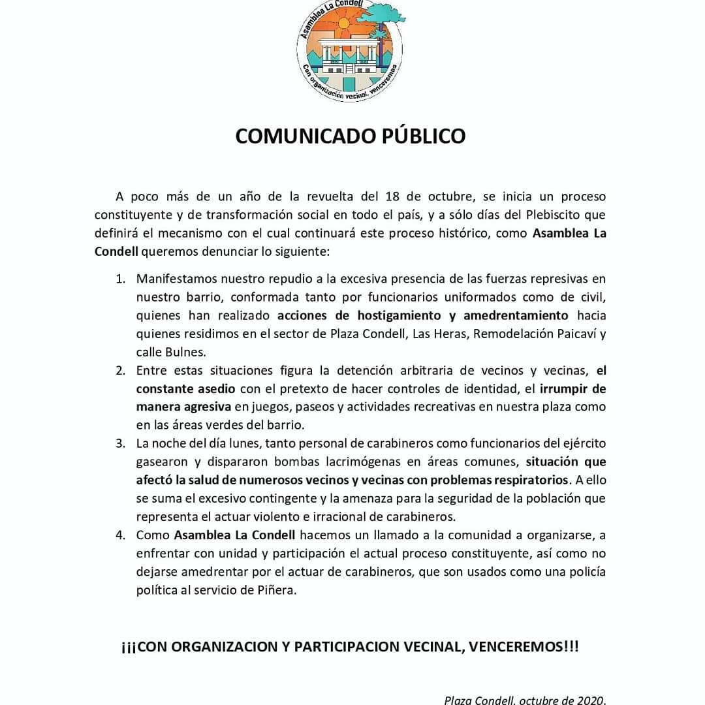
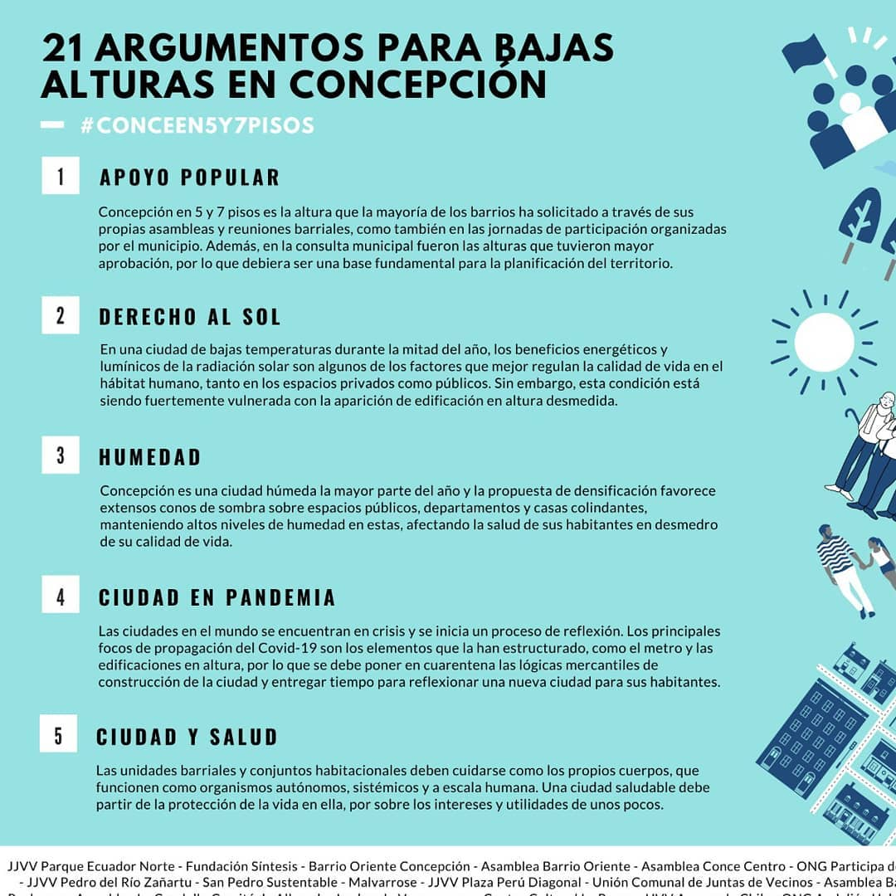
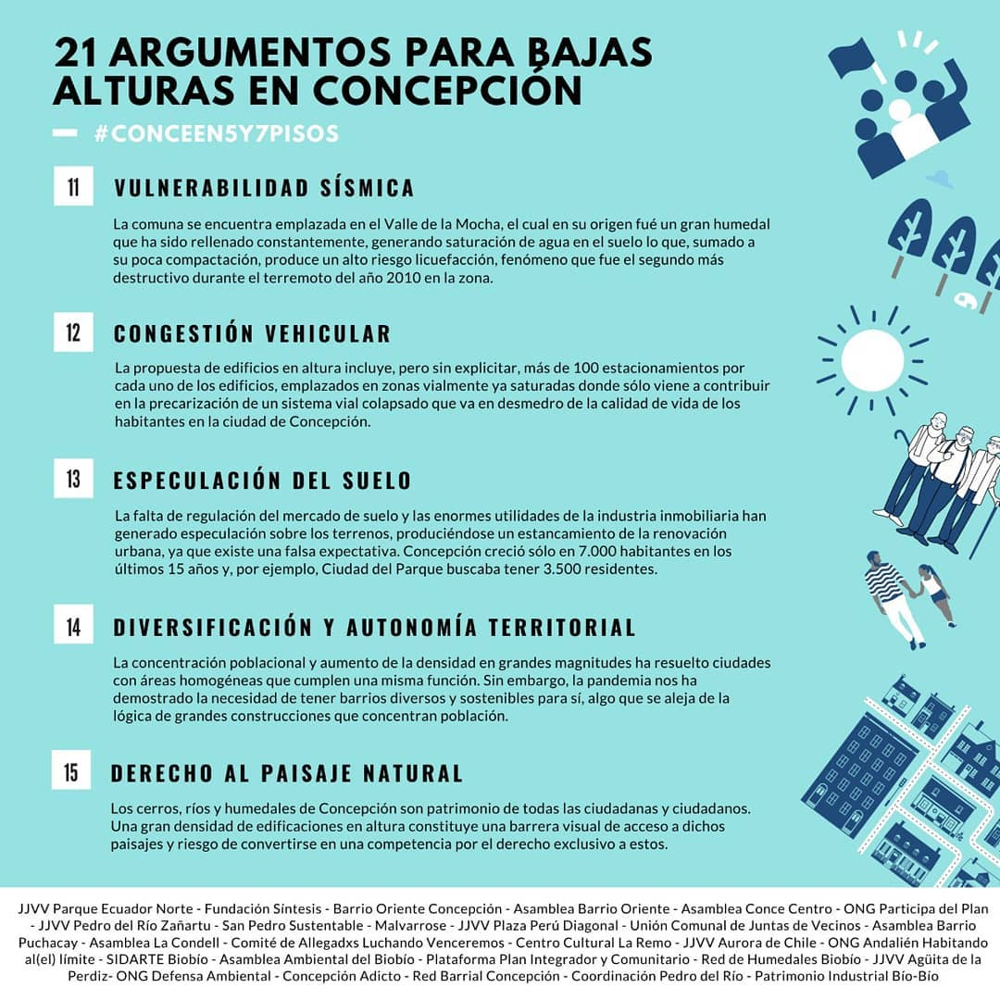
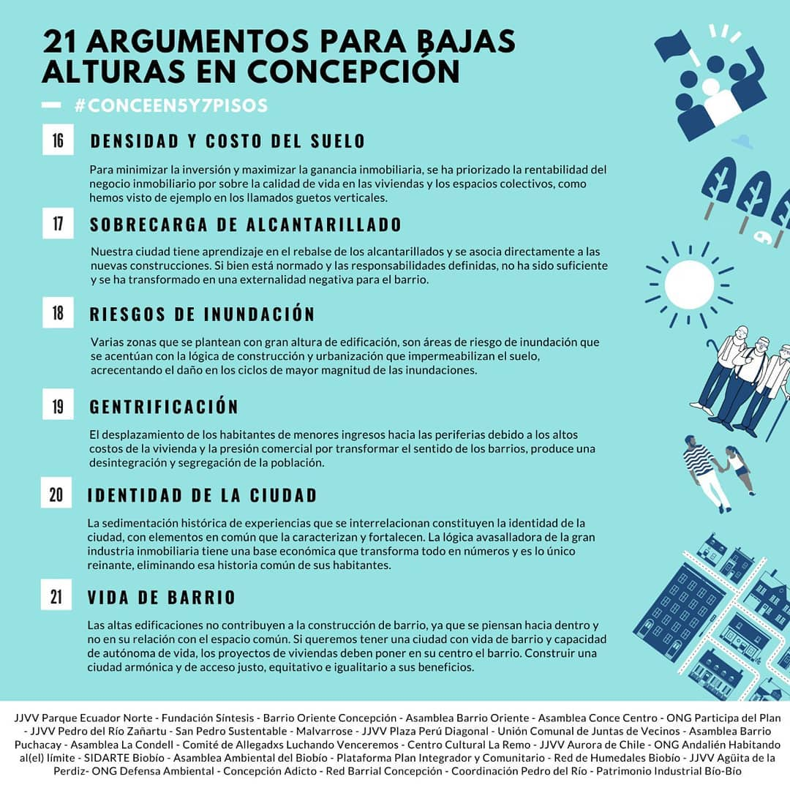

#### FOLIO: CON09
# Asamblea Condell

[instagram](https://www.instagram.com/asambleacondell/)
[facebook](https://www.facebook.com/Asamblea-La-Condell-101911501266827)
[twitter]()
<correo@correo.cl>
---

### Representantes
#### (Nombres o emails de voceros o representantes).

---
### Interacciones frecuentes
#### (listar otras organizaciones que habitualmente)

### Redes sociales
#### ¿Para qué se utiliza la red social?
| Instagram | Facebook | Twitter | Otra 
|---|---|---|---|
|Difusión de actividades e información con respecto a las diferentes coyunturas que a vivido el país. También de transmitir relatos de la protesta |Difusión de actividades e información con respecto a las diferentes coyunturas que a vivido el país|No tiene|No encontrada|

### **Instagram**
| seguidores | seguidos | publicaciones | hashtag |
|---|---|---|---|
|3134|127|150|0|

---

* **Actividad:** Continua desde noviembre del 2019. 
* Primera Publicación IG 3 de nov 2019

---
### Frecuencia de publicación.

Publicaciones:

Actividades: Los eventos los realizan con alta frecuencia dentro de la plaza Condell, tanto en el mes de Noviembre como en Diciembre. El mes de Enero se evidencia un pequeño reflujo que se hace mas presente entre los mes de Febrero y Marzo. 

---
### Ubicación
* Sector de la comuna/ciudad: Comuna de Concepción, zona plaza Condell 

---
### Describir temas de interés y/o trabajo

* El buen vivir 
* Urbanismo y conflicto habitacional 
* Crisis sanitaria 
* Red de oficios

---
### Describir la imagen ideal por la cual se trabaja.
#### (El horizonte hacia el cual se quiere avanzar.)

---
### ¿Que se hace?
#### (Manifestaciones, marchas, intervenciones, actividades culturales, conversatorios, intercambio de saberes, actividades solidarias o de apoyo mutuo, abastecimiento, contra información, emplazamiento a autoridades etc.)

* Actividades culturales
* Asamblea
* Contra información 
* Velatón 
* Difusión científica
* Ferias libres
* Marchas   
* Ciclos de debate y formación
* Presentación de Documentales
* Punto de acopio 

---
### Describir y distinguir demandas más reivindicativas de espacios sin relación con lo contencioso o con lo político mas prefigurativo
#### (lo contencioso; demanda al Estado, a alguna autoridad, privados, etc), (prefigurativo, transformación desde lo cotidiano, etc.).

---
### Tipo de organización interna.
#### (Vocerías, asambleísmo, horizontalidad, etc.; *se entiende que esta dimensión es más difícil de captar vía análisis de redes sociales, pero quizás se puede vislumbrar a través de roles/cargos*)

---
### Describir los temas / imágenes- iconos / conceptos mas habitualmente presentes en sus publicaciones. Describir cambios/ transformaciones en los contenidos desde Octubre.

**Iconos:**

**Banderas:**

**Diseño estético:**

> Párrafo tipo cita 

---
### Percepciones que se tiene del Estado
#### (Aparato burocrático)
> resumen de lo encontrado

| Declaraciones | infografía | 
|---|---|
|Anotar los comunicados |  |

---
### Percepciones que se tiene de las Fuerzas de Orden
#### (Aparato represivo)
> Un comunicado con respecto a la labor que a cometido las fuerzas del orden dentro de la comunidad.

| Declaraciones | infografía | 
|---|---|
| |  |

---
### Incorporar aca notas, citas textuales, links, etc. extra a los ya incorporados, que sean de interés para comprender tanto la forma como los contenidos asociados a la organización.

