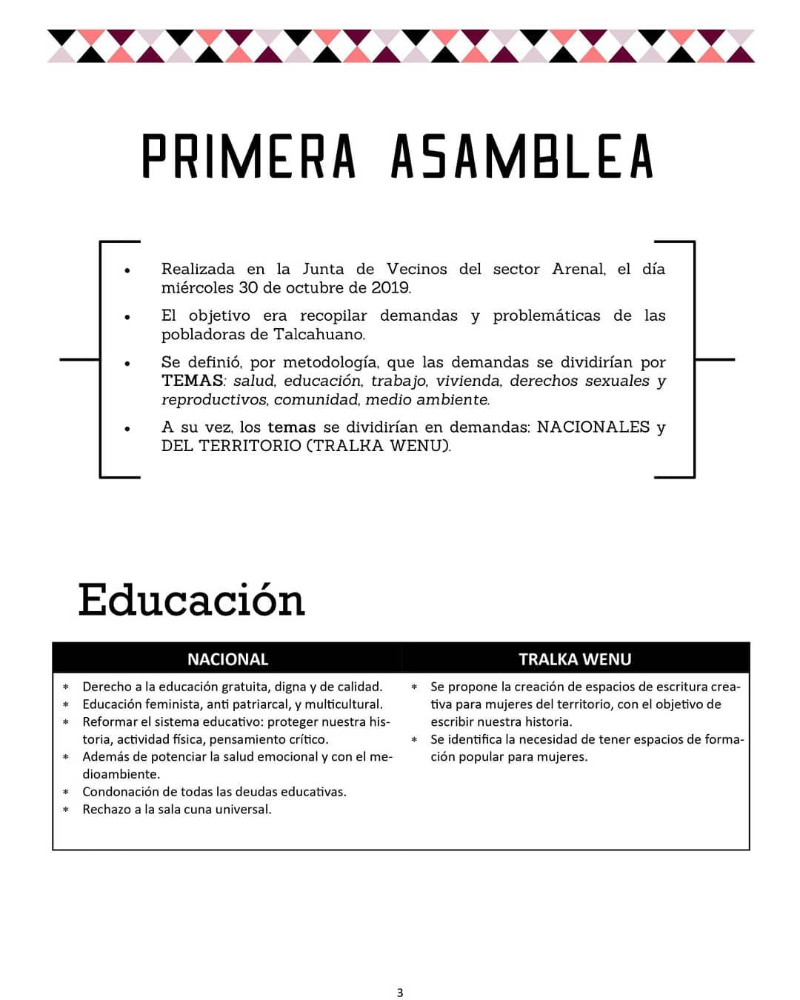
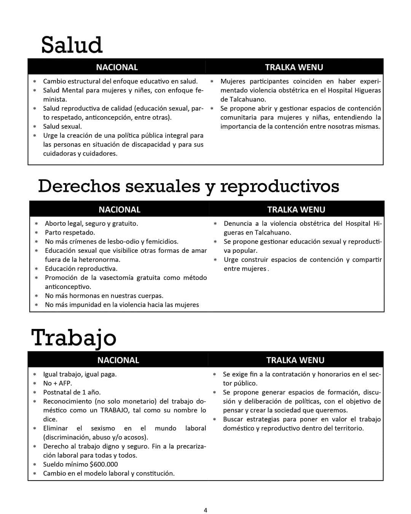
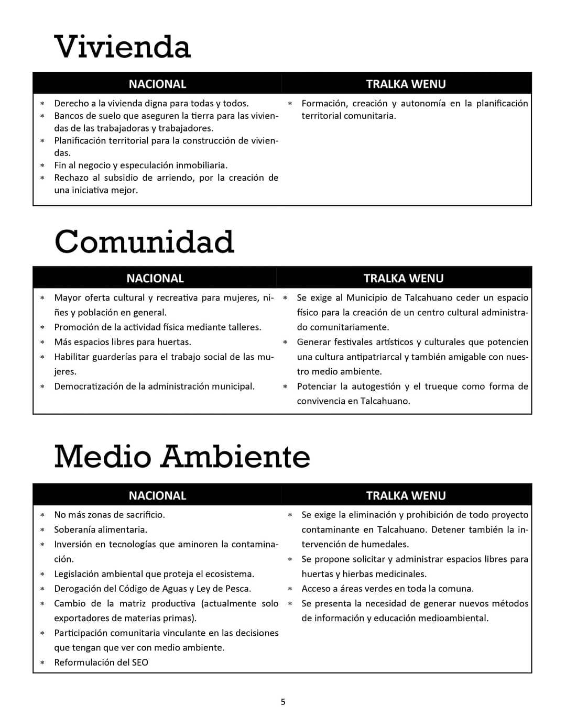
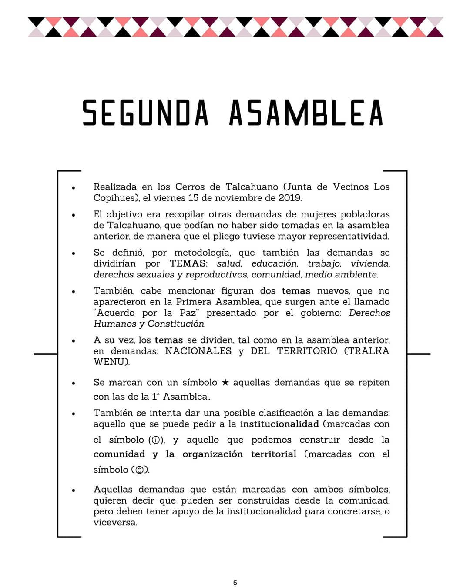
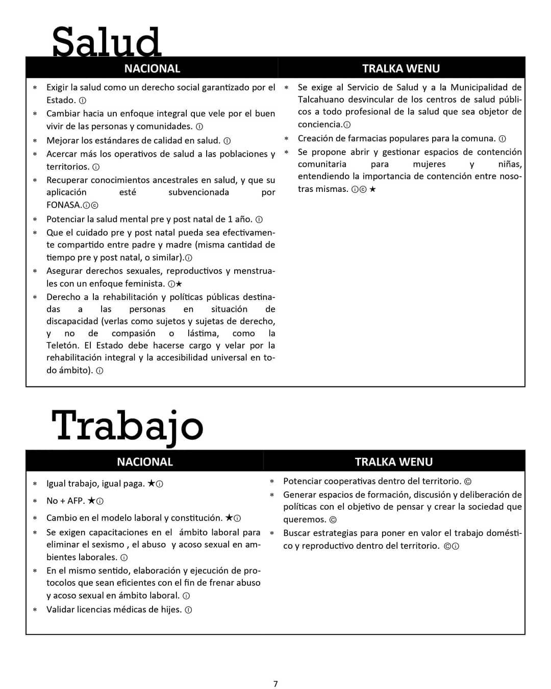
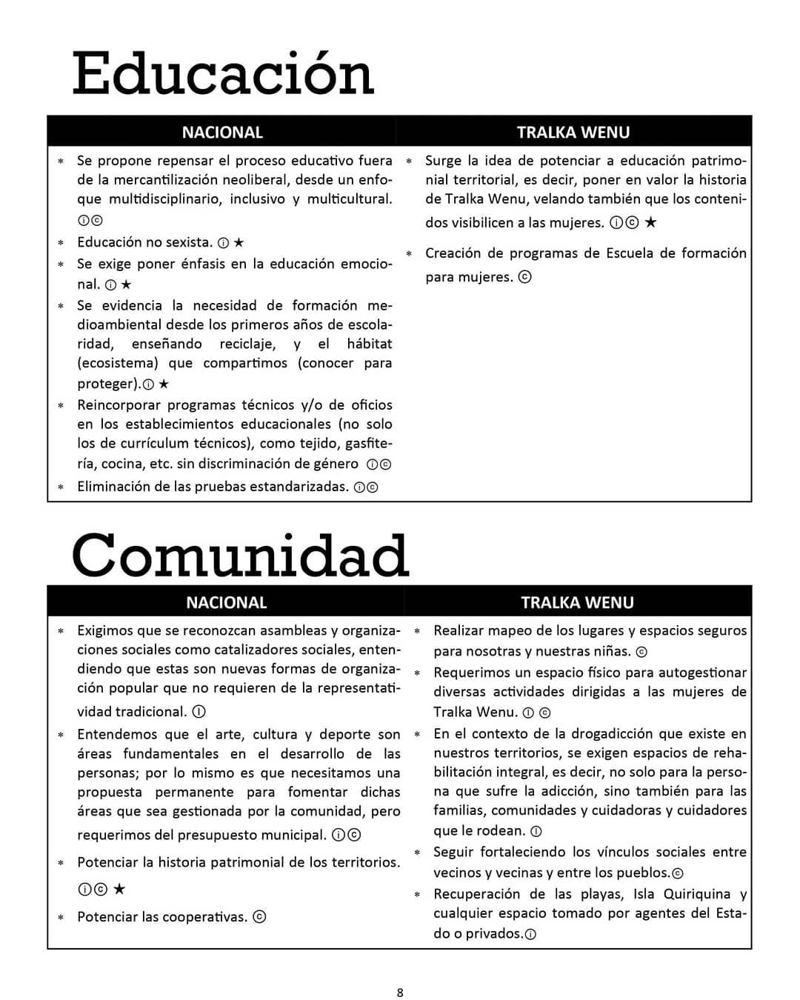
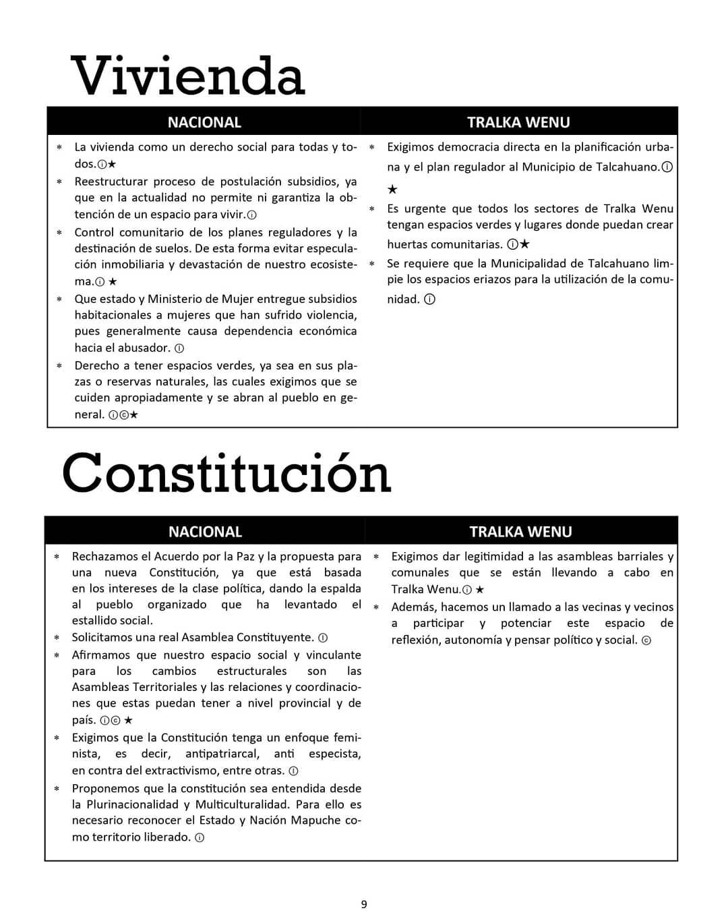
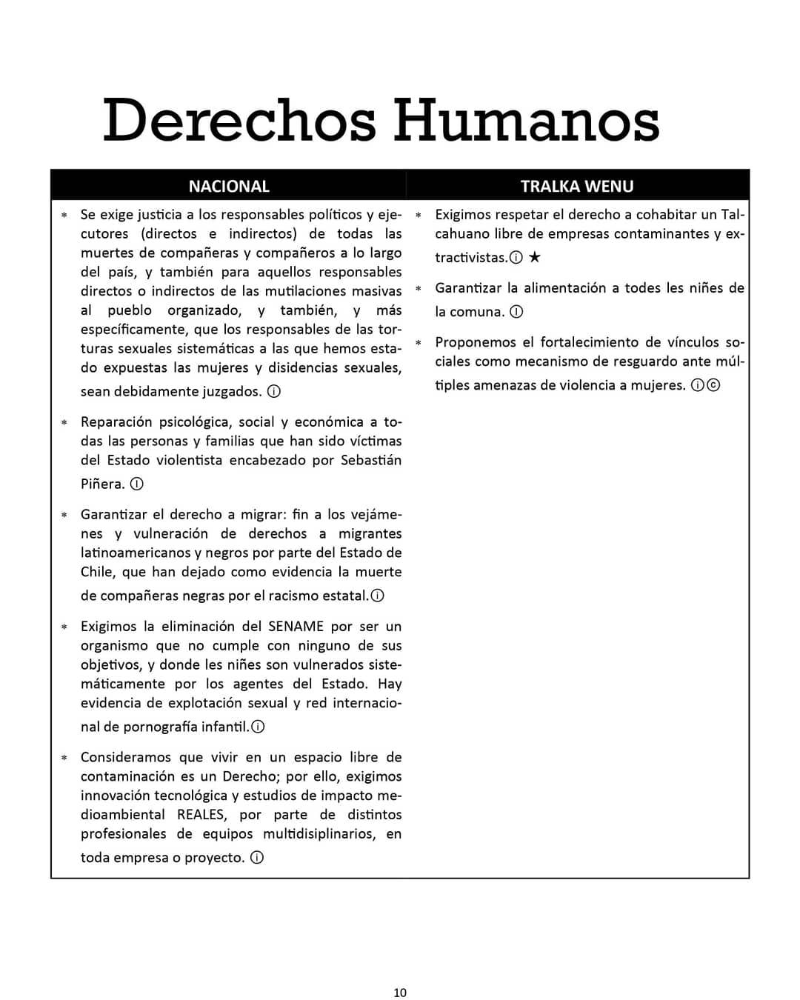
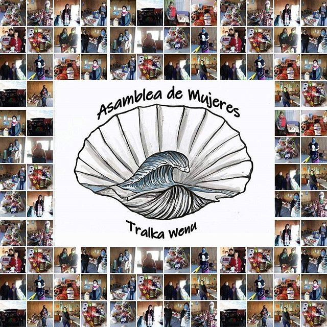
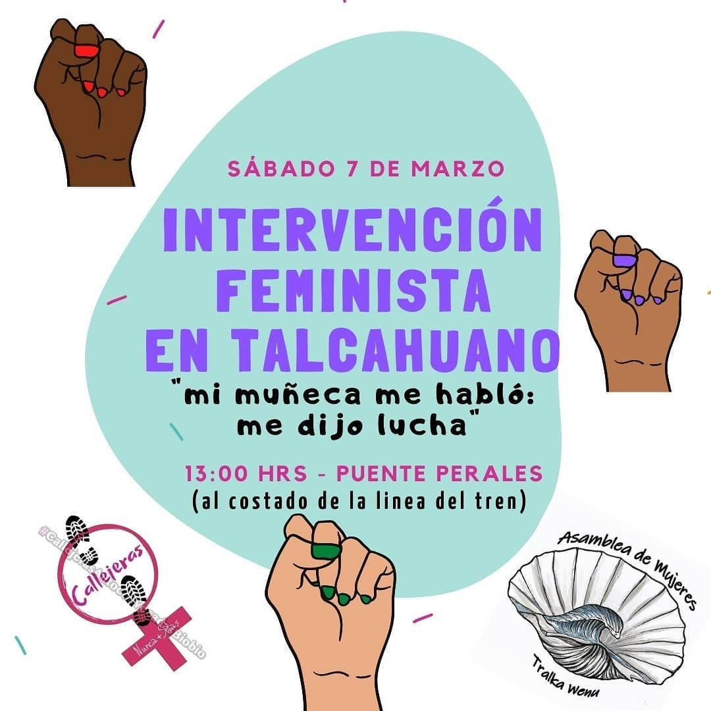

# Asamblea de Mujeres Talcahuano Tralka Wenu

[instagram](https://www.instagram.com/asambleamujeresthno/)
[facebook](https://www.facebook.com/asambleamujeresdethno/)
[twitter]()
<asambleamujeresthno@gmail.com>
---

### Representantes
#### (Nombres o emails de voceros o representantes).

---
### Interacciones frecuentes
#### (listar otras organizaciones que habitualmente)

**Instagram**

| seguidores | seguidos | hashtag |
|---|---|---|
|1356|603|0|

**Facebook**

| seguidores | seguidos | hashtag |
|---|---|---|
|511|0|0|

---
### Describir:

#### (Actividad continua desde octubre, discontinua, actualmente inactiva, etc.)

* **Actividad:** continua desde Diciembre del 2019    

* Primera Publicación IG 15 de Dic 2019 

#### Cantidad de publicaciones
| Instagram | Facebook | otro |
|---|---|---|
|86|0|0|

---
### Describir temas de interés y/o trabajo

* Feminismo
* Defensa Medioambiental
* Conflicto Mapuche

---
### Describir la imagen ideal por la cual se trabaja.
#### (El horizonte hacia el cual se quiere avanzar.)

* Anticapitalista 
* Antipatriarcal 

---
### ¿Que se hace?
#### (Manifestaciones, marchas, intervenciones, actividades culturales, conversatorios, intercambio de saberes, actividades solidarias o de apoyo mutuo, abastecimiento, contrainformacion, emplazamiento a autoridades etc.)

* Asambleas
* Emplazamiento a autoridad (Municipalidad de Talcahuano)
* Ferias libres
* Encuestas de levantamiento de opinión publica
* Marchas
* Actividades Culturales
* Centro de acopio
* Presentación de Documentales
* conversatorios
* Mateada
* Cacerolazo
* Centro de acopio
* Olla común

---
### Describir y distinguir demandas más reivindicativas de espacios sin relación con lo contencioso o con lo político mas prefigurativo
#### (lo contencioso; demanda al Estado, a alguna autoridad, privados, etc), (prefigurativo, transformación desde lo cotidiano, etc.).

---
### Tipo de organización interna.
#### (Vocerías, asambleísmo, horizontalidad, etc.; *se entiende que esta dimensión es más difícil de captar vía análisis de redes sociales, pero quizás se puede vislumbrar a través de roles/cargos*)

---
### Describir los temas / imágenes- iconos / conceptos mas habitualmente presentes en sus publicaciones. Describir cambios/ transformaciones en los contenidos desde Octubre.

**Iconos:**

**Banderas:**

**Diseño estético:**

> 
---
### Percepciones que se tiene del Estado
#### (Aparato burocrático)

| Declaraciones | infografía | 
|---|---|
|Anotar los comunicados |  |

---
### Percepciones que se tiene de las Fuerzas de Orden
#### (Aparato represivo)

| Declaraciones | infografía | 
|---|---|
|Anotar los comunicados |  |

---
### Incorporar aca notas, citas textuales, links, etc. extra a los ya incorporados, que sean de interés para comprender tanto la forma como los contenidos asociados a la organización.
