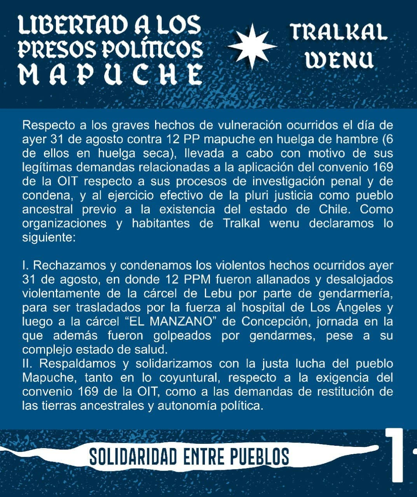
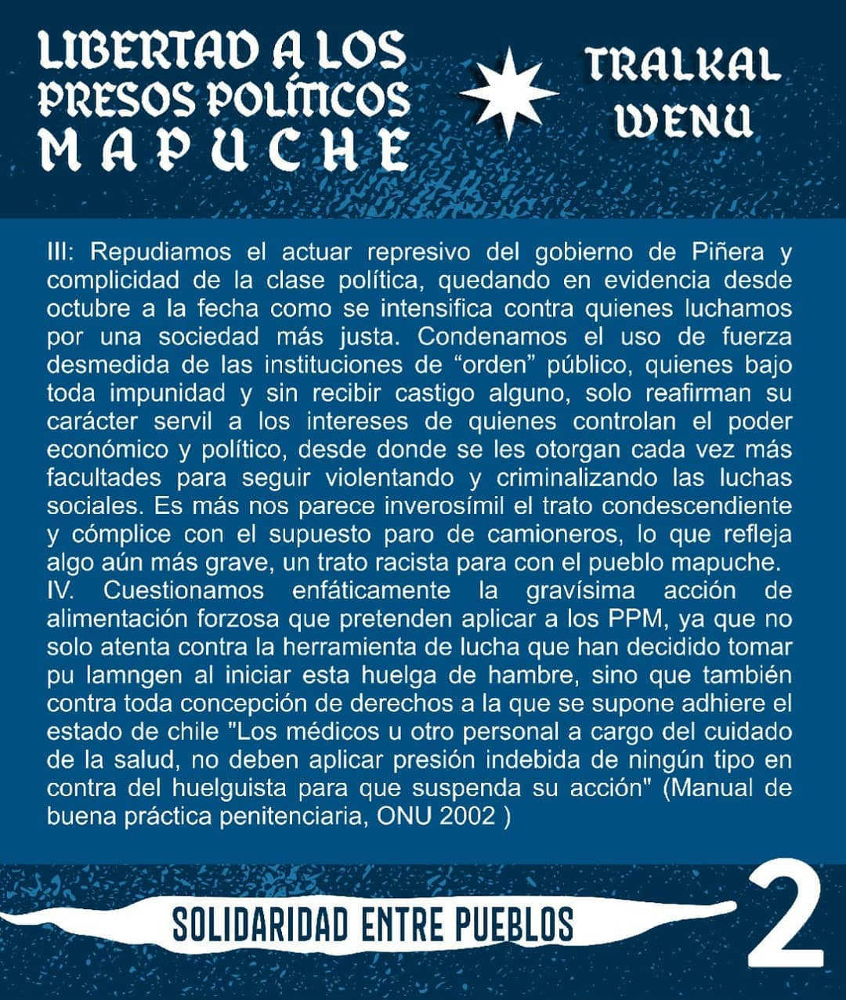
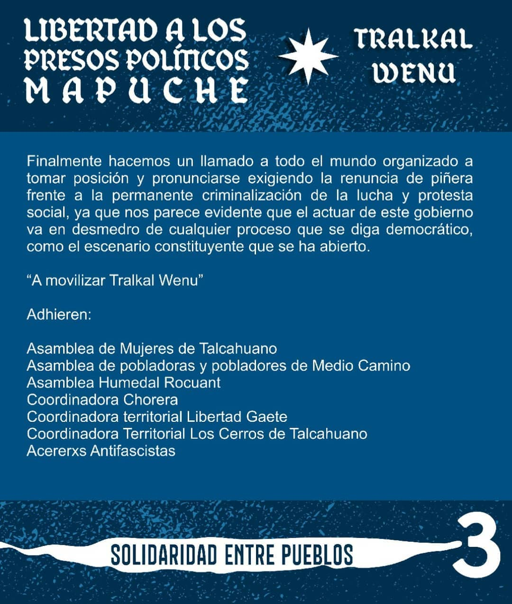
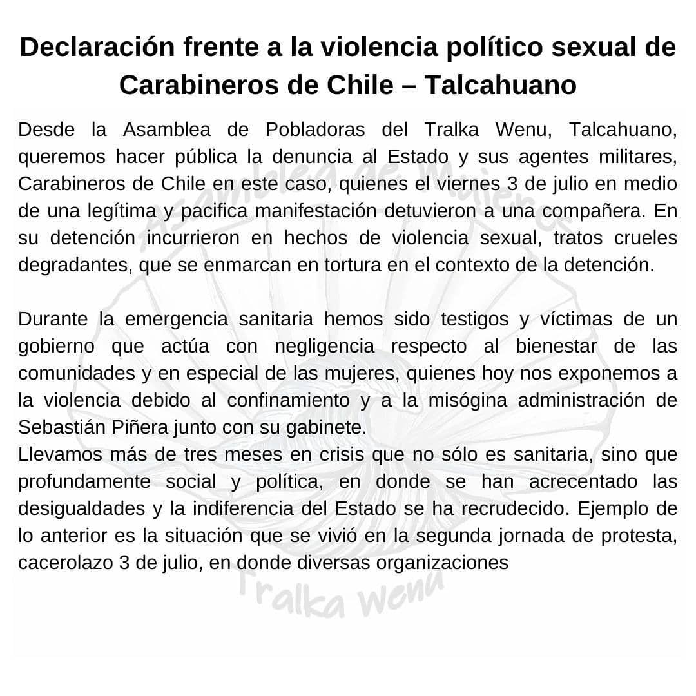
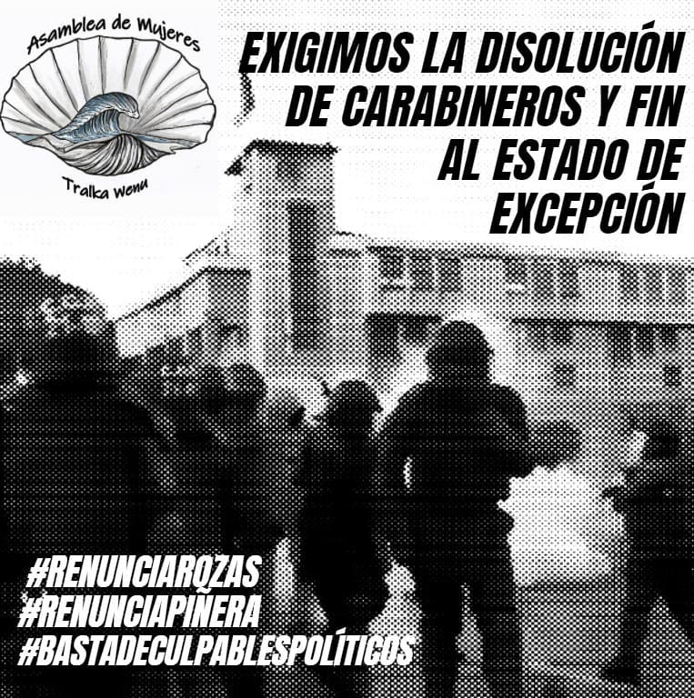
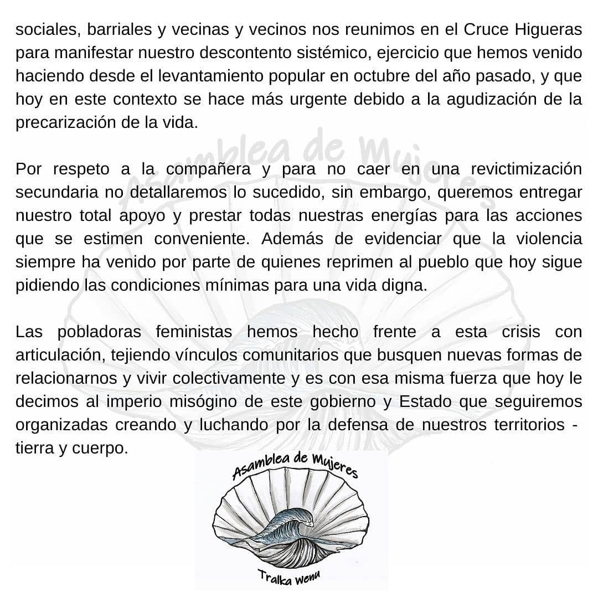
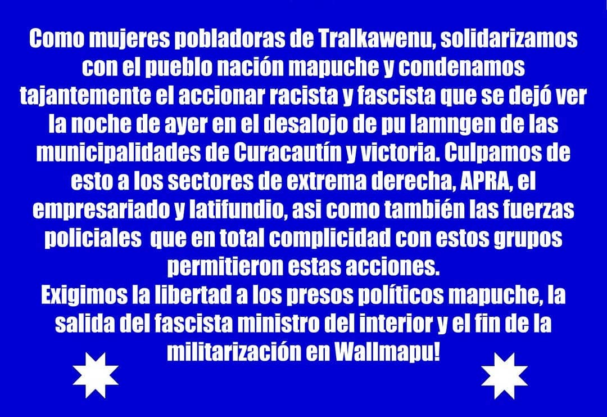

#### FOLIO: TAL02
# Asamblea de Mujeres Talcahuano *Tralka Wenu*

[instagram](https://www.instagram.com/asambleamujeresthno/)
[facebook](https://www.facebook.com/asambleamujeresdethno/)
[twitter]()
<asambleamujeresthno@gmail.com>
---

### Representantes
#### (Nombres o emails de voceros o representantes).

---
### Interacciones frecuentes
#### (listar otras organizaciones que habitualmente)

### Redes sociales
#### ¿Para qué se utiliza la red social?
| Instagram | Facebook | Twitter | Otra 
|---|---|---|---|
|Difusión de información y comunicados, ademas de coordinar y difundir sus actividades|Difusión de información a nivel regional y local|No tiene|No encontrada|

### **Instagram**
| seguidores | seguidos | publicaciones | hashtag |
|---|---|---|---|
|1364|604|86|0|

---

* **Actividad:** continua desde Diciembre del 2019    

* Primera Publicación IG 15 de Dic 2019 

### Frecuencia de publicación.

Publicaciones: Son bastante frecuentes a lo largo del tiempo, exceptuando el mes de febrero.  

Actividades: Las actividades son bastante frecuentes en el mes de diciembre y enero, no hay en febrero, sin embargo, marzo es bastante activo, luego ya con una frecuencia mas cotidiana el resto del tiempo. 

---
### Ubicación
* Sector de la comuna/ciudad: Comuna de Talcahuano. 

---
### Describir temas de interés y/o trabajo

* Feminismo
* Protección medioambiental
* Conflicto Mapuche

---
### Describir la imagen ideal por la cual se trabaja.
#### (El horizonte hacia el cual se quiere avanzar.)

* Anticapitalista 
* Antipatriarcal 

---
### ¿Que se hace?
#### (Manifestaciones, marchas, intervenciones, actividades culturales, conversatorios, intercambio de saberes, actividades solidarias o de apoyo mutuo, abastecimiento, contrainformacion, emplazamiento a autoridades etc.)

* Asambleas
* Emplazamiento a autoridad (Municipalidad de Talcahuano)
* Ferias libres
* Encuestas de levantamiento de opinión publica
* Marchas
* Actividades Culturales
* Centro de acopio
* Presentación de Documentales
* conversatorios
* Mateada
* Cacerolazo
* Centro de acopio
* Olla común

---
### Describir y distinguir demandas más reivindicativas de espacios sin relación con lo contencioso o con lo político mas prefigurativo
#### (lo contencioso; demanda al Estado, a alguna autoridad, privados, etc), (prefigurativo, transformación desde lo cotidiano, etc.).

* Sororidad entre mujeres y disidencias, ademas del 

---
### Tipo de organización interna.
#### (Vocerías, asambleísmo, horizontalidad, etc.; *se entiende que esta dimensión es más difícil de captar vía análisis de redes sociales, pero quizás se puede vislumbrar a través de roles/cargos*)

---
### Describir los temas / imágenes- iconos / conceptos mas habitualmente presentes en sus publicaciones. Describir cambios/ transformaciones en los contenidos desde Octubre.

**Iconos:**

**Banderas:**

**Diseño estético:**

> 
---
### Percepciones que se tiene del Estado
#### (Aparato burocrático)

| Declaraciones | infografía | 
|---|---|
| |  |
|||
| ||

---
### Percepciones que se tiene de las Fuerzas de Orden
#### (Aparato represivo)

| Declaraciones | infografía | 
|---|---|
| |  |
| ||
|||

---
### Incorporar aca notas, citas textuales, links, etc. extra a los ya incorporados, que sean de interés para comprender tanto la forma como los contenidos asociados a la organización.
