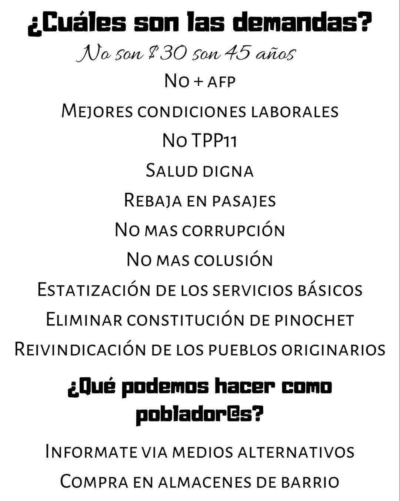
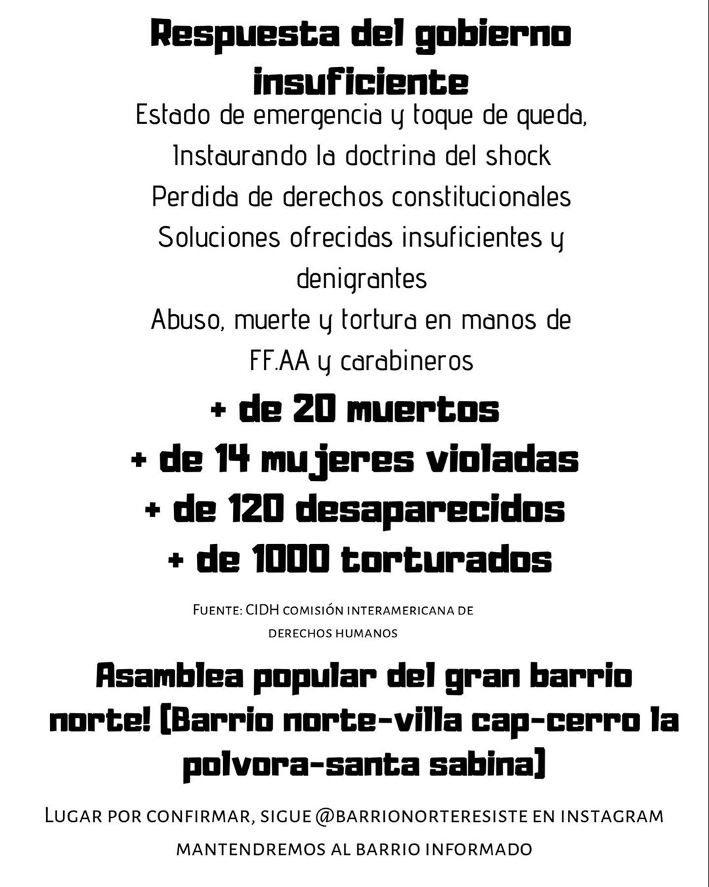
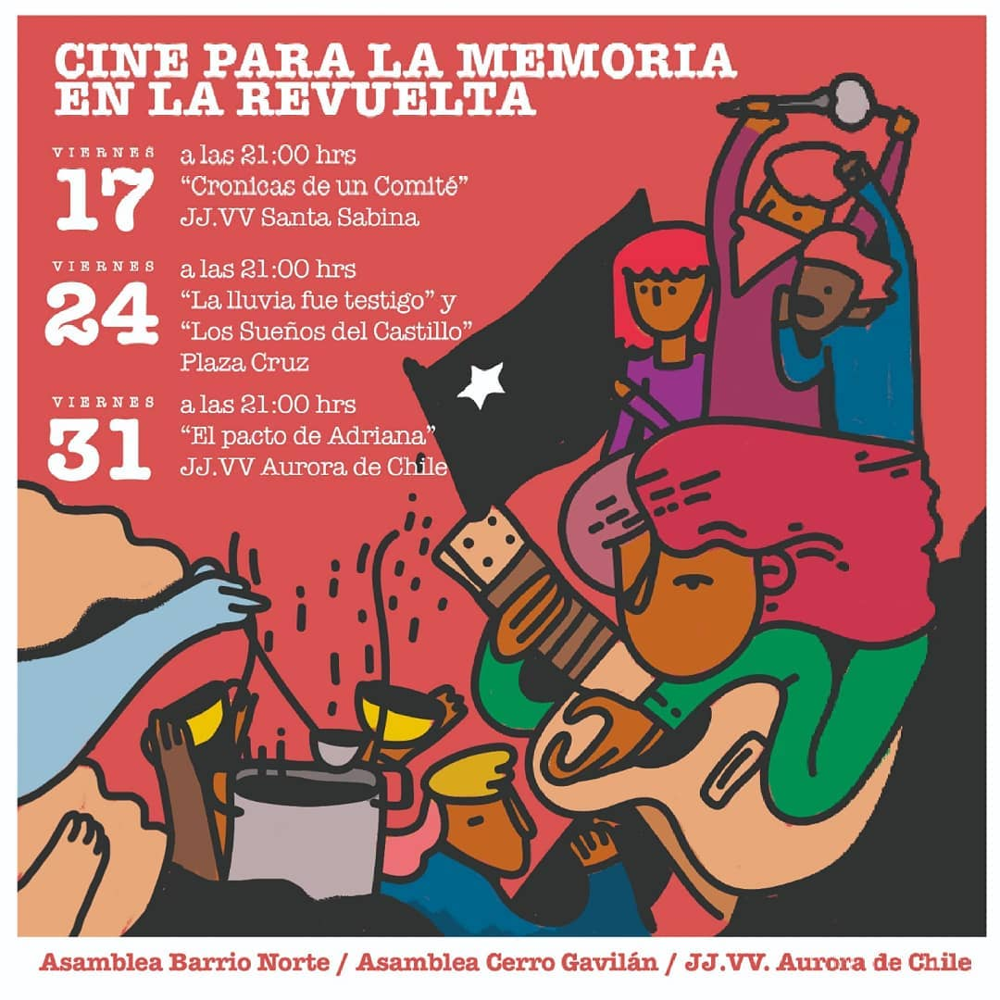
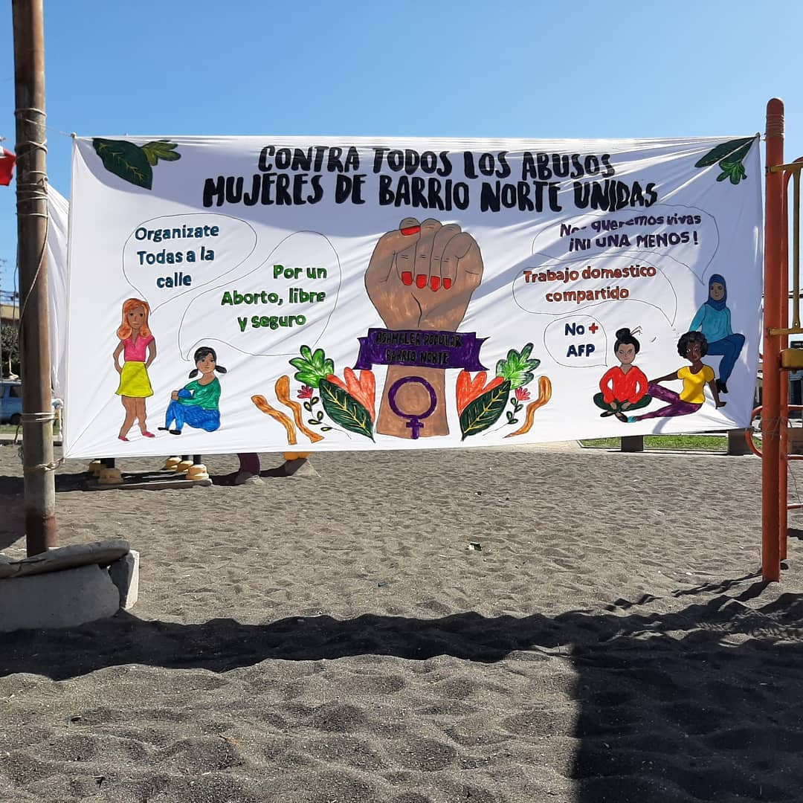
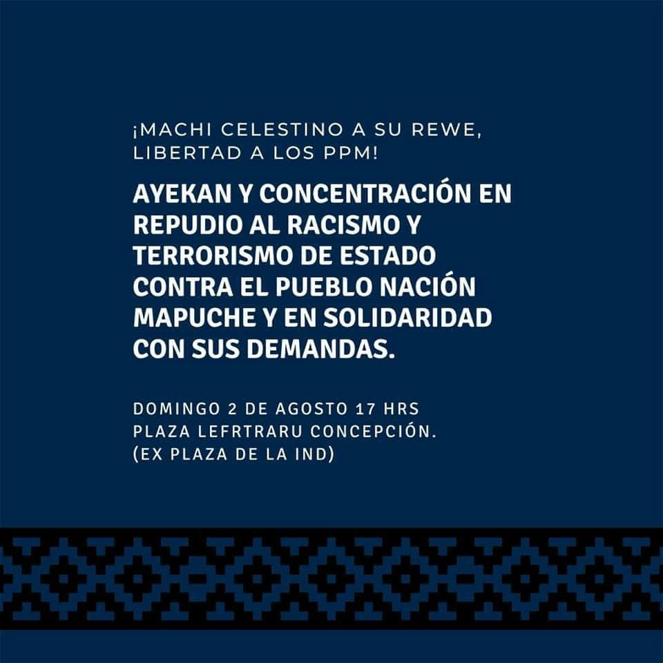

#### FOLIO: CON05
# Asamblea Popular Barrio Norte

[instagram](https://www.instagram.com/asambleapopularbarrionorte/)
[facebook](https://www.facebook.com/Asamblea-Popular-Barrio-Norte-104038587705845/)
[twitter]()
<correo@correo.cl>
---

### Representantes
#### (Nombres o emails de voceros o representantes).

---
### Interacciones frecuentes
#### (listar otras organizaciones que habitualmente)

### Redes sociales
#### ¿Para qué se utiliza la red social?
| Instagram | Facebook | Twitter | Otra 
|---|---|---|---|
|0|0|0|0|

### **Instagram**
| seguidores | seguidos | publicaciones | hashtag |
|---|---|---|---|
|1983|774|201|0|

---

* **Actividad:** continua desde Octubre de 2019.   

* Primera Publicación IG 23 de Oct 2019 

---
### Frecuencia de publicación.

Publicaciones: Semanales, casi diarias.  

Actividades: 2 a 3 Mensuales hasta marzo. Luego de la crisis sanitaria se reduce a 1.   

---
### Ubicación
* Sector de la comuna/ciudad: Comuna de Concepción, zona Barrio Norte. 

---
### Describir temas de interés y/o trabajo

* Feminismo
* Protección medioambiental 
* Ciclos de formación 
* Protección de los DD.HH 
* Crisis sanitaria 
* Recuperación de la memoria
* Red de oficios 
* Red de abastecimiento 
* Conflicto Mapuche
* Protección de la infancia
* Libertad para lxs presxs de la revuelta

---
### Describir la imagen ideal por la cual se trabaja.
#### (El horizonte hacia el cual se quiere avanzar.)

* Anticapitalista 
* Antipatriarcal 
* Multiculturalidad

---
### ¿Que se hace?
#### (Manifestaciones, marchas, intervenciones, actividades culturales, conversatorios, intercambio de saberes, actividades solidarias o de apoyo mutuo, abastecimiento, contra información, emplazamiento a autoridades etc.)

* Asamblea 
* Marchas 
* Actividades culturales 
* Muralismo 
* Música en vivo 
* Mateada 
* Once popular 
* Velatón 
* Navidad popular 
* Taller de afiche digital 
* AGP 
* Cacerolazo 
* Contra información 
* Punto de acopio 
* Conversatorios 
* Olla común 
* Ayekan

---
### Describir y distinguir demandas más reivindicativas de espacios sin relación con lo contencioso o con lo político mas prefigurativo
#### (lo contencioso; demanda al Estado, a alguna autoridad, privados, etc), (prefigurativo, transformación desde lo cotidiano, etc.).

* No TTP 11
* No + zonas de sacrificio 
* No + AFP
* Aborto libre seguro y gratuito
* No + SENAME 

---
### Tipo de organización interna.
#### (Vocerías, asambleísmo, horizontalidad, etc.; *se entiende que esta dimensión es más difícil de captar vía análisis de redes sociales, pero quizás se puede vislumbrar a través de roles/cargos*)

---
### Describir los temas / imágenes- iconos / conceptos mas habitualmente presentes en sus publicaciones. Describir cambios/ transformaciones en los contenidos desde Octubre.

**Iconos:**

**Banderas:**

**Diseño estético:**

> 

---
### Percepciones que se tiene del Estado
#### (Aparato burocrático)

| Declaraciones | infografía | 
|---|---|
|Anotar los comunicados |  |

---
### Percepciones que se tiene de las Fuerzas de Orden
#### (Aparato represivo)

| Declaraciones | infografía | 
|---|---|
|Anotar los comunicados |  |
| | |
---
### Incorporar aca notas, citas textuales, links, etc. extra a los ya incorporados, que sean de interés para comprender tanto la forma como los contenidos asociados a la organización.
