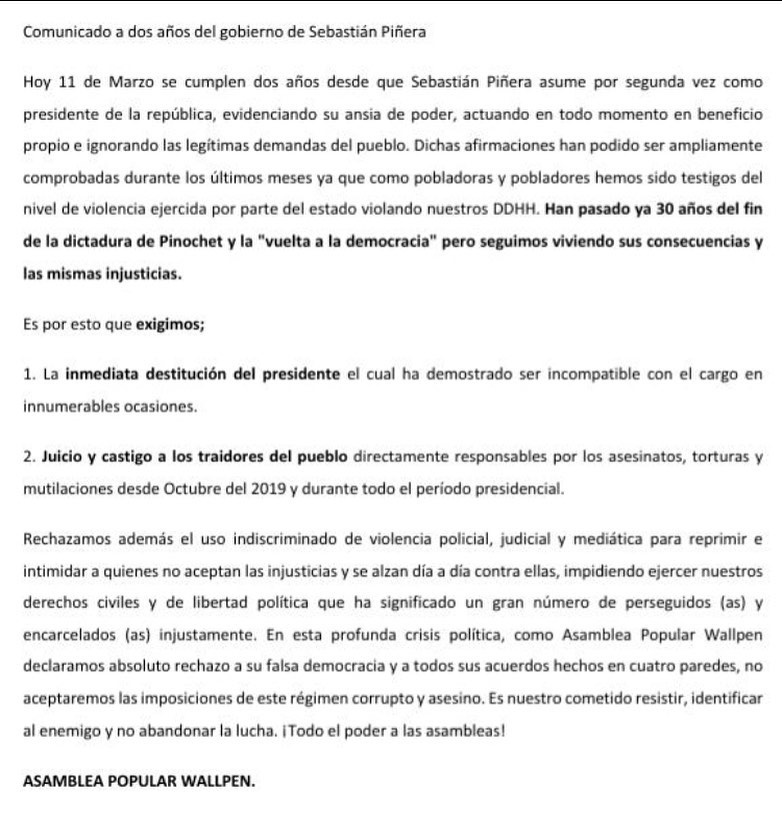
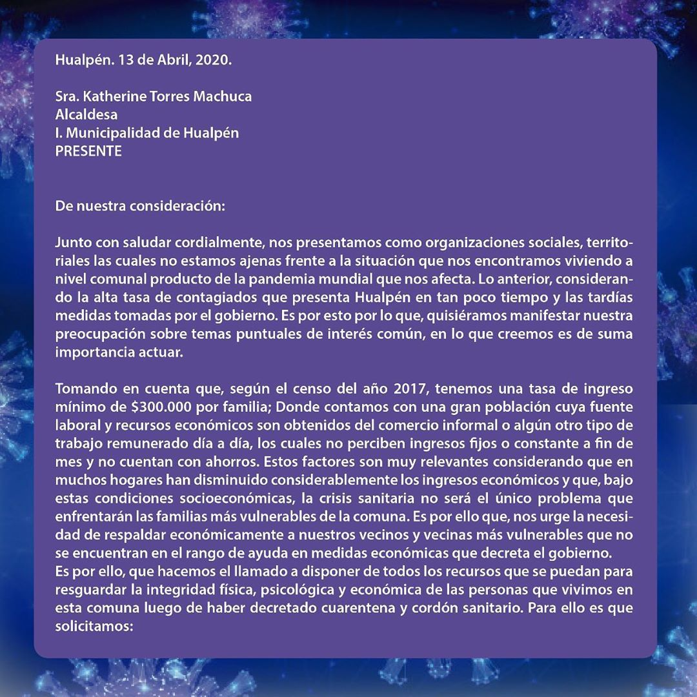
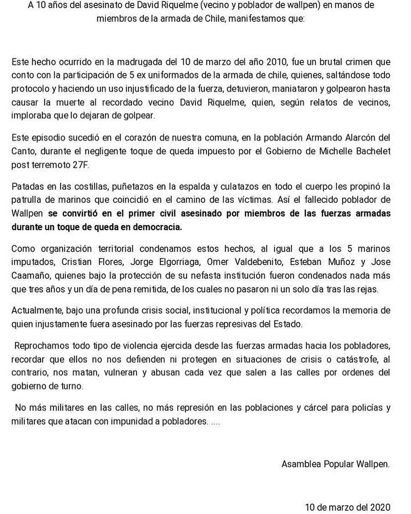

#### FOLIO: WAL1 
# Asamblea Popular Wallpen 

[instagram](https://www.instagram.com/asambleapopularwallpen/)
[facebook](https://www.facebook.com/AsambleaPopularWallpen)
[twitter]()
<correo@correo.cl>
---

### Representantes
#### (Nombres o emails de voceros o representantes).

---
### Interacciones frecuentes
#### (listar otras organizaciones que habitualmente)

### Redes sociales
#### ¿Para qué se utiliza la red social?
| Instagram | Facebook | Twitter | Otra 
|---|---|---|---|
|0|0|0|0|

### **Instagram**
| seguidores | seguidos | publicaciones | hashtag |
|---|---|---|---|
|2024|355|282|0|

---

* **Actividad:**   

* Primera Publicación IG 22 de Feb 2020

---
### Frecuencia de publicación.

Publicaciones:

Actividades: De forma semanal desde el mes de Febrero y Marzo, sin embargo, existe un reflujo luego de la crisis sanitaria. 

---
### Ubicación
* Sector de la comuna/ciudad: Comuna de Hualpén 

---
### Describir temas de interés y/o trabajo

* Libertad de lxs presxs politicxs de la revuelta
* Feminismo 
* Crisis sanitaria 
* Derechos humanos
* Protección de la infancia
* Defensa medioambiental
* Recuperación de la memoria 

---
### Describir la imagen ideal por la cual se trabaja.
#### (El horizonte hacia el cual se quiere avanzar.)

---
### ¿Que se hace?
#### (Manifestaciones, marchas, intervenciones, actividades culturales, conversatorios, intercambio de saberes, actividades solidarias o de apoyo mutuo, abastecimiento, contra información, emplazamiento a autoridades etc.)

* Asamblea 
* Marcha 
* Cacerolazo 
* Red de oficios 
* Programas online de conversaciones (streaming)
* Centro de acopio 
* Contra información 
* Charlas y actividades formativas
* Olla común 
* Intervención artística 

---
### Describir y distinguir demandas más reivindicativas de espacios sin relación con lo contencioso o con lo político mas prefigurativo
#### (lo contencioso; demanda al Estado, a alguna autoridad, privados, etc), (prefigurativo, transformación desde lo cotidiano, etc.).

---
### Tipo de organización interna.
#### (Vocerías, asambleísmo, horizontalidad, etc.; *se entiende que esta dimensión es más difícil de captar vía análisis de redes sociales, pero quizás se puede vislumbrar a través de roles/cargos*)

---
### Describir los temas / imágenes- iconos / conceptos mas habitualmente presentes en sus publicaciones. Describir cambios/ transformaciones en los contenidos desde Octubre.

**Iconos:**

**Banderas:**

**Diseño estético:**

> Párrafo tipo cita 

---
### Percepciones que se tiene del Estado
#### (Aparato burocrático)
> resumen de lo encontrado

| Declaraciones | infografía | 
|---|---|
| |  |
|| |
| ||
||
||
| ||
| ||
| ||
|

---
### Percepciones que se tiene de las Fuerzas de Orden
#### (Aparato represivo)
> resumen de lo encontrado

| Declaraciones | infografía | 
|---|---|
| |  |

---
### Incorporar aca notas, citas textuales, links, etc. extra a los ya incorporados, que sean de interés para comprender tanto la forma como los contenidos asociados a la organización.

[Boletin](https://issuu.com/jeka6/docs/boletin_apw_digital)