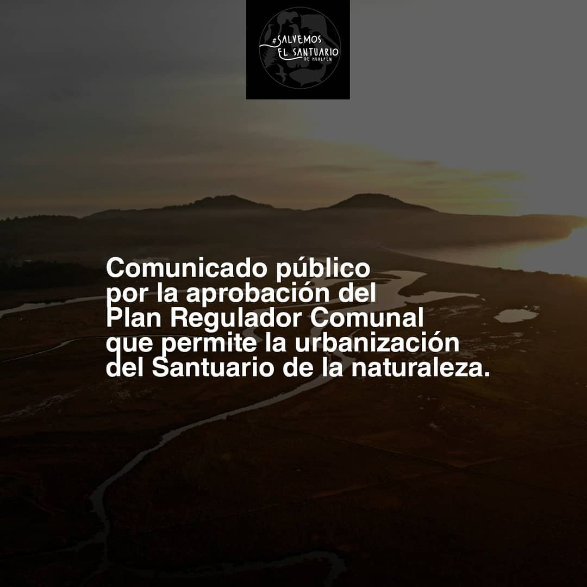
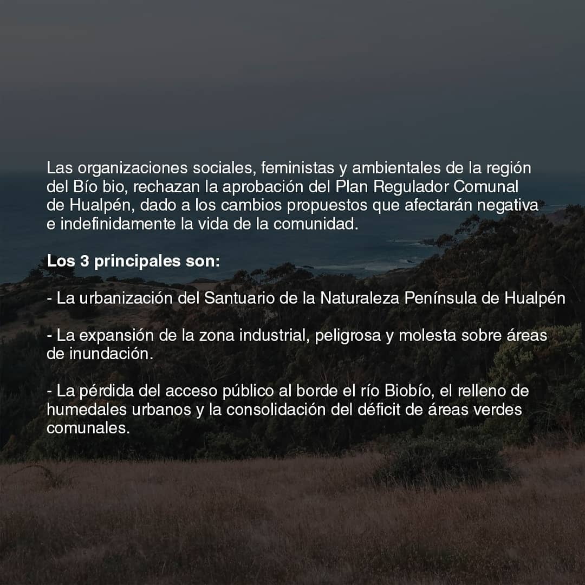
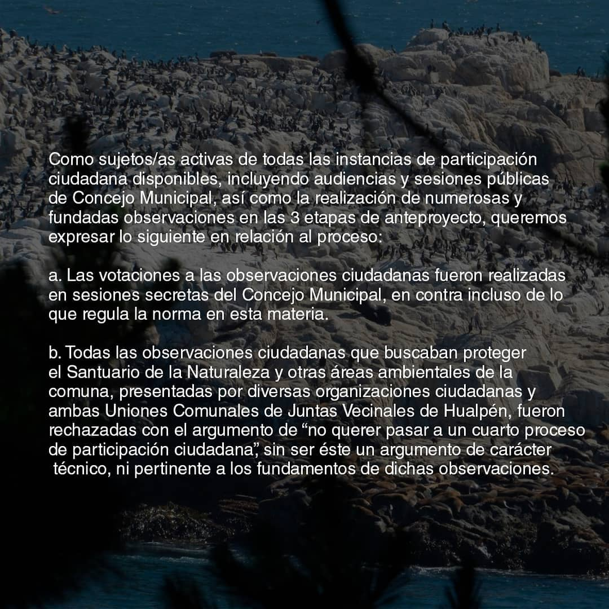
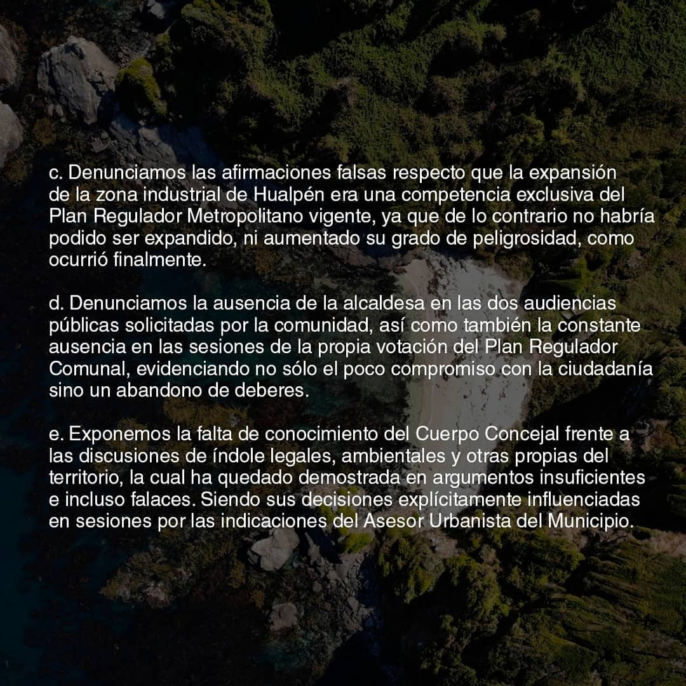
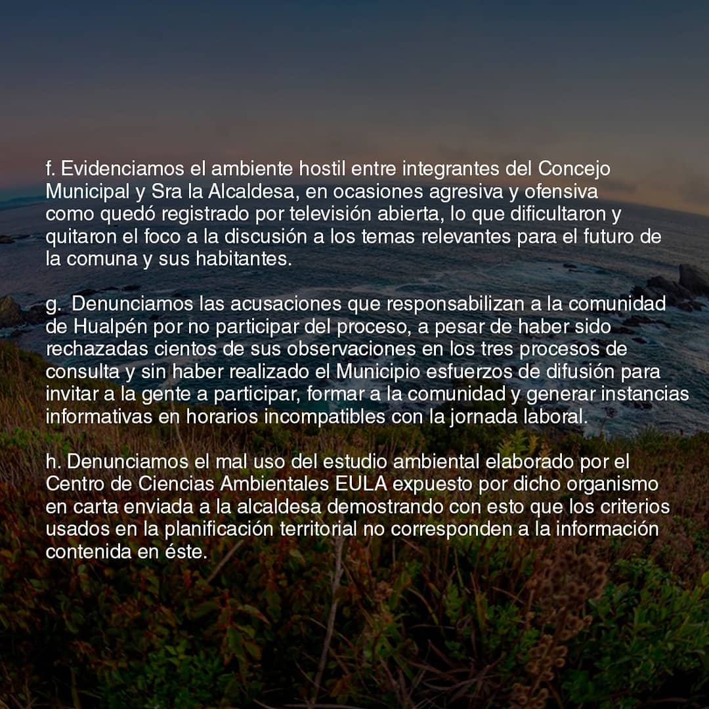
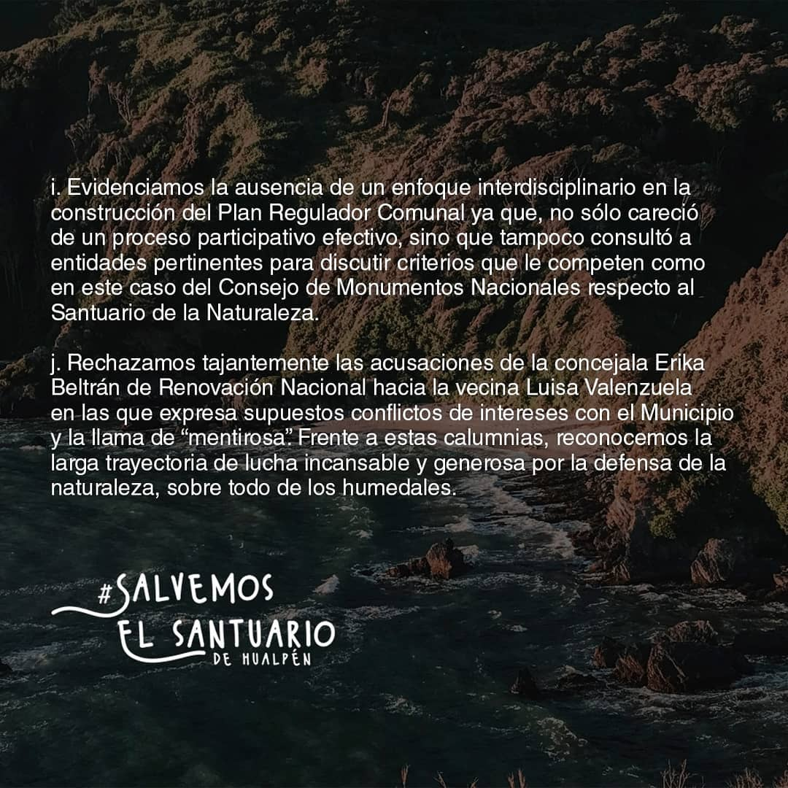

#### FOLIO: TAL03
# Asamblea T. Humedal Rocuant

[instagram](https://www.instagram.com/asambleahumedalrocuant/)
[facebook](https://www.facebook.com/Asambleahumedalrocuant)
[twitter]()
<asambleahumedalrocuant@gmail.com>
---

### Representantes
#### (Nombres o emails de voceros o representantes).

---
### Interacciones frecuentes
#### (listar otras organizaciones que habitualmente)

### Redes sociales
#### ¿Para qué se utiliza la red social?
| Instagram | Facebook | Twitter | Otra 
|---|---|---|---|
|0|0|0|0|

### **Instagram**
| seguidores | seguidos | publicaciones | hashtag |
|---|---|---|---|
|2169|2812|183|0|

---

* **Actividad:**  

* Primera publicación IG 4 de Nov 2019

---
### Frecuencia de publicación.

Publicaciones: Casi a diario

Actividades:

---
### Ubicación
* Sector de la comuna/ciudad: Comuna de Talcahuano, zona Humedal Rocuant. 

---
### Describir temas de interes y/o trabajo

* Defensa medioambiental
* Proceso constituyente
* Conflicto Mapuche
* Recuperación de la memoria
* Libertad de lxs presxs politicxs de la revuelta (según sus datos 170 aprox)
* Feminismo

---
### Describir la imagen ideal por la cual se trabaja.
#### (El horizonte hacia el cual se quiere avanzar.)

---
### ¿Que se hace?
#### (Manifestaciones, marchas, intervenciones, actividades culturales, conversatorios, intercambio de saberes, actividades solidarias o de apoyo mutuo, abastecimiento, contra información, emplazamiento a autoridades etc.)

* Asamblea
* Conservatorio.
* Música en vivo
* Marcha
* Caminatas
* Limpieza de áreas verdes  
* contra información y panfleteo
* Muralismo
* Actividades culturales
* Música en vivo
* Emplazamiento a autoridad (Municipalidad de Talcahuano)
* Cacerolazo 

---
### Describir y distinguir demandas más reivindicativas de espacios sin relación con lo contencioso o con lo político mas prefigurativo
#### (lo contencioso; demanda al Estado, a alguna autoridad, privados, etc), (prefigurativo, transformación desde lo cotidiano, etc.).

* No TTP 11 -reivindicativo-
* Conciencia de los humedales -prefigurativo-

---
### Tipo de organización interna.
#### (Vocerías, asambleísmo, horizontalidad, etc.; *se entiende que esta dimensión es más difícil de captar vía análisis de redes sociales, pero quizás se puede vislumbrar a través de roles/cargos*)

---
### Describir los temas / imágenes- iconos / conceptos mas habitualmente presentes en sus publicaciones. Describir cambios/ transformaciones en los contenidos desde Octubre.

**Iconos:**

**Banderas:**

**Diseño estético:**

>

---
### Percepciones que se tiene del Estado
#### (Aparato burocrático)

| Declaraciones | infografía | 
|---|---|
| |  |
| ||
| ||
| ||
| ||
| ||

---
### Percepciones que se tiene de las Fuerzas de Orden
#### (Aparato represivo)

| Declaraciones | infografía | 
|---|---|
|Anotar los comunicados |  |

---
### Incorporar aca notas, citas textuales, links, etc. extra a los ya incorporados, que sean de interés para comprender tanto la forma como los contenidos asociados a la organización.
