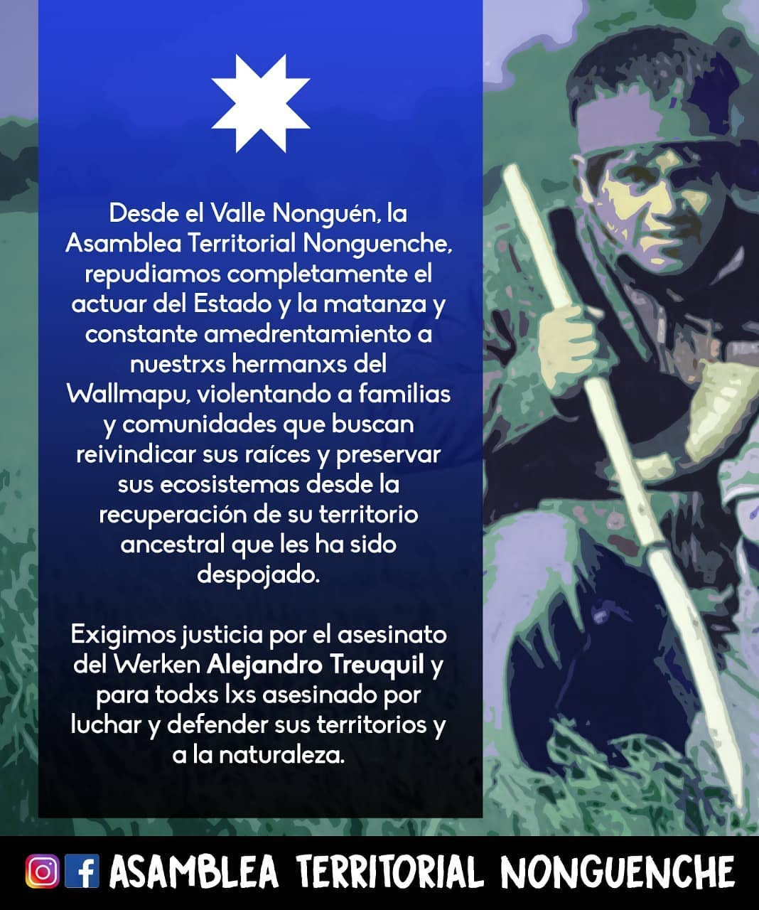
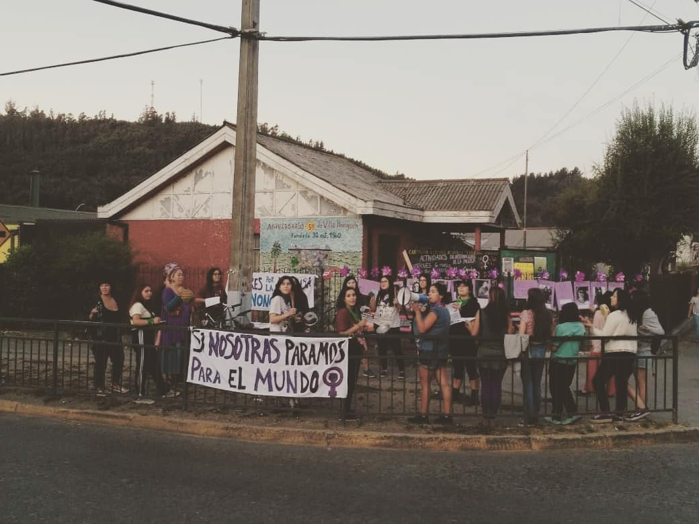
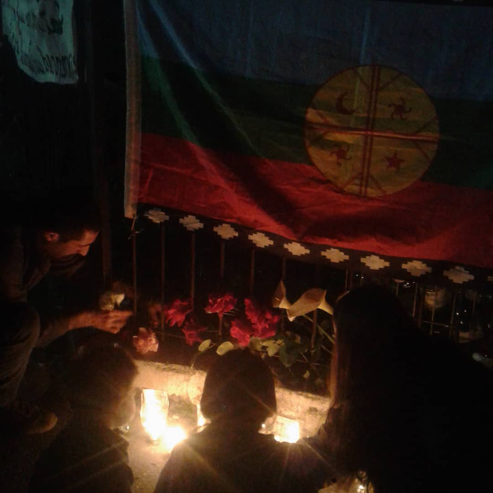
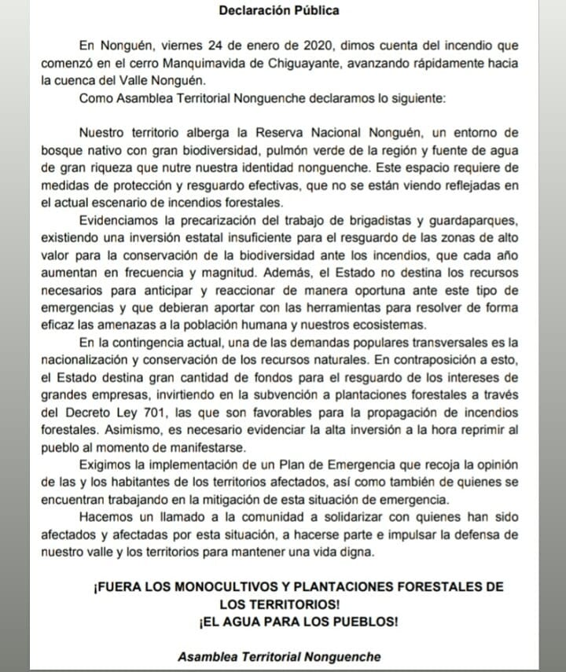
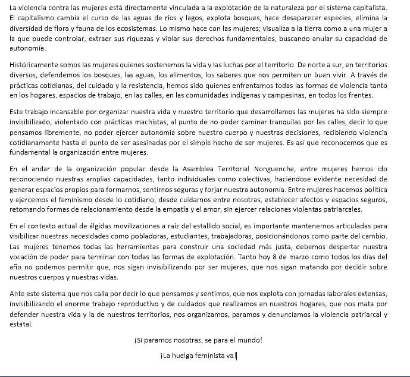

#### FOLIO: CON04
# Asamblea Territorial Nonguen *Nonguenche*

[instagram](https://www.instagram.com/asambleanonguen/)
[facebook](https://www.facebook.com/Asamblea-Territorial-Nonguen-109566617184017/)
[twitter]()
<correo@correo.cl>
---

### Representantes
#### (Nombres o emails de voceros o representantes).

---
### Interacciones frecuentes
#### (listar otras organizaciones que habitualmente)

### Redes sociales
#### ¿Para qué se utiliza la red social?
| Instagram | Facebook | Twitter | Otra 
|---|---|---|---|
|Coordinación y difusión de actividades. Junto con entregar información del sector sobre los incendios forestales|Coordinación y difusión de actividades|No tiene|No encontrada|

### **Instagram**
| seguidores | seguidos | publicaciones | hashtag |
|---|---|---|---|
|1332|141|78|0|

---

* **Actividad:** Continua hasta el mes de Agosto del 2020 

* Primera Publicación IG 13 de Nov 2019 

---
### Frecuencia de publicación.

Publicaciones: Publicaciones semanales hasta el 4 de Ago 2020 

Actividades:

---
### Ubicación
* Sector de la comuna/ciudad: Comuna de Concepción, zona de Nonguen. 

---
### Describir temas de interés y/o trabajo

* Conflicto Mapuche 
* Red de oficios
* Protección Ambiental
* Libertad de lxs presxs politicxs de la revuelta
* Feminismo 

---
### Describir la imagen ideal por la cual se trabaja.
#### (El horizonte hacia el cual se quiere avanzar.)

* Anticapitalismo 
* Fin al modelo forestal 
* No mas zonas de sacrificio 
* Huelga feminista 
* La protesta no es delito 
* Fuera Forestales 

---
### ¿Que se hace?
#### (Manifestaciones, marchas, intervenciones, actividades culturales, conversatorios, intercambio de saberes, actividades solidarias o de apoyo mutuo, abastecimiento, contra información, emplazamiento a autoridades etc.)

* Actividades culturales 
* Música en vivo
* Muralismo 
* Asamblea 
* Marcha 
* Ferias libres 
* Conversatorios 
* Velatón  
* Once comunitaria 
* Limpieza de áreas verdes 
* Punto de acopio 
* Cacerolazo 

---
### Describir y distinguir demandas más reivindicativas de espacios sin relación con lo contencioso o con lo político mas prefigurativo
#### (lo contencioso; demanda al Estado, a alguna autoridad, privados, etc), (prefigurativo, transformación desde lo cotidiano, etc.).

---
### Tipo de organización interna.
#### (Vocerías, asambleísmo, horizontalidad, etc.; *se entiende que esta dimensión es más difícil de captar vía análisis de redes sociales, pero quizás se puede vislumbrar a través de roles/cargos*)

> No se logra identificar representantes, aunque si existe una participación en las diferentes actividades que levanta la organización

---
### Describir los temas / imágenes- iconos / conceptos mas habitualmente presentes en sus publicaciones. Describir cambios/ transformaciones en los contenidos desde Octubre.

**Iconos:**

**Banderas:**

**Diseño estético:**

> En la estética se presenta principalmente comunidades compartiendo diferentes espacios sociales. Desde una protesta hasta compartir una comida. Se guía mas por entregar la información a través de videos. 

---
### Percepciones que se tiene del Estado
#### (Aparato burocrático)
> resumen de lo encontrado

| Declaraciones | infografía | 
|---|---|
| |  |
|

---
### Percepciones que se tiene de las Fuerzas de Orden
#### (Aparato represivo)
> resumen de lo encontrado

| Declaraciones | infografía | 
|---|---|
|Anotar los comunicados |  |

---
### Incorporar aca notas, citas textuales, links, etc. extra a los ya incorporados, que sean de interés para comprender tanto la forma como los contenidos asociados a la organización.

[Encuesta para identificar vecinos en riesgo](https://docs.google.com/forms/d/e/1FAIpQLScrbdLzIySOkwXSU3InPlENeW1Q-ROp1fjl6GFLZT4Ks9tQMg/viewform?vc=0&c=0&w=1) 