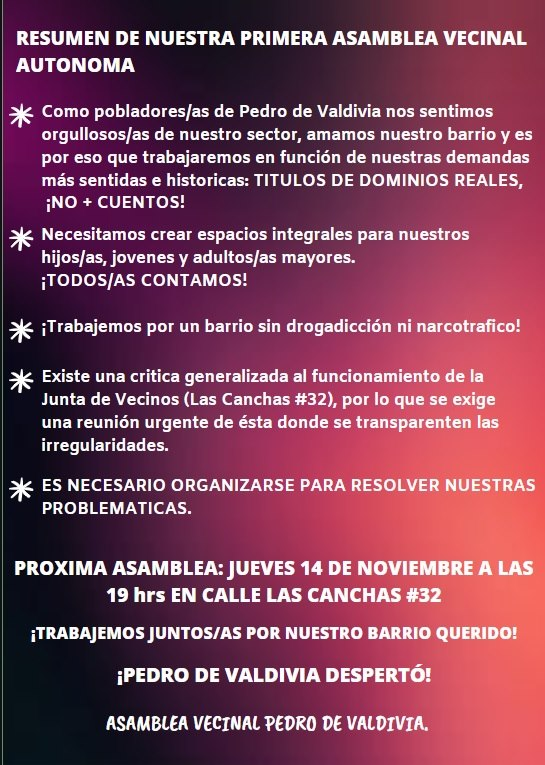
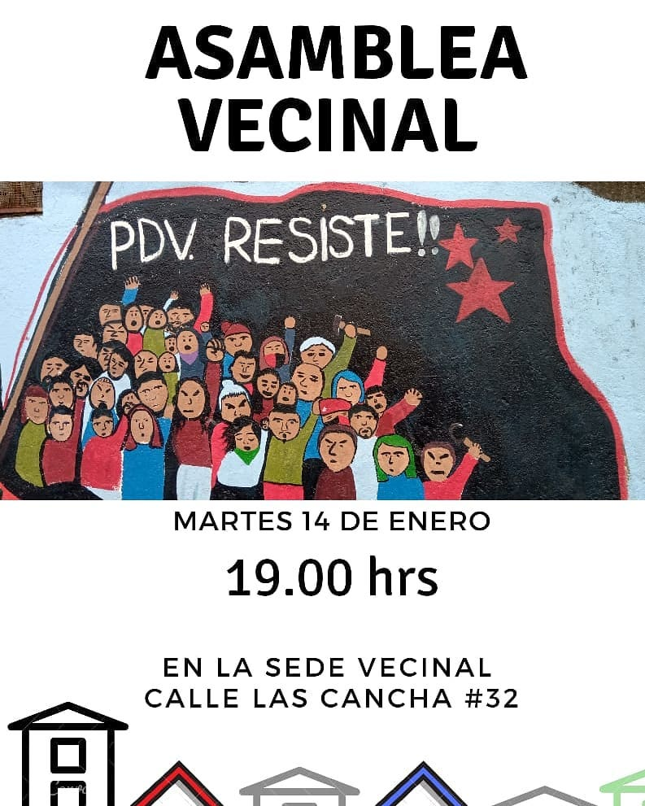

#### FOLIO: CON06
# Asamblea Vecinal Pedro de Valdivia

[instagram](https://www.instagram.com/asambleapedrodevaldivia/)
[facebook](https://www.facebook.com/Asamblea-Vecinal-Pedro-de-Valdivia-115024036606796/)
[twitter]()
<correo@correo.cl>
---

### Representantes
#### (Nombres o emails de voceros o representantes).

---
### Interacciones frecuentes
#### (listar otras organizaciones que habitualmente)

* Asamblea Provincial 

### Redes sociales
#### ¿Para qué se utiliza la red social?
| Instagram | Facebook | Twitter | Otra 
|---|---|---|---|
|0|0|0|0|

### **Instagram**
| seguidores | seguidos | publicaciones | hashtag |
|---|---|---|---|
|564|235|30|0|

---

* **Actividad:**  

* Primera Publicación IG 7 de Nov 2019 
  
* Primera Publicación FB 7 de Nov 2019 

---
### Frecuencia de publicación.

Publicaciones:

Actividades: Múltiples actividades en el mes de noviembre y diciembre. Es evidente un reflujo en el mes de Febrero, no existen publicaciones entre el 3 y el 26 de ese mes.   

---
### Ubicación
* Sector de la comuna/ciudad:

---
### Describir temas de interés y/o trabajo

* Urbanismo y conflicto habitacional 
* Recuperación de la memoria 
* Conflicto Mapuche 
* Crisis sanitaria 

---
### Describir la imagen ideal por la cual se trabaja.
#### (El horizonte hacia el cual se quiere avanzar.)

---
### ¿Que se hace?
#### (Manifestaciones, marchas, intervenciones, actividades culturales, conversatorios, intercambio de saberes, actividades solidarias o de apoyo mutuo, abastecimiento, contra información, emplazamiento a autoridades etc.)

* Asamblea 
* Marcha 
* Muralismo 
* Cacerolazo 
* Actividades culturales 
* Contra información 
* Emplazamiento a autoridad (SERVIU) 

---
### Describir y distinguir demandas más reivindicativas de espacios sin relación con lo contencioso o con lo político mas prefigurativo
#### (lo contencioso; demanda al Estado, a alguna autoridad, privados, etc), (prefigurativo, transformación desde lo cotidiano, etc.).

* Renuncia Piñera 

---
### Tipo de organización interna.
#### (Vocerías, asambleísmo, horizontalidad, etc.; *se entiende que esta dimensión es más difícil de captar vía análisis de redes sociales, pero quizás se puede vislumbrar a través de roles/cargos*)

* Asambleísmo horizontal y abierto. 

---
### Describir los temas / imágenes- iconos / conceptos mas habitualmente presentes en sus publicaciones. Describir cambios/ transformaciones en los contenidos desde Octubre.

**Iconos:**

**Banderas:**

**Diseño estético:**

> 

---
### Percepciones que se tiene del Estado
#### (Aparato burocrático)
> resumen de lo encontrado

| Declaraciones | infografía | 
|---|---|
|Anotar los comunicados |  |

---
### Percepciones que se tiene de las Fuerzas de Orden
#### (Aparato represivo)
> resumen de lo encontrado

| Declaraciones | infografía | 
|---|---|
|Anotar los comunicados |  |

---
### Incorporar aca notas, citas textuales, links, etc. extra a los ya incorporados, que sean de interés para comprender tanto la forma como los contenidos asociados a la organización.
