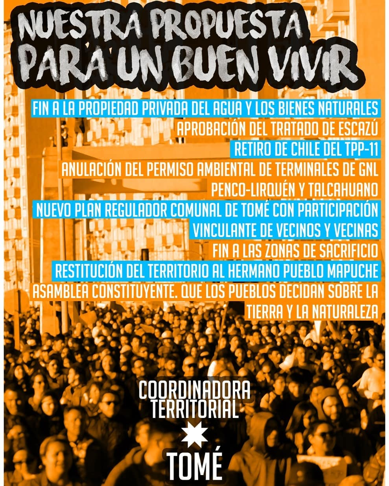
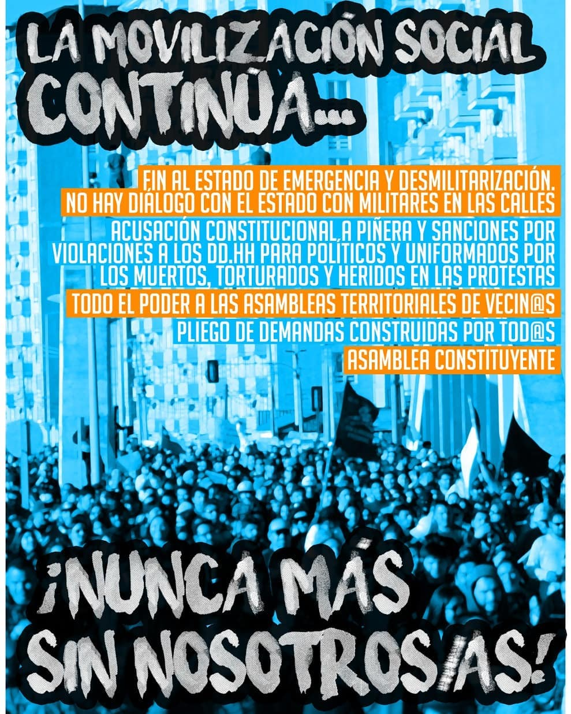
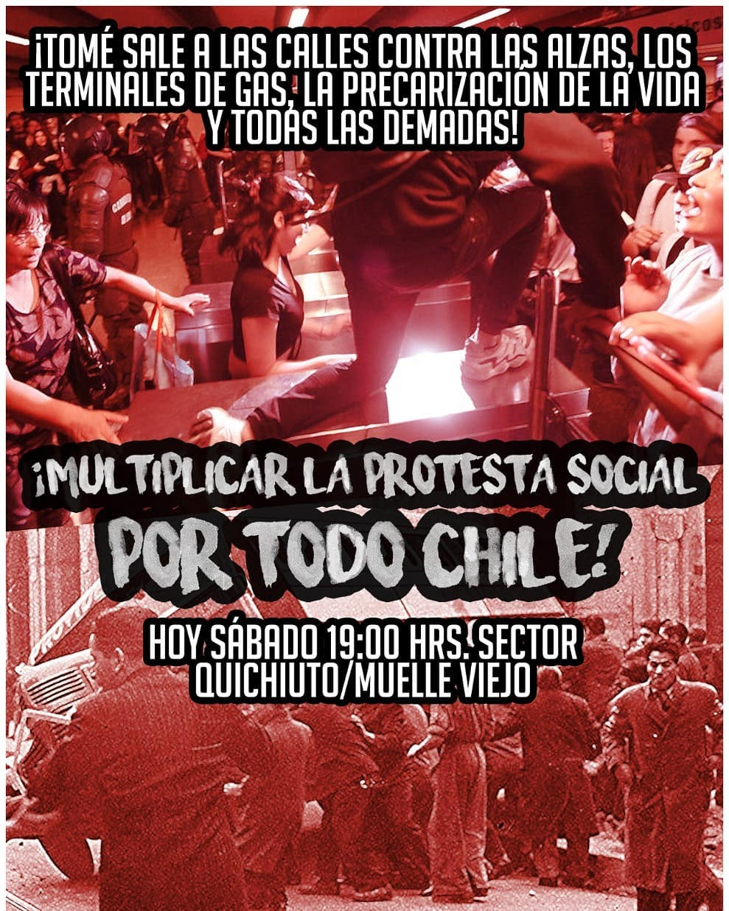
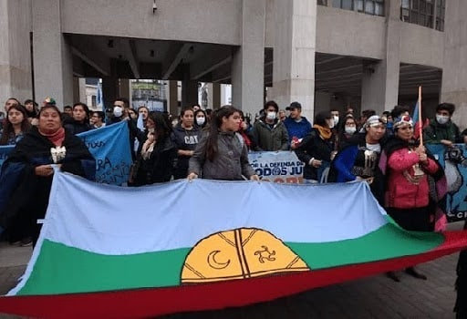
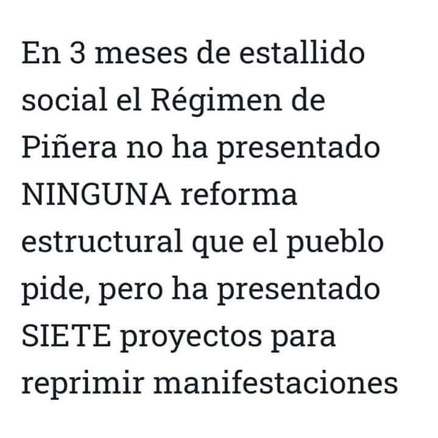
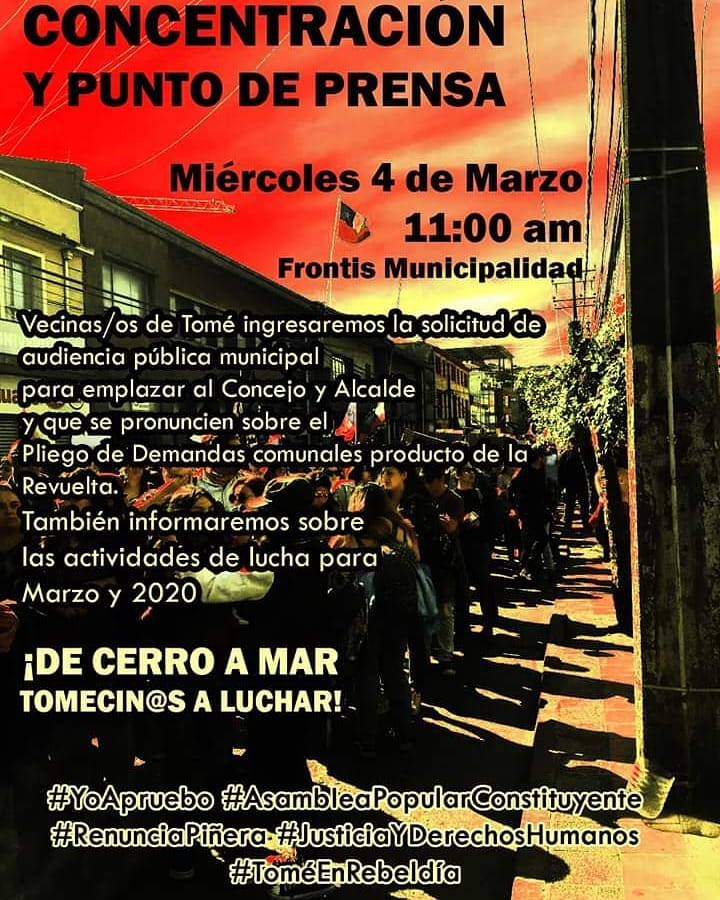

#### FOLIO: TOM2
# Coordinadora Territorial Tomé

[instagram](https://www.instagram.com/coordinadora.territorial.tome/)
[facebook](https://www.facebook.com/coordinadoraterritorialtome)
[twitter]()
<coordinadoraterritorialtome@gmail.com>
---

### Representantes
#### (Nombres o emails de voceros o representantes).

---
### Interacciones frecuentes
#### (listar otras organizaciones que habitualmente)

### Redes sociales
#### ¿Para qué se utiliza la red social?
| Instagram | Facebook | Twitter | Otra 
|---|---|---|---|
|Difusión de actividades |Difusión de informacion nacional y regional |No tiene |No se encuentra|

### **Instagram**
| seguidores | seguidos | publicaciones | hashtag |
|---|---|---|---|
|1892|2661|228|1|

---

* **Actividad:** Continua desde mayo del 2019.   

* Primera Publicación IG 29 de mayo del 2019

---
### Frecuencia de publicación.

Publicaciones: Tienen una alta frecuencia de publicaciones entre octubre y diciembre del 2019. Para el mes de febrero se nota una baja, sin embargo, se vuelve a un ritmo mas continuo desde el mes de marzo del 2020

Actividades: Multiples marchas y con bastante frecuencia entre los meses de octubre y diciembre del 2019, incluso hasta enero del 2020. Denota un reflujo en el mes de febrero. Para volver a actividades con la precaución de la crisis sanitaria por la pandemia. 

---
### Ubicación
* Sector de la comuna/ciudad: Comuna de Tome, zona centro. 

---
### Describir temas de interés y/o trabajo

* Protección medioambiental
* Feminismo
* Libertad para lxs presxs de la revuelta
* Protección de los DD.HH
* Proceso constituyente
* Crisis sanitaria 
* Conflicto Mapuche
* Libertad para lxs presxs de la revuelta

---
### Describir la imagen ideal por la cual se trabaja.
#### (El horizonte hacia el cual se quiere avanzar.)

---
### ¿Que se hace?
#### (Manifestaciones, marchas, intervenciones, actividades culturales, conversatorios, intercambio de saberes, actividades solidarias o de apoyo mutuo, abastecimiento, contra información, emplazamiento a autoridades etc.)

* Marchas
* Cacerolazo 
* Actividades culturales
* Asambleas
* Velatón
* Charlas y actividades formativas
* Contra información
* Olla común 
* Centro de acopio
* Ayekan
* Cicletadas
* Intervención artística 

---
### Describir y distinguir demandas más reivindicativas de espacios sin relación con lo contencioso o con lo político mas prefigurativo
#### (lo contencioso; demanda al Estado, a alguna autoridad, privados, etc), (prefigurativo, transformación desde lo cotidiano, etc.).

>Se insta a realizar actos de "Recuperación Ecológica y Cultural"

---
### Tipo de organización interna.
#### (Vocerías, asambleísmo, horizontalidad, etc.; *se entiende que esta dimensión es más difícil de captar vía análisis de redes sociales, pero quizás se puede vislumbrar a través de roles/cargos*)

---
### Describir los temas / imágenes- iconos / conceptos mas habitualmente presentes en sus publicaciones. Describir cambios/ transformaciones en los contenidos desde Octubre.

**Iconos:**

**Banderas:**

**Diseño estético:**

> Párrafo tipo cita 

---
### Percepciones que se tiene del Estado
#### (Aparato burocrático)
> resumen de lo encontrado

| Declaraciones | infografía | 
|---|---|
| |  |
||| 
---
### Percepciones que se tiene de las Fuerzas de Orden
#### (Aparato represivo)
> resumen de lo encontrado

| Declaraciones | infografía | 
|---|---|
|Anotar los comunicados |  |

---
### Incorporar aca notas, citas textuales, links, etc. extra a los ya incorporados, que sean de interés para comprender tanto la forma como los contenidos asociados a la organización.
