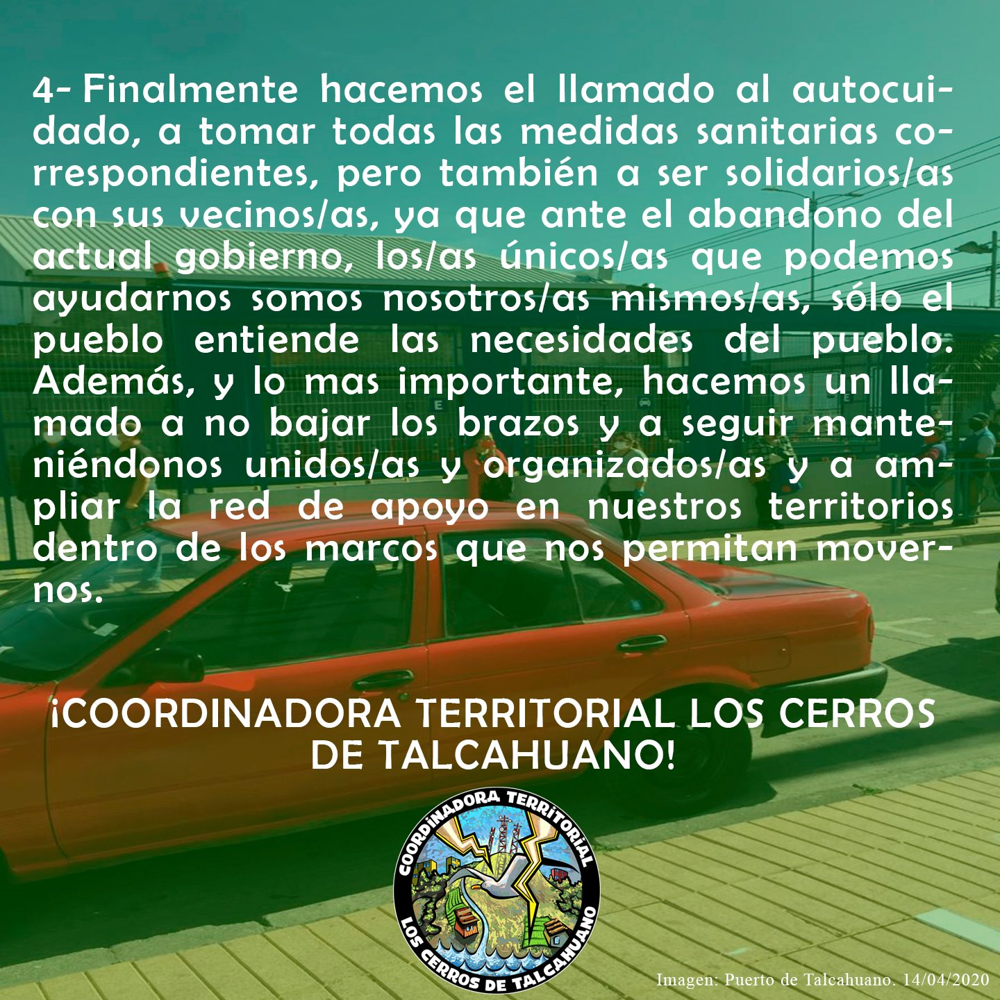

#### FOLIO: TAL01
# Coordinadora Territorial los Cerros de Talcahuano

[instagram](https://www.instagram.com/ct.cerrosdethno/)
[facebook](https://www.facebook.com/CoordinadoraTerritorialLosCerrosdeTalcahuano/)
[twitter]()
<correo@correo.cl>
---

### Representantes
#### (Nombres o emails de voceros o representantes).

---
### Interacciones frecuentes
#### (listar otras organizaciones que habitualmente)

### Redes sociales
#### ¿Para qué se utiliza la red social?
| Instagram | Facebook | Twitter | Otra 
|---|---|---|---|
|Coordinación y difusión de actividades|Coordinación y difusión de actividades|No tiene|No encuentra|

### **Instagram**
| seguidores | seguidos | publicaciones | hashtag |
|---|---|---|---|
|1061|253|141|1|

---

* **Actividad:** Continua desde agosto del 2019 

* Primera Publicación IG 10 de Ago 2019

---
### Frecuencia de publicación.

Publicaciones: mensualmente hasta 18 de Oct 2019, luego es casi a diario

Actividades:

---
### Ubicación
* Sector de la comuna/ciudad:

---
### Describir temas de interés y/o trabajo

* Juntas Vecinales
* Asambleas de pobladores
* Urbanismo y problemas habitacionales
* Sistema de seguridad social (pensiones)
* Mejoras salariales
* Salud publica
* conflicto Mapuche
* Protección medioambiental
* Crisis sanitaria

---
### Describir la imagen ideal por la cual se trabaja.
#### (El horizonte hacia el cual se quiere avanzar.)

* Renuncia del presidente Piñera  

---
### ¿Que se hace?
#### (Manifestaciones, marchas, intervenciones, actividades culturales, conversatorios, intercambio de saberes, actividades solidarias o de apoyo mutuo, abastecimiento, contra información, emplazamiento a autoridades etc.)

* Encuentros de pobladores
* Agitación y propaganda
* Cacerolazos
* Actividades culturales
* Charlas y actividades formativas
* Navidad popular
* Emplazamiento a autoridades
* Olla común
* Punto de acopio
* Mateadas
* talleres de primeros auxilios
* Programas online de conversaciones (streaming)
* Muralismo

---
### Describir y distinguir demandas más reivindicativas de espacios sin relación con lo contencioso o con lo político mas prefigurativo
#### (lo contencioso; demanda al Estado, a alguna autoridad, privados, etc), (prefigurativo, transformación desde lo cotidiano, etc.).

---
### Tipo de organización interna.
#### (Vocerías, asambleísmo, horizontalidad, etc.; *se entiende que esta dimensión es más difícil de captar vía análisis de redes sociales, pero quizás se puede vislumbrar a través de roles/cargos*)

---
### Describir los temas / imágenes- iconos / conceptos mas habitualmente presentes en sus publicaciones. Describir cambios/ transformaciones en los contenidos desde Octubre.

**Iconos:**

**Banderas:**

**Diseño estético:**

> 

---
### Percepciones que se tiene del Estado
#### (Aparato burocrático)
> resumen de lo encontrado

| Declaraciones | infografía | 
|---|---|
| | |
| ||
| ||
| ||
| ||
| ||
| ||
| ||

---
### Percepciones que se tiene de las Fuerzas de Orden
#### (Aparato represivo)
> resumen de lo encontrado

| Declaraciones | infografía | 
|---|---|
|Anotar los comunicados |  |

---
### Incorporar aca notas, citas textuales, links, etc. extra a los ya incorporados, que sean de interés para comprender tanto la forma como los contenidos asociados a la organización.
