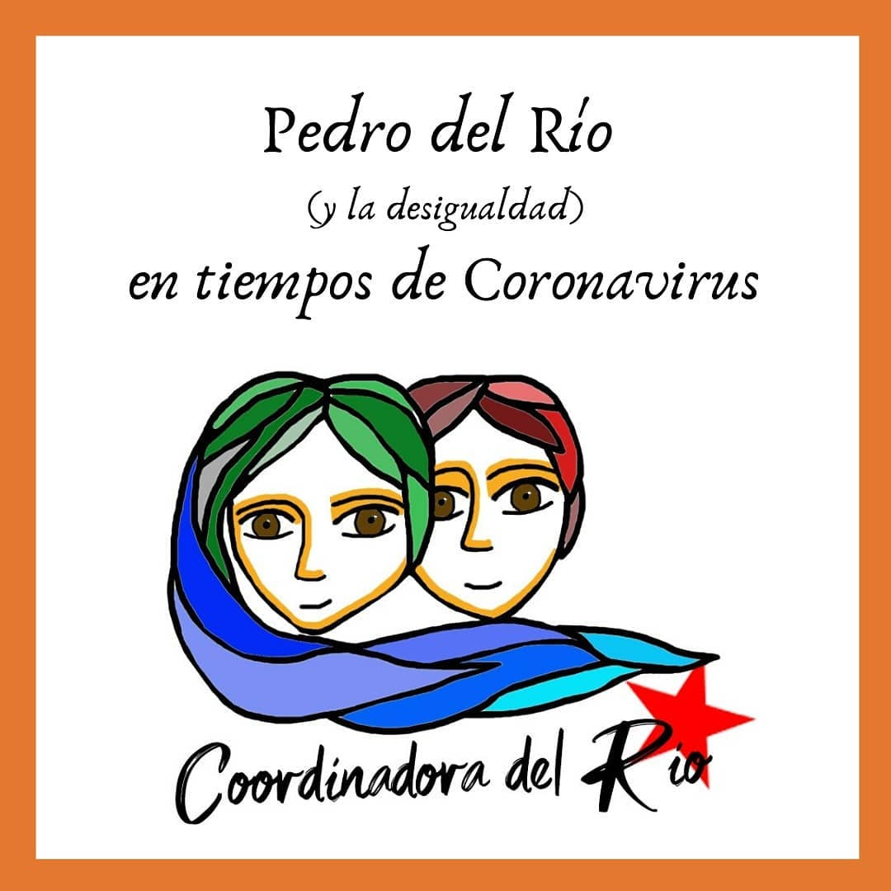
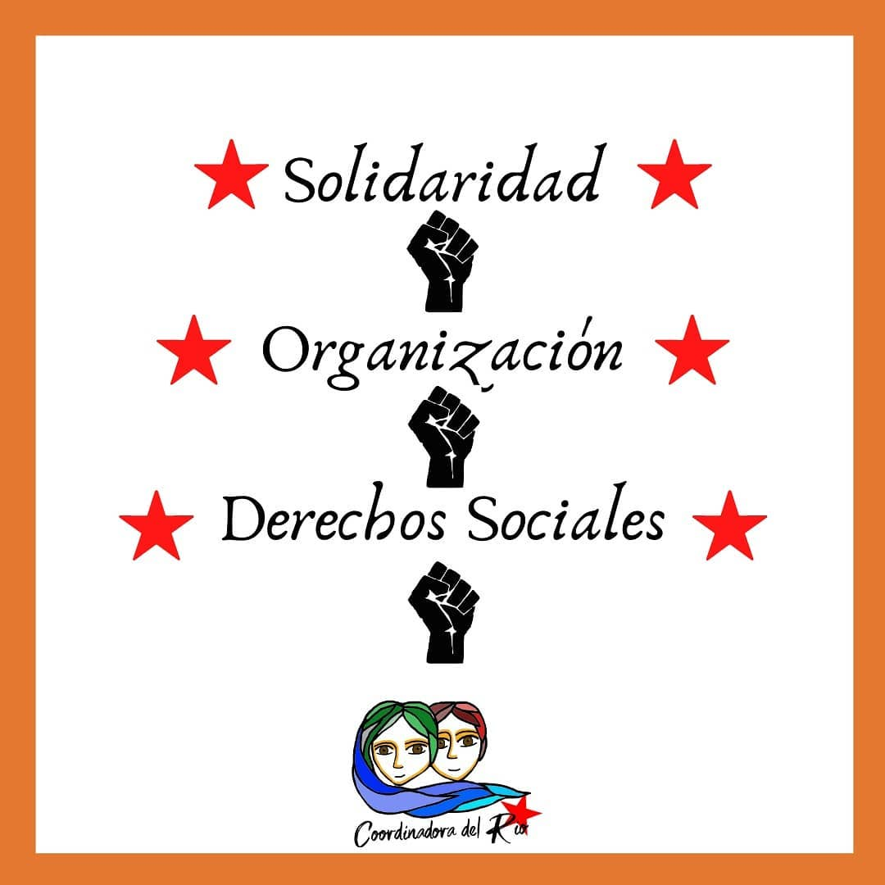
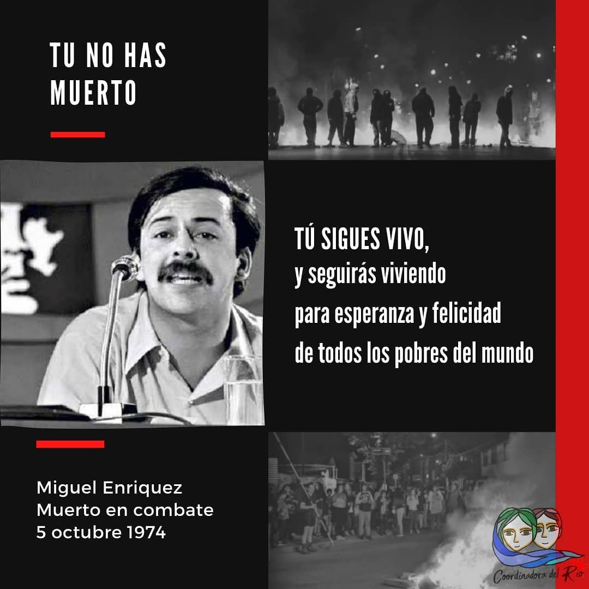
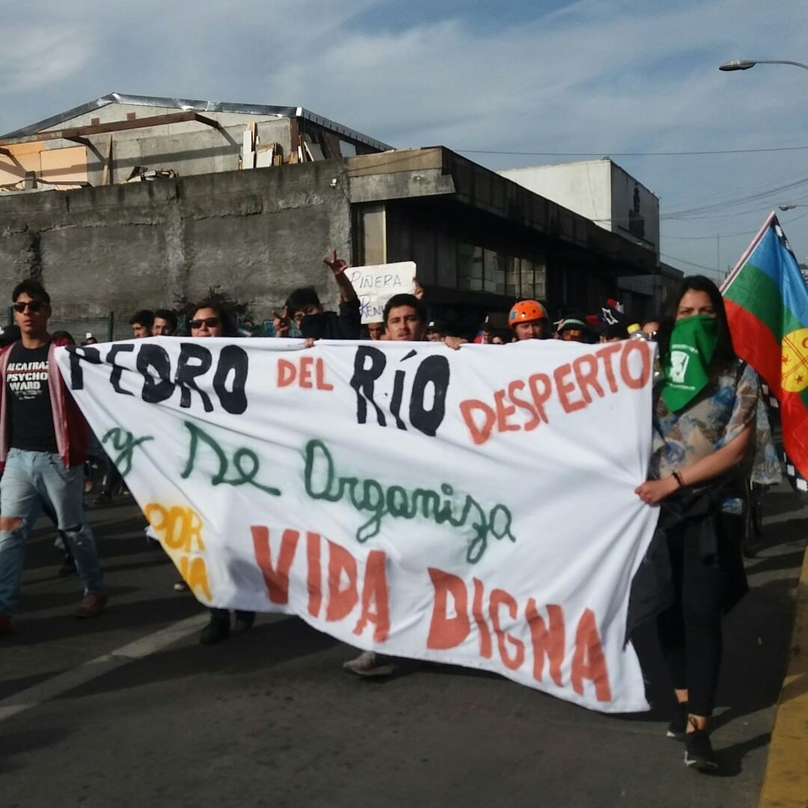
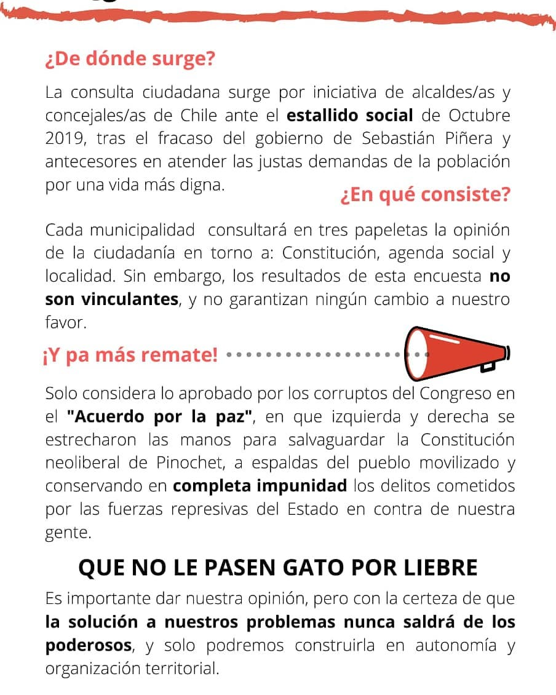
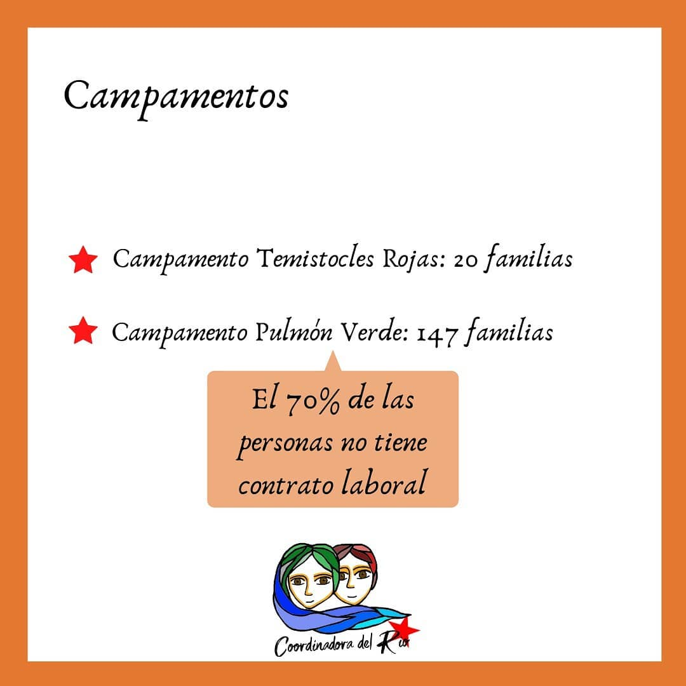
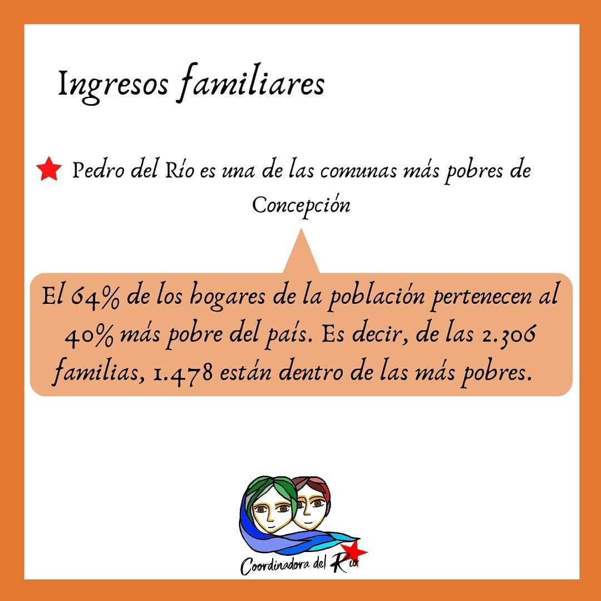
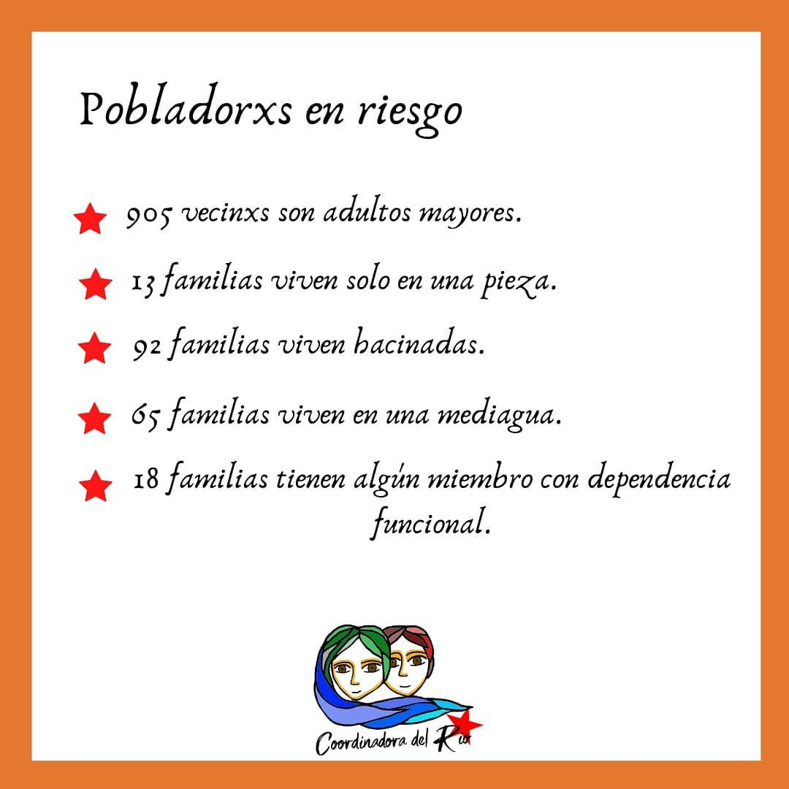

#### FOLIO: CON03
# Coordinadora del Río

[instagram](https://www.instagram.com/coordinadora.delrio/)
[facebook](https://www.facebook.com/Coordinadora-del-Río-108180527307273/)
[twitter]()
<correo@correo.cl>
---

### Representantes
#### (Nombres o emails de voceros o representantes).

---
### Interacciones frecuentes
#### (listar otras organizaciones que habitualmente)

* Asamblea Provincial 

### Redes sociales
#### ¿Para qué se utiliza la red social?
| Instagram | Facebook | Twitter | Otra 
|---|---|---|---|
|Coordinación y difusión de actividades. Junto con entregar información del sector y también hacer denuncias publicas de las condiciones de abandono estatal|Coordinación y difusión de actividades. Junto con entregar información del sector y también hacer denuncias publicas de las condiciones de abandono estatal|No tiene|No encontrada|

### **Instagram**
| seguidores | seguidos | publicaciones | hashtag |
|---|---|---|---|
|635|328|93|0|

---

* **Actividad:** continua desde Octubre.  

* Primera Publicación IG 9 de Nov 2019 

---
### Frecuencia de publicación.

Publicaciones: Generalmente 2 por semana 

Actividades: de manera mensual. Luego de la crisis sanitaria semanalmente.  

---
### Ubicación
* Sector de la comuna/ciudad: Comuna de Concepción, zona Pedro del Río Zañartu

---
### Describir temas de interés y/o trabajo

* Feminismo 
* Crisis sanitaria 
* Conflicto Mapuche 
* Red de oficio 
* Recuperación de la memoria 

---
### Describir la imagen ideal por la cual se trabaja.
#### (El horizonte hacia el cual se quiere avanzar.)

* Contra el pacto político por la paz 
* Rechazo a la ampliación del puente ferroviario y túnel del cerro Chepe 

---
### ¿Que se hace?
#### (Manifestaciones, marchas, intervenciones, actividades culturales, conversatorios, intercambio de saberes, actividades solidarias o de apoyo mutuo, abastecimiento, contra información, emplazamiento a autoridades etc.)

* Marcha 
* Operativo de salud preventivo 
* Muralismo 
* Caminatas 
* Once popular 
* AGP 
* Campaña solidaria por incendios 
* Contra información 
* Actividades culturales
* Música en vivo
* Divulgación científica
* Centro de acopio 
* Cacerolazo 
* Olla común 

---
### Describir y distinguir demandas más reivindicativas de espacios sin relación con lo contencioso o con lo político mas prefigurativo
#### (lo contencioso; demanda al Estado, a alguna autoridad, privados, etc), (prefigurativo, transformación desde lo cotidiano, etc.).

> Desarrollo de diferentes instancias de trabajo colectivo y solidario. Desde la educación, con una escuela popular, hasta el levantamiento de información 

---
### Tipo de organización interna.
#### (Vocerías, asambleísmo, horizontalidad, etc.; *se entiende que esta dimensión es más difícil de captar vía análisis de redes sociales, pero quizás se puede vislumbrar a través de roles/cargos*)

> No se logra identificar representantes, aunque si existe una participación en las diferentes actividades que levanta la organización

---
### Describir los temas / imágenes- iconos / conceptos mas habitualmente presentes en sus publicaciones. Describir cambios/ transformaciones en los contenidos desde Octubre.

**Iconos:**

**Banderas:**

**Diseño estético:**

> 

---
### Percepciones que se tiene del Estado
#### (Aparato burocrático)
> resumen de lo encontrado

| Declaraciones | infografía | 
|---|---|
| |  |

---
### Percepciones que se tiene de las Fuerzas de Orden
#### (Aparato represivo)
> resumen de lo encontrado

| Declaraciones | infografía | 
|---|---|
|Anotar los comunicados |  |

---
### Incorporar aca notas, citas textuales, links, etc. extra a los ya incorporados, que sean de interés para comprender tanto la forma como los contenidos asociados a la organización.

* Recolección de levantamiento de información del territorio.

