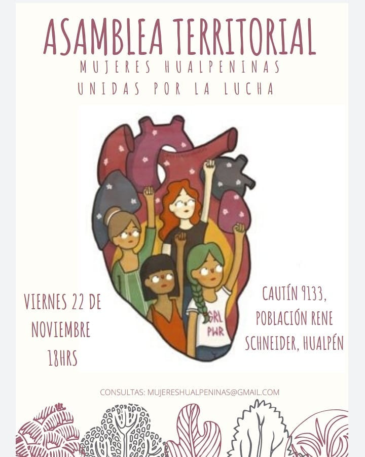
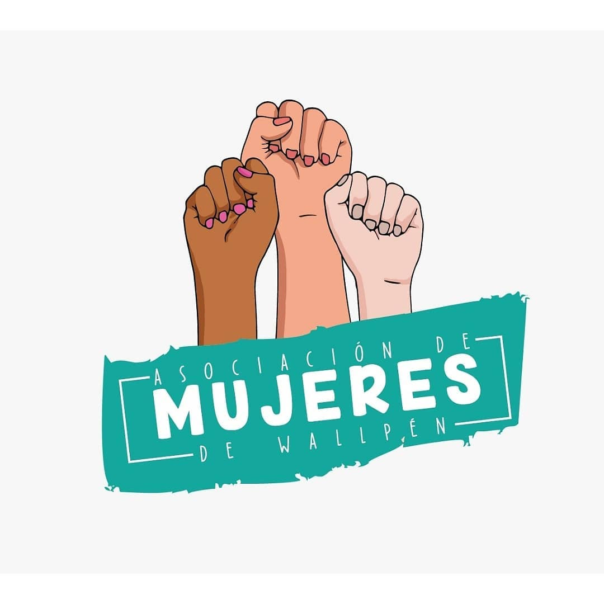
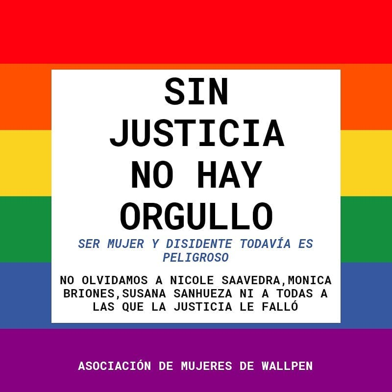
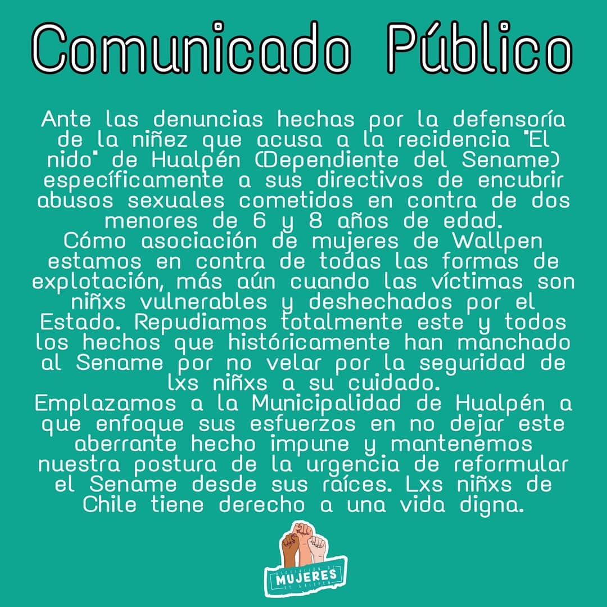
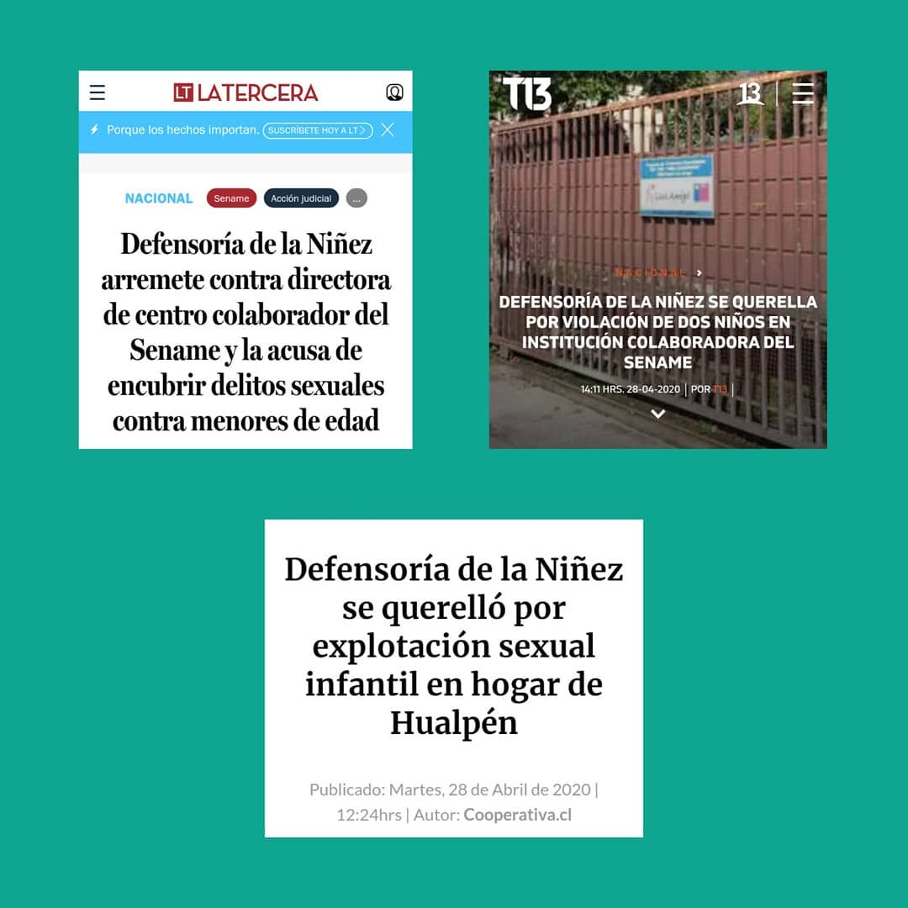
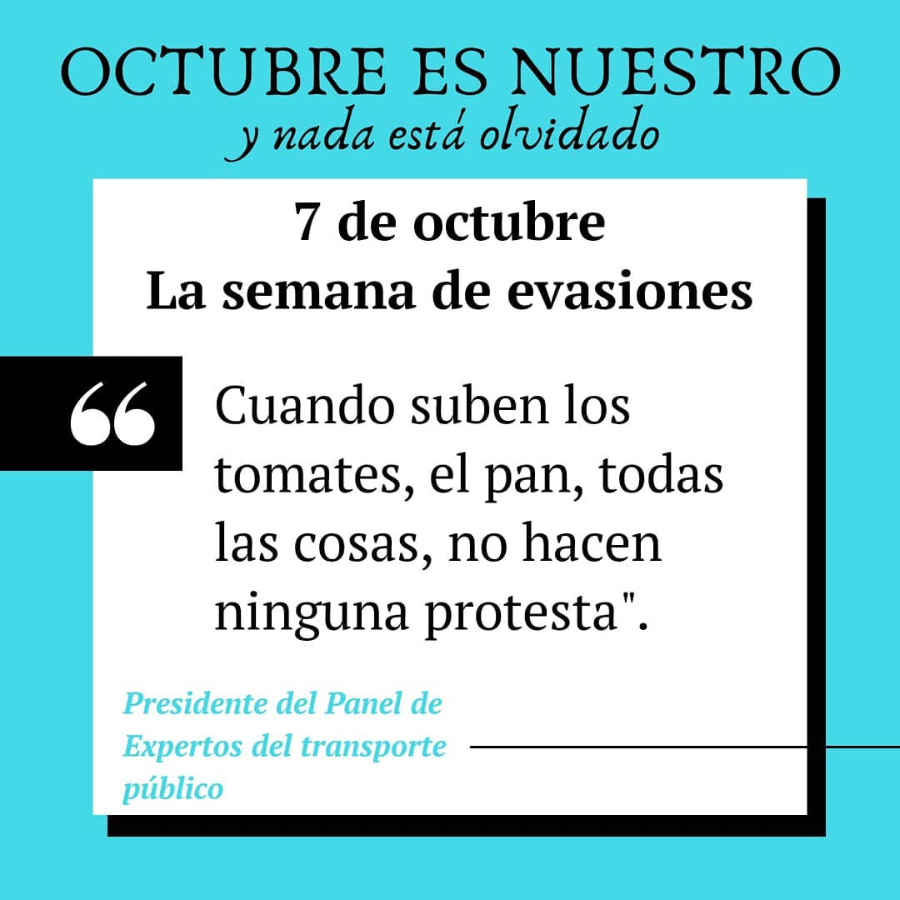
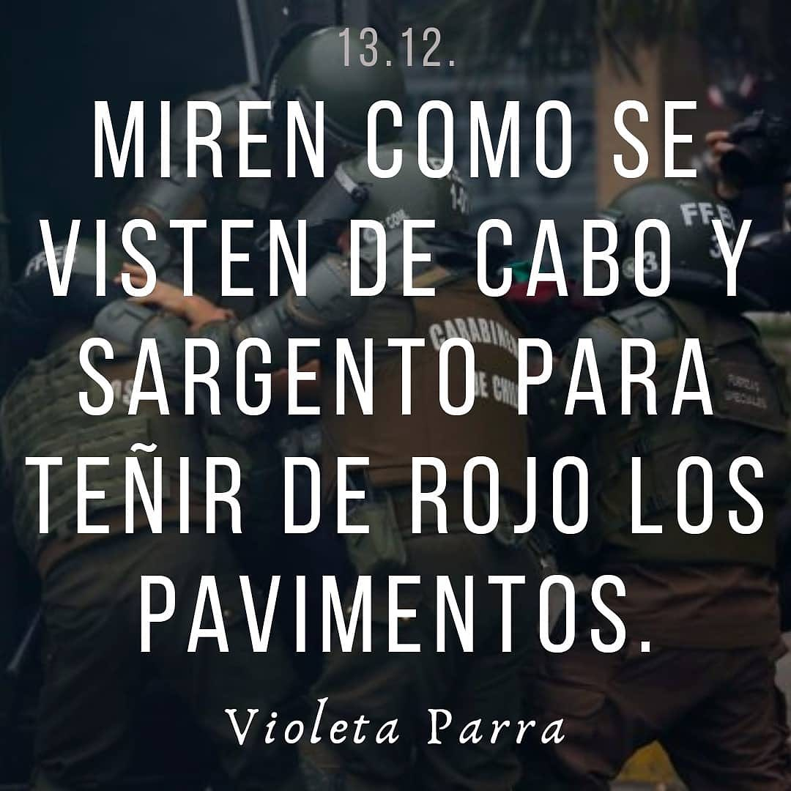
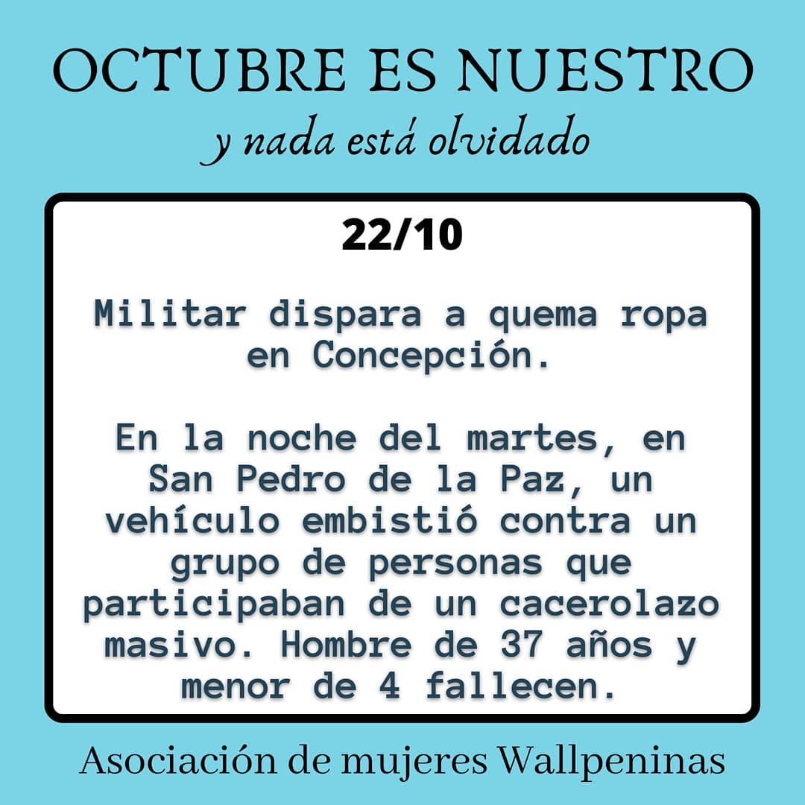
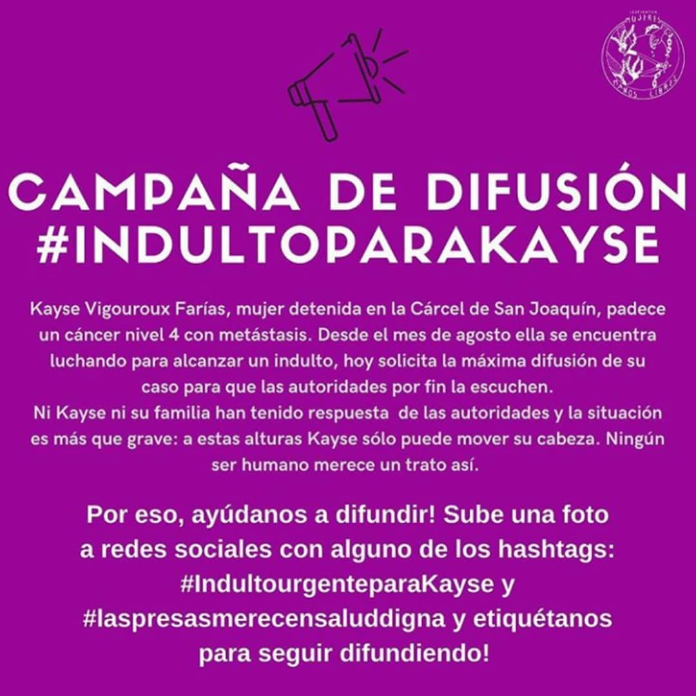
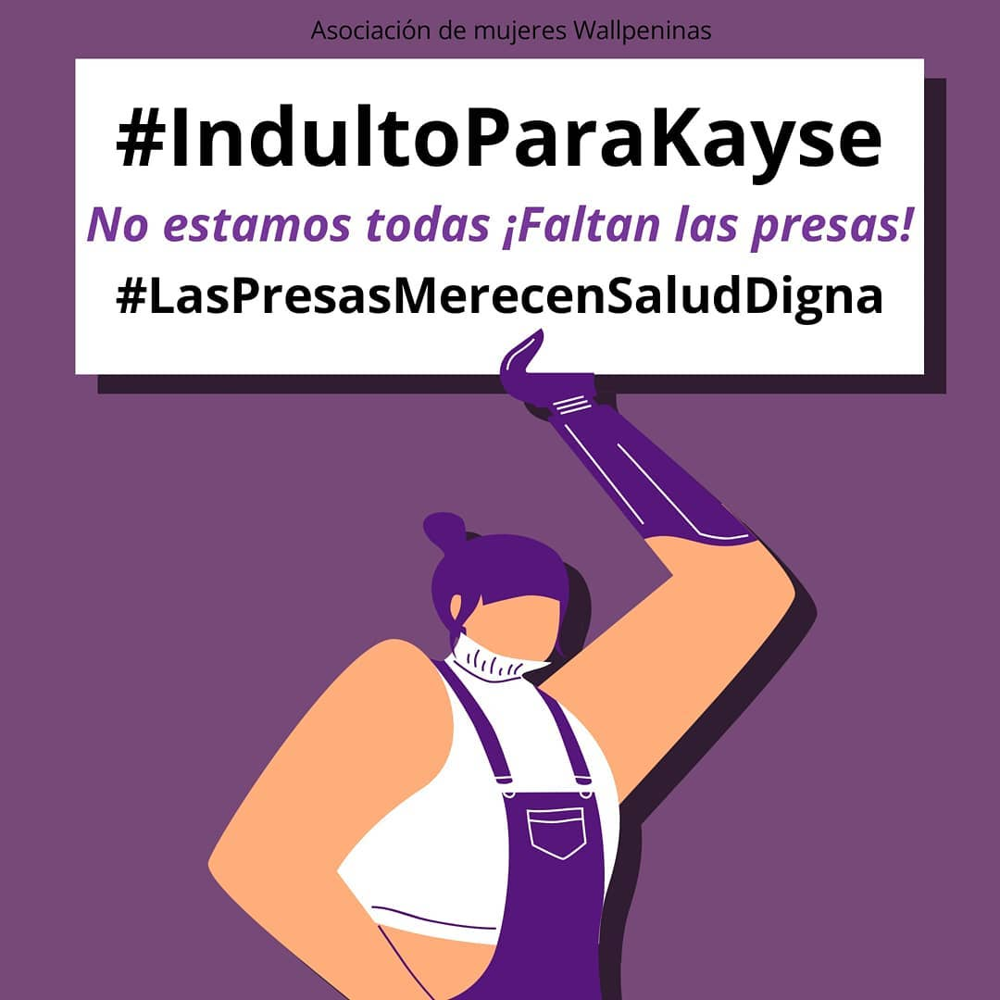

#### FOLIO: WAL4
# Mujeres de Wallpen 

[instagram](https://www.instagram.com/mujereswallpeninas/)
[facebook]()
[twitter](https://twitter.com/mujwallpeninas)
<correo@correo.cl>
---

### Representantes
#### (Nombres o emails de voceros o representantes).

---
### Interacciones frecuentes
#### (listar otras organizaciones que habitualmente)

### Redes sociales
#### ¿Para qué se utiliza la red social?
| Instagram | Facebook | Twitter | Otra 
|---|---|---|---|
|0|0|0|0|

### **Instagram**
| seguidores | seguidos | publicaciones | hashtag |
|---|---|---|---|
|2129|828|207|5|

---

* **Actividad:**   

* Primera Publicación IG 14 de noviembre del 2019

---
### Frecuencia de publicación.

Publicaciones:

Actividades:

---
### Ubicación
* Sector de la comuna/ciudad:

---
### Describir temas de interés y/o trabajo

* Feminismo
* Libertad para lxs presxs de la revuelta
* Proceso constituyente
* Recuperación de la memoria
* Protección de la infancia

---
### Describir la imagen ideal por la cual se trabaja.
#### (El horizonte hacia el cual se quiere avanzar.)

> Hace un tiempo hicimos un grupo de mujeres de Hualpén con la finalidad de tener un red de apoyo y ayudarnos en lo que fuese necesario. Luego del estallido social el grupo se tornó más necesario, era en donde nos comunicábamos, nos pasamos datos y nos ayudamos entre nosotras, por sobre todo las mujeres que eran mamás. Sentimos necesario reunirnos y conocernos más, ya que además de un espacio de amistad y risas también somos conscientes de que nuestras necesidades muchas veces son invisibles a los ojos del resto. Es por esto que voluntarias del grupo nos reunimos para organizar la Primera Asamblea de Mujeres Wallpeninas

---
### ¿Que se hace?
#### (Manifestaciones, marchas, intervenciones, actividades culturales, conversatorios, intercambio de saberes, actividades solidarias o de apoyo mutuo, abastecimiento, contra información, emplazamiento a autoridades etc.)

* Asambleas 
* Marchas 
* Intervención artística
* Velatón 
* Charlas y actividades formativas
* Olla común 
* Cacerolazo  
* Divulgación científica
* Crisis sanitaria
* Contra información
* Programas online de conversaciones (streaming)
* Centro de acopio 
* Emplazamiento a autoridades
* Cicletadas

---
### Describir y distinguir demandas más reivindicativas de espacios sin relación con lo contencioso o con lo político mas prefigurativo
#### (lo contencioso; demanda al Estado, a alguna autoridad, privados, etc), (prefigurativo, transformación desde lo cotidiano, etc.).

---
### Tipo de organización interna.
#### (Vocerías, asambleísmo, horizontalidad, etc.; *se entiende que esta dimensión es más difícil de captar vía análisis de redes sociales, pero quizás se puede vislumbrar a través de roles/cargos*)

---
### Describir los temas / imágenes- iconos / conceptos mas habitualmente presentes en sus publicaciones. Describir cambios/ transformaciones en los contenidos desde Octubre.

**Iconos:**

**Banderas:**

**Diseño estético:**

> Párrafo tipo cita 

---
### Percepciones que se tiene del Estado
#### (Aparato burocrático)
> resumen de lo encontrado

| Declaraciones | infografía | 
|---|---|
| |  |
| | |
| | |

---
### Percepciones que se tiene de las Fuerzas de Orden
#### (Aparato represivo)
> resumen de lo encontrado

| Declaraciones | infografía | 
|---|---|
|Anotar los comunicados |  |
| | |

---
### Incorporar aca notas, citas textuales, links, etc. extra a los ya incorporados, que sean de interés para comprender tanto la forma como los contenidos asociados a la organización.

