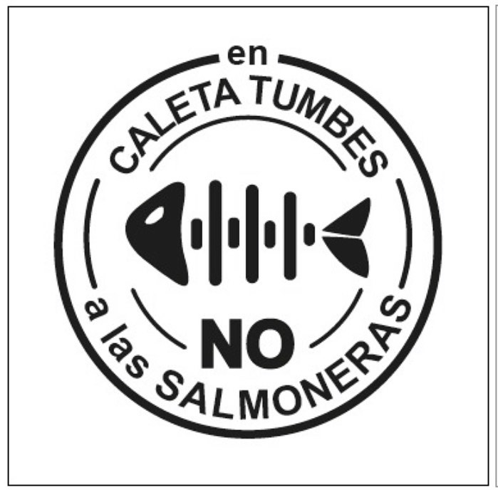
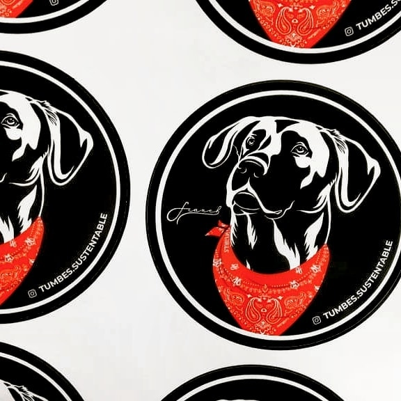
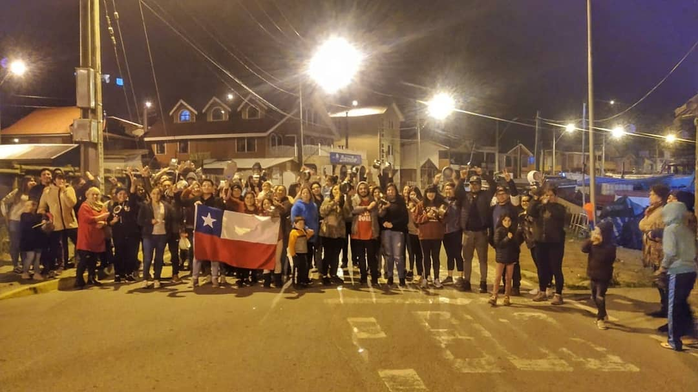
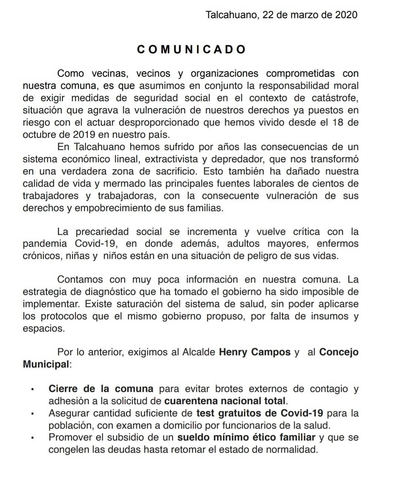
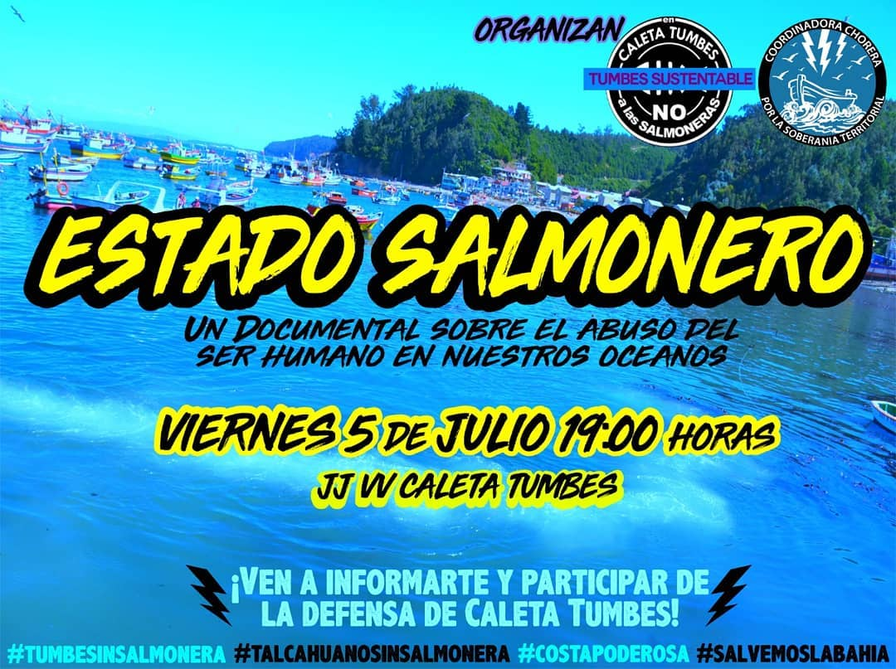
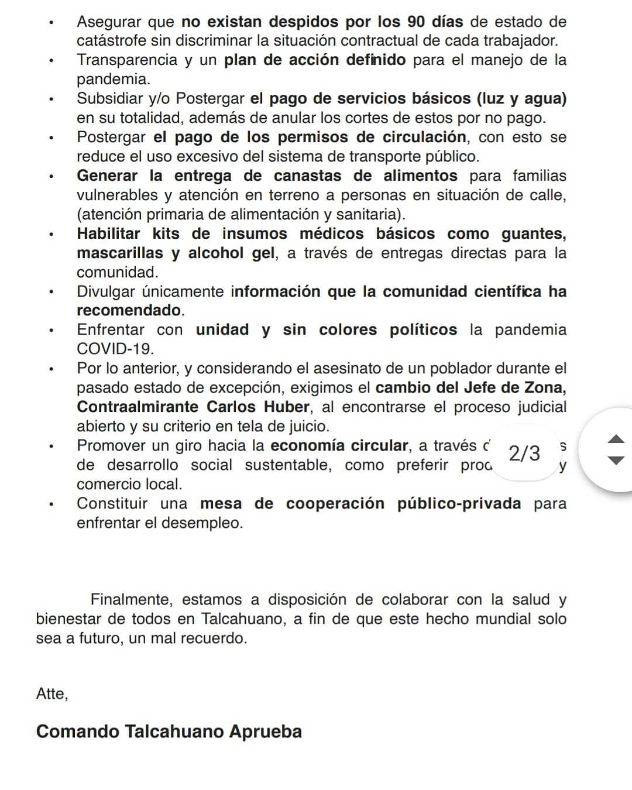
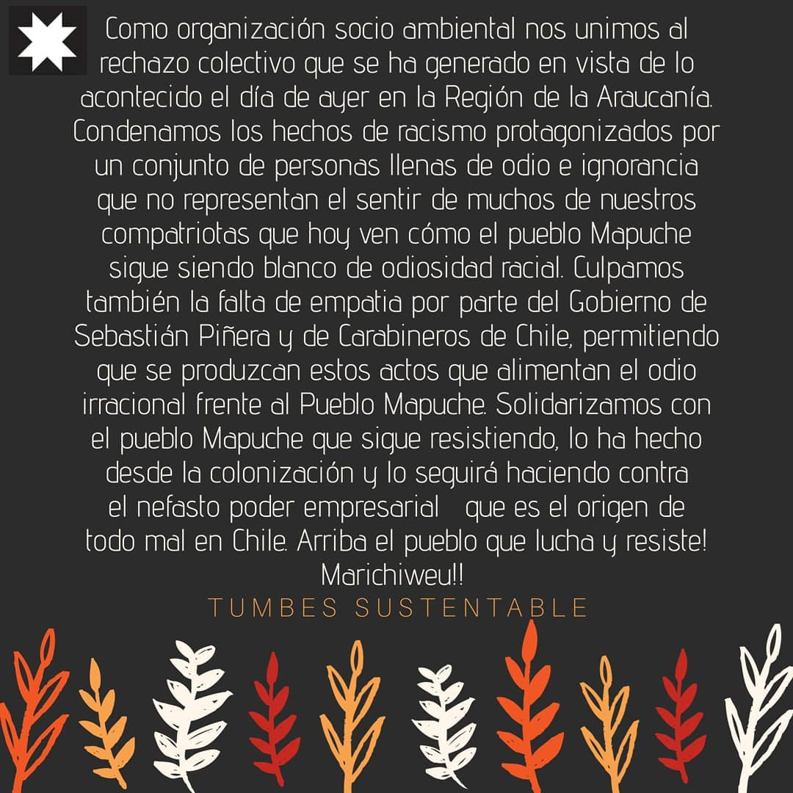

#### FOLIO: TAL6
# Tumbes Sustentable 

[instagram](https://www.instagram.com/tumbes.sustentable/)
[facebook](https://www.facebook.com/Tumbes.sustentable)
[twitter]()
<tumbes.sustentable@gmail.com>
---

### Representantes
#### (Nombres o emails de voceros o representantes).

---
### Interacciones frecuentes
#### (listar otras organizaciones que habitualmente)

### Redes sociales
#### ¿Para qué se utiliza la red social?
| Instagram | Facebook | Twitter | Otra 
|---|---|---|---|
|Difundir las actividades que han realizado y entregar información respecto a las salmoneras que atentan el sector |Difusión de información tanto local, como regional y nacional|No tiene |No se encuentra|

### **Instagram**
| seguidores | seguidos | publicaciones | hashtag |
|---|---|---|---|
|1231|769|100|1|

---

* **Actividad:** Discontinua entre los meses de febrero, luego del mes de abril de forma intermitente.

* Primera Publicación IG 13 de mayo del 2019

---
### Frecuencia de publicación.

Publicaciones: Discontinua entre los meses de febrero, luego del mes de abril de forma intermitente. 

Actividades: Las actividades se dividen entre las de información para la caleta y las actividades comunales, aunque no con periodicidad, exceptuando Octubre.

---
### Ubicación
* Sector de la comuna/ciudad: Comuna de Talcahuano, zona de Tumbes. 

---
### Describir temas de interés y/o trabajo

* Protección medioambiental
* Feminismo

---
### Describir la imagen ideal por la cual se trabaja.
#### (El horizonte hacia el cual se quiere avanzar.)

* Tener un medio ambiente libre de contaminación 

---
### ¿Que se hace?
#### (Manifestaciones, marchas, intervenciones, actividades culturales, conversatorios, intercambio de saberes, actividades solidarias o de apoyo mutuo, abastecimiento, contra información, emplazamiento a autoridades etc.)

* Asambleas 
* Emplazamiento a autoridades
* Marchas
* Intervención artística
* Centro de acopio 

---
### Describir y distinguir demandas más reivindicativas de espacios sin relación con lo contencioso o con lo político mas prefigurativo
#### (lo contencioso; demanda al Estado, a alguna autoridad, privados, etc), (prefigurativo, transformación desde lo cotidiano, etc.).

> Conciencia y protección de áreas verdes y oceánicas de Talcahuano
---
### Tipo de organización interna.
#### (Vocerías, asambleísmo, horizontalidad, etc.; *se entiende que esta dimensión es más difícil de captar vía análisis de redes sociales, pero quizás se puede vislumbrar a través de roles/cargos*)

> No se logra identificar representantes, aunque si existe una participación asambleísta y abierta para la comunidad de Tumbes en espacios públicos. 

---
### Describir los temas / imágenes- iconos / conceptos mas habitualmente presentes en sus publicaciones. Describir cambios/ transformaciones en los contenidos desde Octubre.

**Iconos:**

**Banderas:**

**Diseño estético:**

> Párrafo tipo cita 

---
### Percepciones que se tiene del Estado
#### (Aparato burocrático)
> resumen de lo encontrado

| Declaraciones | infografía | 
|---|---|
| |  |
| ||

---
### Percepciones que se tiene de las Fuerzas de Orden
#### (Aparato represivo)
> resumen de lo encontrado

| Declaraciones | infografía | 
|---|---|
| |  |
| ||

---
### Incorporar aca notas, citas textuales, links, etc. extra a los ya incorporados, que sean de interés para comprender tanto la forma como los contenidos asociados a la organización.

[recolección de firmas para la instalación de Salmonera en Tumbes](https://www.change.org/p/sgiacamang-gastonsaavedra-felix-gonzalezg-delannaysmario-evitemos-la-instalación-de-salmonera-en-tumbes-talcahuano?recruiter=306611825&utm_source=share_petition&utm_campaign=psf_combo_share_initial&utm_medium=whatsapp&utm_content=washarecopy_16889635_es-ES%3Av7&recruited_by_id=de5774b0-05ae-11e5-816b-8591ebaba262)