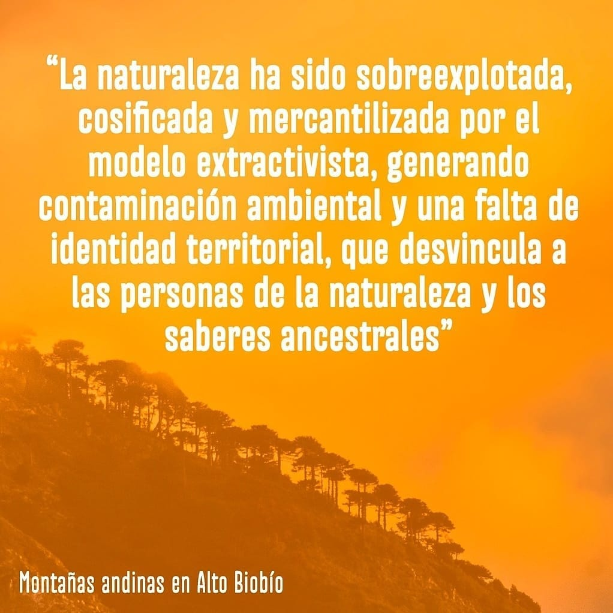
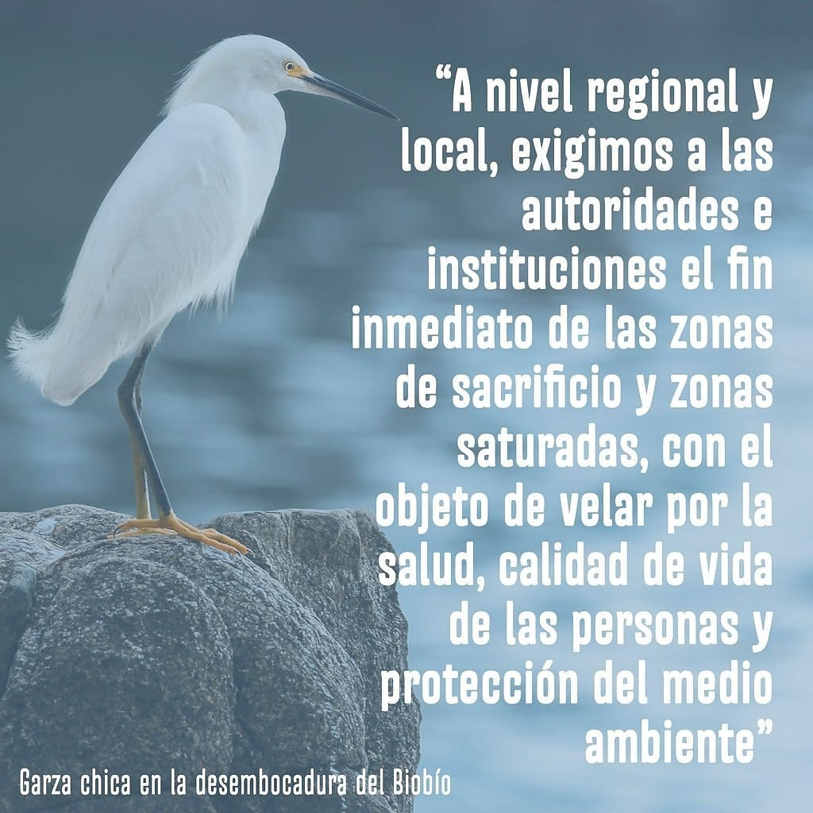
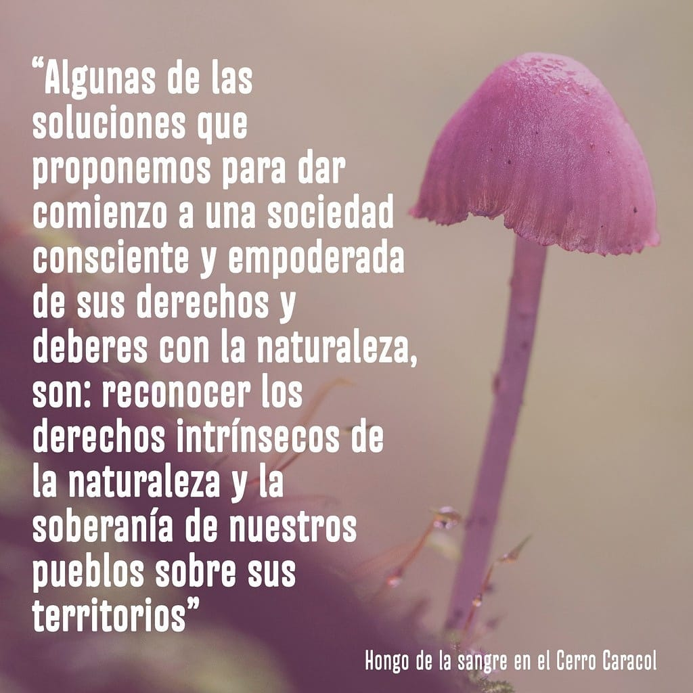
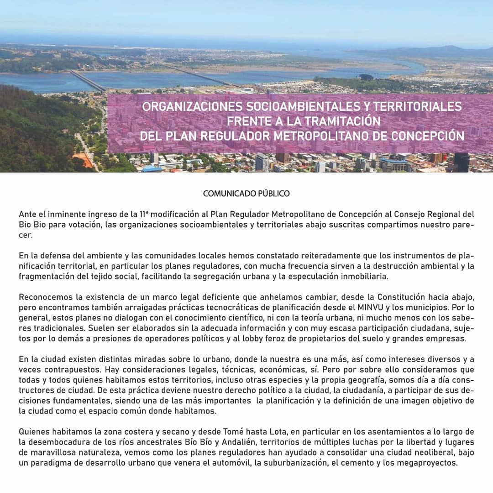
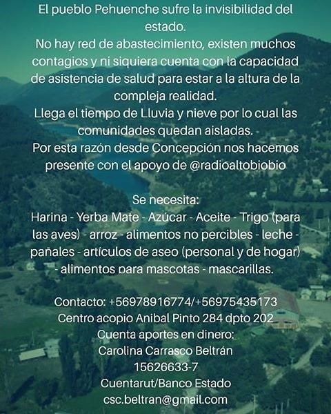
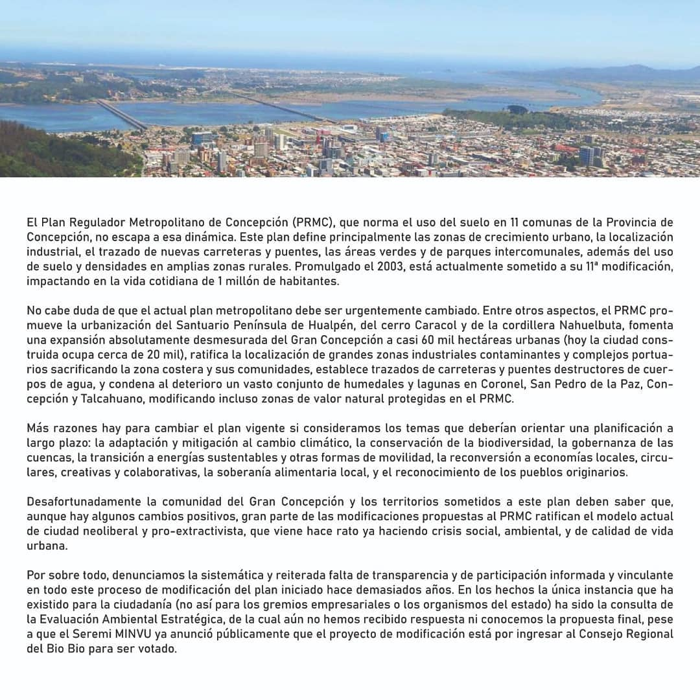
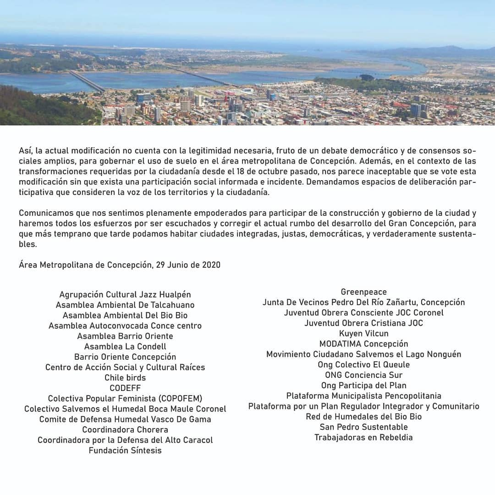

#  Asamblea Ambiental del Biobío

[instagram](https://www.instagram.com/asambleaambientalbiobio/)
[facebook](https://www.facebook.com/AsambleaAmbientalBioBio/)
[twitter]()
<asambleaambientalbiobio@gmail.com>

### Representantes
#### (Nombres o emails de voceros o representantes).

---
### Interacciones frecuentes
#### (listar otras organizaciones que habitualmente)

**Instagram**

| seguidores | seguidos | hashtag |
|---|---|---|
|2790|403|0|

**Facebook**

| seguidores | seguidos | hashtag |
|---|---|---|
|3318|0|0|

---

---
### Describir:
#### (Actividad continua desde octubre, discontinua, actualmente inactiva, etc.)

* **Actividad:**   

* Primera Publicación IG 20 de Nov 2019

#### Cantidad de publicaciones
| Instagram | Facebook | otro |
|---|---|---|
|103|0|0|

---
### Frecuencia de publicación.

| Actividades | Publicaciones |
|---|---|  
|mensual | semanal | 

---
### Describir temas de interés y/o trabajo

* Protección medioambiental
* Urbanización y problemática habitacional
* Plan regulador

---
### Describir la imagen ideal por la cual se trabaja.
#### (El horizonte hacia el cual se quiere avanzar.)

---
### ¿Qué se hace?
#### (Manifestaciones, marchas, intervenciones, actividades culturales, conversatorios, intercambio de saberes, actividades solidarias o de apoyo mutuo, abastecimiento, contrainformacion, emplazamiento a autoridades etc.)

* marchas
* cicletadas
* Actividades culturales
* organizar asambleas abiertas
* Charlas y seminarios
* Voluntariado para rescate de fauna
* programas por redes sociales
* divulgación científica
* junta de firmas para peticiones al tribunal ambiental

---
### Describir y distinguir demandas más reivindicativas de espacios sin relación con lo contencioso o con lo político mas prefigurativo
#### (lo contencioso; demanda al Estado, a alguna autoridad, privados, etc), (prefigurativo, transformación desde lo cotidiano, etc.).

---
### Tipo de organización interna.
#### (Vocerías, asambleísmo, horizontalidad, etc.; *se entiende que esta dimensión es más difícil de captar vía análisis de redes sociales, pero quizás se puede vislumbrar a través de roles/cargos*)

---
### Describir los temas / imágenes- iconos / conceptos mas habitualmente presentes en sus publicaciones. Describir cambios/ transformaciones en los contenidos desde Octubre.

**Iconos:**

**Banderas:**

**Diseño estético:**

> Sobre sale el diseño con fondos naturales, tanto de paisajismo como de animales. 

---
### Percepciones que se tiene del Estado
#### (Aparato burocrático)

| Declaraciones | infografía | 
|---|---|
| |   |
|||
||
|||
---
### Percepciones que se tiene de las Fuerzas de Orden
#### (Aparato represivo)

| Declaraciones | infografía | 
|---|---|
|Anotar los comunicados |  |

---
### Incorporar acá notas, citas textuales, links, etc. extra a los ya incorporados, que sean de interés para comprender tanto la forma como los contenidos asociados a la organización.

[primer comunicado completo](https://www.lanalhuenoticias.cl/leenota.php?noti=7894#.XdVehHuvGDZ)

