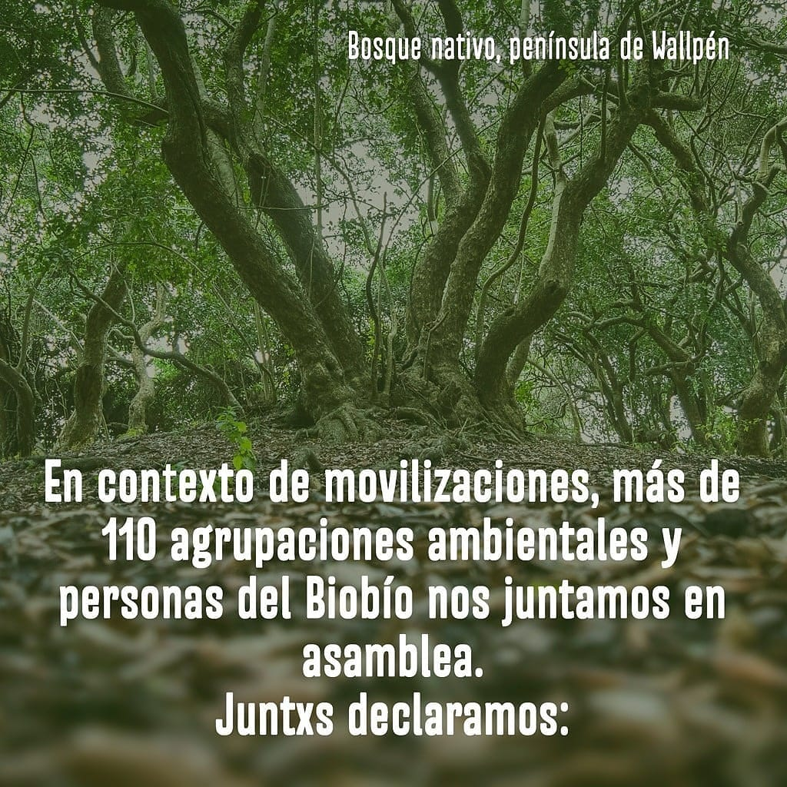

#### FOLIO: CUR02
#  Asamblea Ambiental del Biobío

[instagram](https://www.instagram.com/asambleaambientalbiobio/)
[facebook](https://www.facebook.com/AsambleaAmbientalBioBio/)
[twitter]()
<asambleaambientalbiobio@gmail.com>
---

### Representantes
#### (Nombres o emails de voceros o representantes).

---
### Interacciones frecuentes
#### (listar otras organizaciones que habitualmente)

### Redes sociales
#### ¿Para qué se utiliza la red social?
| Instagram | Facebook | Twitter | Otra 
|---|---|---|---|
|Difusión de contenido y actividades|Difusión de información a nivel regional sobre conflicto ambiental|No tiene|No encontrado|

### **Instagram**
| seguidores | seguidos | publicaciones | hashtag |
|---|---|---|---|
|2795|404|103|0|

---

* **Actividad:** Continua 

* Primera Publicación IG 20 de Nov 2019

---
### Frecuencia de publicación.

Publicaciones: son frecuentes en publicar, en especial sobre actividades que se realizaran dentro de la región. Ademas, publican sobre la flora y fauna local. 

Actividades: Tienen actividades regulares cada mes, en especial sobre formación en conflictos ambientales de la región.     

---
### Ubicación
* Sector de la comuna/ciudad: Toda la region del Biobío. 

---
### Describir temas de interés y/o trabajo

* Protección medioambiental
* Urbanización y problemática habitacional
* Plan regulador

---
### Describir la imagen ideal por la cual se trabaja.
#### (El horizonte hacia el cual se quiere avanzar.)

---
### ¿Qué se hace?
#### (Manifestaciones, marchas, intervenciones, actividades culturales, conversatorios, intercambio de saberes, actividades solidarias o de apoyo mutuo, abastecimiento, contrainformacion, emplazamiento a autoridades etc.)

* marchas
* cicletadas
* Actividades culturales
* organizar asambleas abiertas
* Charlas y seminarios
* Voluntariado para rescate de fauna
* programas por redes sociales
* divulgación científica
* junta de firmas para peticiones al tribunal ambiental

---
### Describir y distinguir demandas más reivindicativas de espacios sin relación con lo contencioso o con lo político mas prefigurativo
#### (lo contencioso; demanda al Estado, a alguna autoridad, privados, etc), (prefigurativo, transformación desde lo cotidiano, etc.).

El trabajo esta destinado principalmente a estudiar los conflictos ambientales de la región. Como también instar a la comunidad a aprender sobre flora y fauna local.  

---
### Tipo de organización interna.
#### (Vocerías, asambleísmo, horizontalidad, etc.; *se entiende que esta dimensión es más difícil de captar vía análisis de redes sociales, pero quizás se puede vislumbrar a través de roles/cargos*)

No se logra identificar representantes, sin embargo, se logra identificar la participación de múltiples instancias de discusión abierta, haciendo frecuentes llamados a participar en la asamblea de forma cotidiana

---
### Describir los temas / imágenes- iconos / conceptos mas habitualmente presentes en sus publicaciones. Describir cambios/ transformaciones en los contenidos desde Octubre.

**Iconos:**

**Banderas:**

**Diseño estético:**

> Sobre sale el diseño con fondos naturales, tanto de paisajismo como de animales. 

---
### Percepciones que se tiene del Estado
#### (Aparato burocrático)

| Declaraciones | infografía | 
|---|---|
| |   |
|||
||
|||
---
### Percepciones que se tiene de las Fuerzas de Orden
#### (Aparato represivo)

| Declaraciones | infografía | 
|---|---|
|Anotar los comunicados |  |

---
### Incorporar acá notas, citas textuales, links, etc. extra a los ya incorporados, que sean de interés para comprender tanto la forma como los contenidos asociados a la organización.

[primer comunicado completo](https://www.lanalhuenoticias.cl/leenota.php?noti=7894#.XdVehHuvGDZ)

