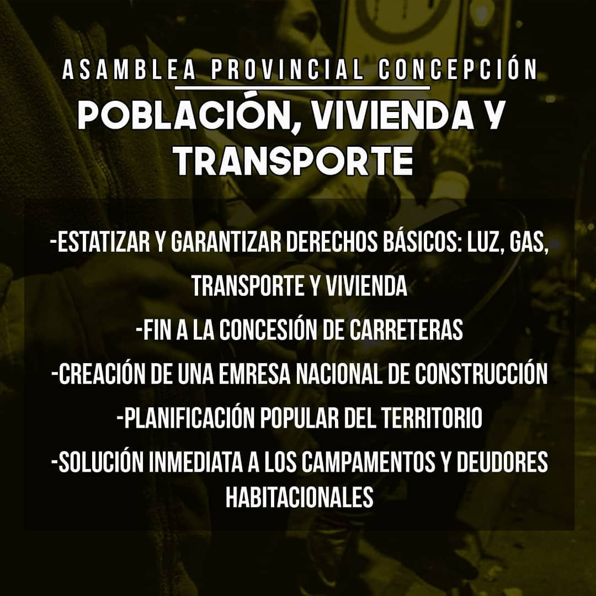
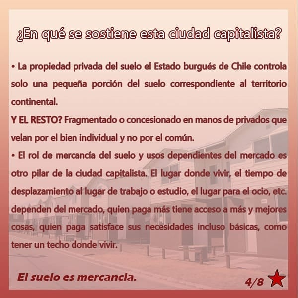

# Asamblea Provincial de Concepción

[instagram](https://www.instagram.com/asambleaprovincial/)
[facebook]()
[twitter]()
<correo@correo.cl>
---

### Representantes
#### (Nombres o emails de voceros o representantes).

---
### Interacciones frecuentes
#### (listar otras organizaciones que habitualmente)

**Instagram**

| seguidores | seguidos | hashtag |
|---|---|---|
|0|0|0|

**Facebook**

| seguidores | seguidos | hashtag |
|---|---|---|
|0|0|0|

---
### Describir:
#### (Actividad continua desde octubre, discontinua, actualmente inactiva, etc.)

* **Actividad:** continua desde noviembre del 2019
* Primera Publicación IG

---
### Frecuencia de publicación.

Publicaciones: Semanal

Actividades: Mensual

---
### Describir temas de interés y/o trabajo

* Trabajo
* Medio Ambiente
* Derechos humanos
* Feminismo y sexualidades
* Salud
* Protección sociales
* Urbanismo y conflicto habitacional

---
### Describir la imagen ideal por la cual se trabaja.
#### (El horizonte hacia el cual se quiere avanzar.)

---
### ¿Que se hace?
#### (Manifestaciones, marchas, intervenciones, actividades culturales, conversatorios, intercambio de saberes, actividades solidarias o de apoyo mutuo, abastecimiento, contra información, emplazamiento a autoridades etc.)

* Marchas
* Cacerolazo
* Actividades formativas
* conversatorios
* Contra información
* Coordinar y difundir las actividades de diferentes asambleas
* Actividades culturales
* Ferias libres de las pulgas

---
### Describir y distinguir demandas más reivindicativas de espacios sin relación con lo contencioso o con lo político mas prefigurativo
#### (lo contencioso; demanda al Estado, a alguna autoridad, privados, etc), (prefigurativo, transformación desde lo cotidiano, etc.).

* Conjunto de fotos con las demandas completas en el archivo

---
### Tipo de organización interna.
#### (Vocerías, asambleísmo, horizontalidad, etc.; *se entiende que esta dimensión es más difícil de captar vía análisis de redes sociales, pero quizás se puede vislumbrar a través de roles/cargos*)

---
### Describir los temas / imágenes- iconos / conceptos mas habitualmente presentes en sus publicaciones. Describir cambios/ transformaciones en los contenidos desde Octubre.

**iconos:**

* Puño en alto
* Perro Matapaco
* Estrella de 5 punto roja
* Cacerola

**Banderas:**

* Chilena
* Mapuche (tricolor)
* Rojinegra

**Diseño estético**:

> El diseño estético de las publicaciones y afiches tiene cierta continuidad a lo largo del tiempo. Sin embargo, las que salen de esta linea son principalmente publicaciones de otras organizaciones sociales.

---
### Percepciones que se tiene del Estado
#### (Aparato burocrático)

| Declaraciones | infografía | 
|---|---|
|Anotar los comunicados |  |

---
### Percepciones que se tiene de las Fuerzas de Orden
#### (Aparato represivo)

| Declaraciones | infografía | 
|---|---|
|Anotar los comunicados |  |

---
### Incorporar aca notas, citas textuales, links, etc. extra a los ya incorporados, que sean de interés para comprender tanto la forma como los contenidos asociados a la organización.

