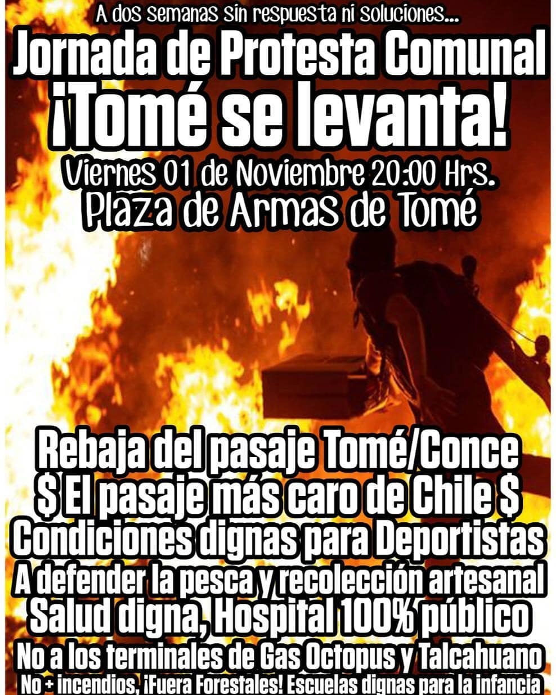
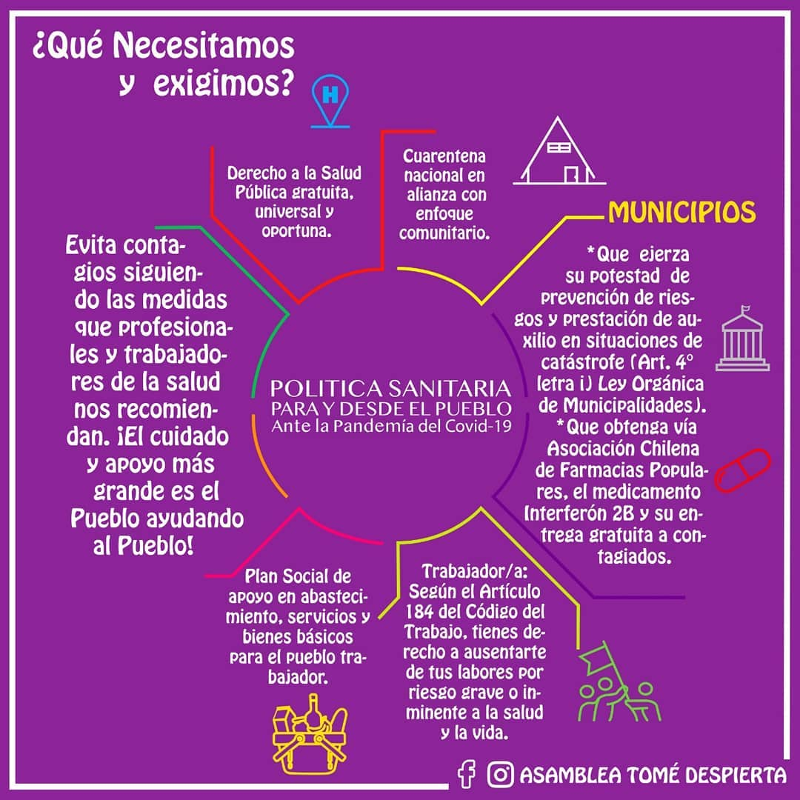
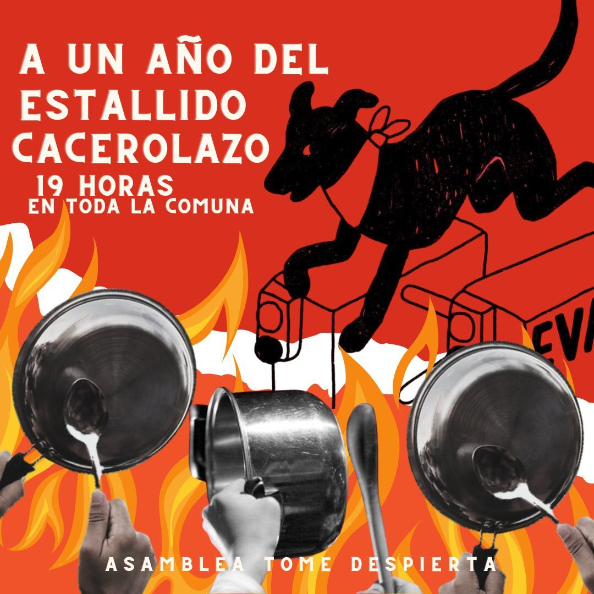
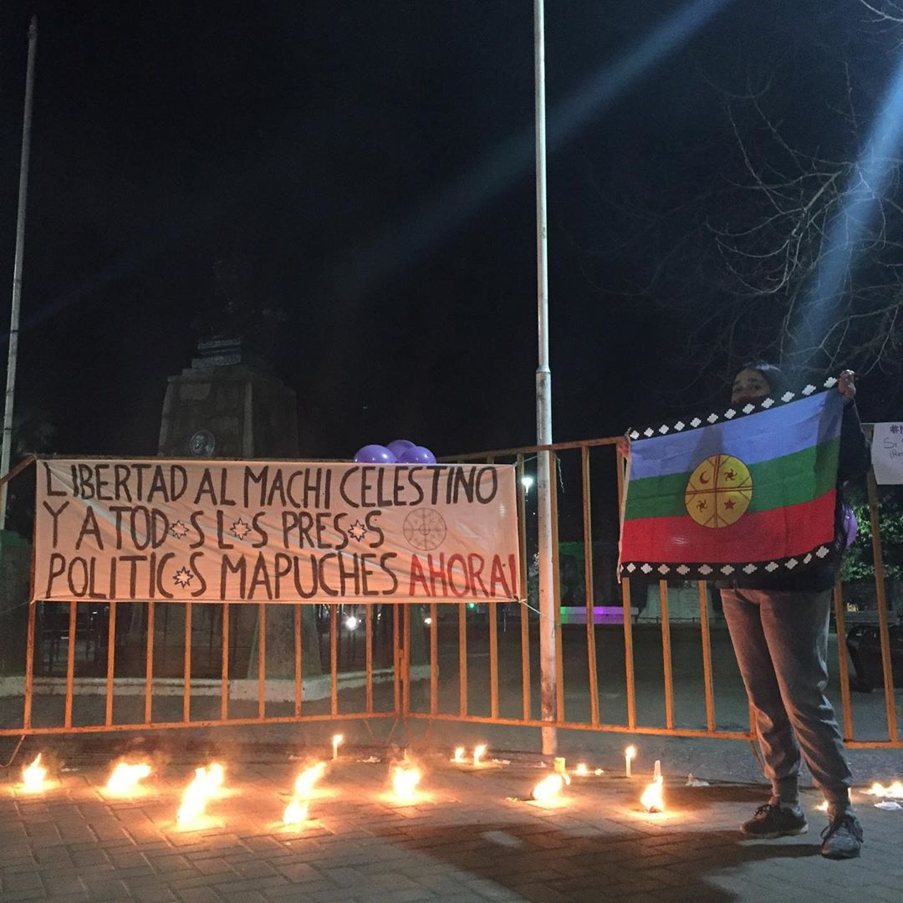
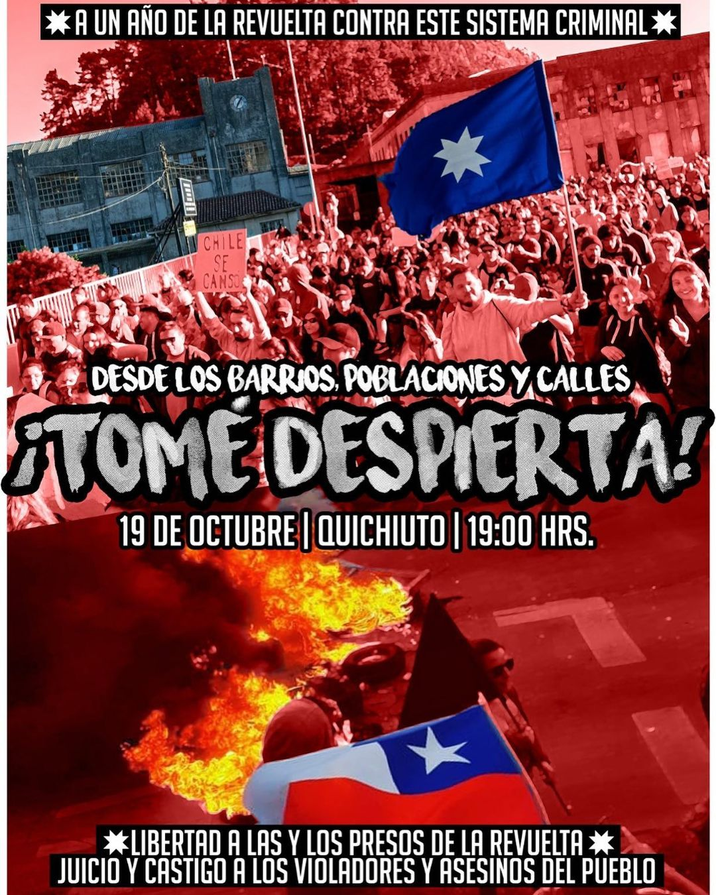
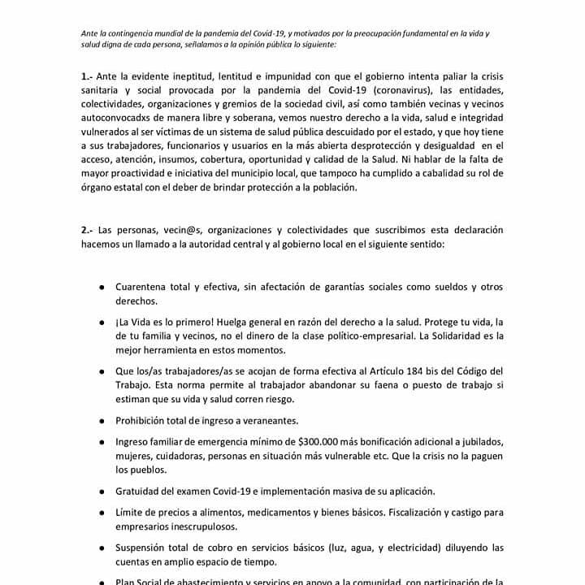
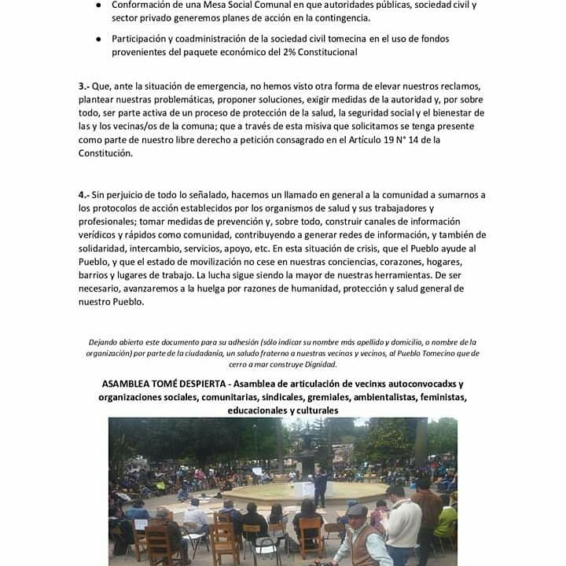
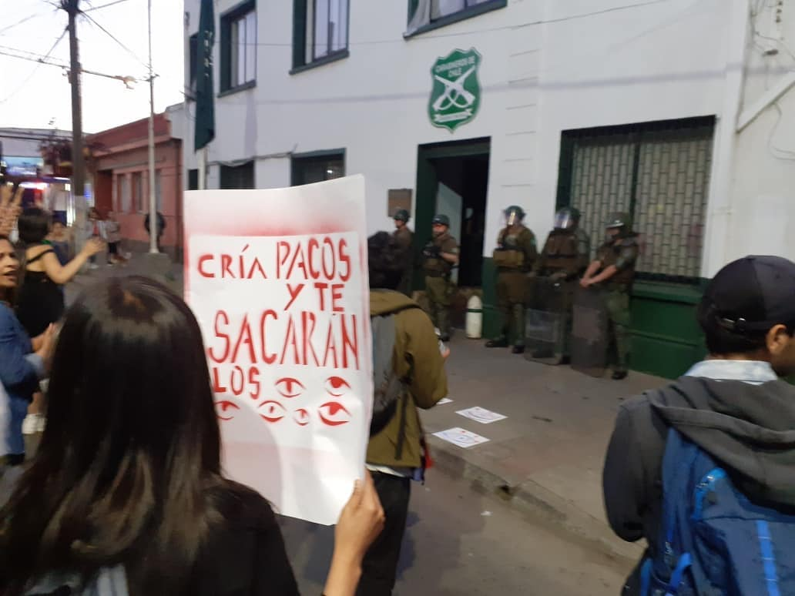

#### FOLIO: TOM01
# Asamblea Tome Despierta

[instagram](https://www.instagram.com/asamblea.tomedespiertacl/)
[facebook](https://www.facebook.com/tomedespierta)
[twitter]()
<correo@correo.cl>
---

### Representantes
#### (Nombres o emails de voceros o representantes).

---
### Interacciones frecuentes
#### (listar otras organizaciones que habitualmente)

### Redes sociales
#### ¿Para qué se utiliza la red social?
| Instagram | Facebook | Twitter | Otra 
|---|---|---|---|
|Se usa principalmente para coordinar y difundir las actividades que realizan |Difusión de información nacional como regional |No tiene |No Encontrada|

### **Instagram**
| seguidores | seguidos | publicaciones | hashtag |
|---|---|---|---|
|1042|267|106|3|

---

* **Actividad:** Continua desde octubre del 2019

* Primera Publicación IG 31 de oct 2019

---
### Frecuencia de publicación.

Publicaciones: 

Actividades:

---
### Ubicación
* Sector de la comuna/ciudad: Comuna de Tome 

---
### Describir temas de interés y/o trabajo

* Proceso constituyente
* Derechos humanos
* transporte publico
* Defensa Medioambiental
* Feminismo
* Crisis sanitaria
* Conflicto Mapuche

---
### Describir la imagen ideal por la cual se trabaja.
#### (El horizonte hacia el cual se quiere avanzar.)

>Las principales demandas son articuladas de forma dual, por un lado como una exigencia hacia las autoridades competentes, pero del otro una forma de crear pliego que se puede gestionar entre la comunidad. 

---
### ¿Que se hace?
#### (Manifestaciones, marchas, intervenciones, actividades culturales, conversatorios, intercambio de saberes, actividades solidarias o de apoyo mutuo, abastecimiento, contra información, emplazamiento a autoridades etc.)

* marchas
* asambleas
* actividades culturales
* Limpieza de áreas verdes  
* Escuela constituyente
* Centro de acopio
* Cicletadas 

---
### Describir y distinguir demandas más reivindicativas de espacios sin relación con lo contencioso o con lo político mas prefigurativo
#### (lo contencioso; demanda al Estado, a alguna autoridad, privados, etc), (prefigurativo, transformación desde lo cotidiano, etc.).

> Dentro de la asamblea se busca la participación de la comunidad en la limpieza y protección ambiental de forma cotidiana y responsable.  

---
### Tipo de organización interna.
#### (Vocerías, asambleísmo, horizontalidad, etc.; *se entiende que esta dimensión es más difícil de captar vía análisis de redes sociales, pero quizás se puede vislumbrar a través de roles/cargos*)

---
### Describir los temas / imágenes- iconos / conceptos mas habitualmente presentes en sus publicaciones. Describir cambios/ transformaciones en los contenidos desde Octubre.

**Iconos:**

**Banderas:**

**Diseño estético:**

> Se nota un desarrollo progresivo en búsqueda de una estética propia. Es notable en la cantidad de cambios que se aprecia pasando el tiempo, tanto en colores, símbolos y tipografía.  

---
### Percepciones que se tiene del Estado
#### (Aparato burocrático)
> Las principales criticas van dirigidas a los organismos municipales y locales por conflictos medioambientales, junto posteriormente al manejos de la crisis sanitaria por el covid-19 

| Declaraciones | infografía | 
|---|---|
| |  |
| | |
---
### Percepciones que se tiene de las Fuerzas de Orden
#### (Aparato represivo)
> Principalmente se hace visibilidad o condenación a las violaciones de derechos humanos. Incluyendo actos de protesta 

| Declaraciones | infografía | 
|---|---|
|Anotar los comunicados |  |

---
### Incorporar aca notas, citas textuales, links, etc. extra a los ya incorporados, que sean de interés para comprender tanto la forma como los contenidos asociados a la organización.
