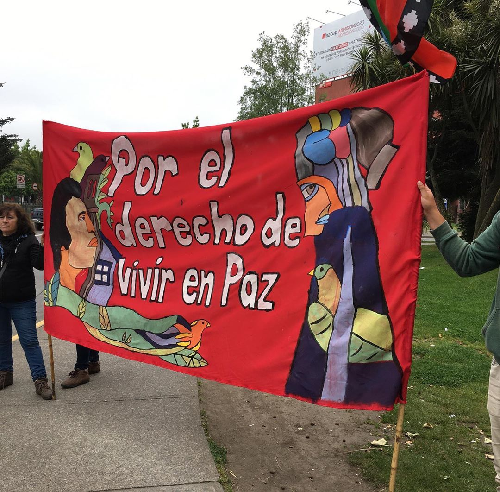
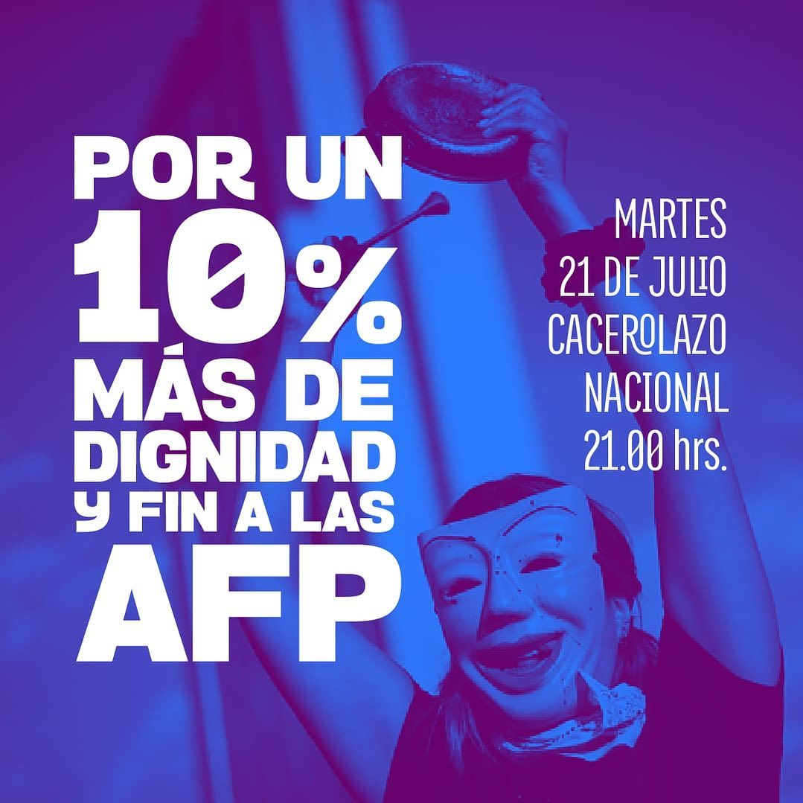
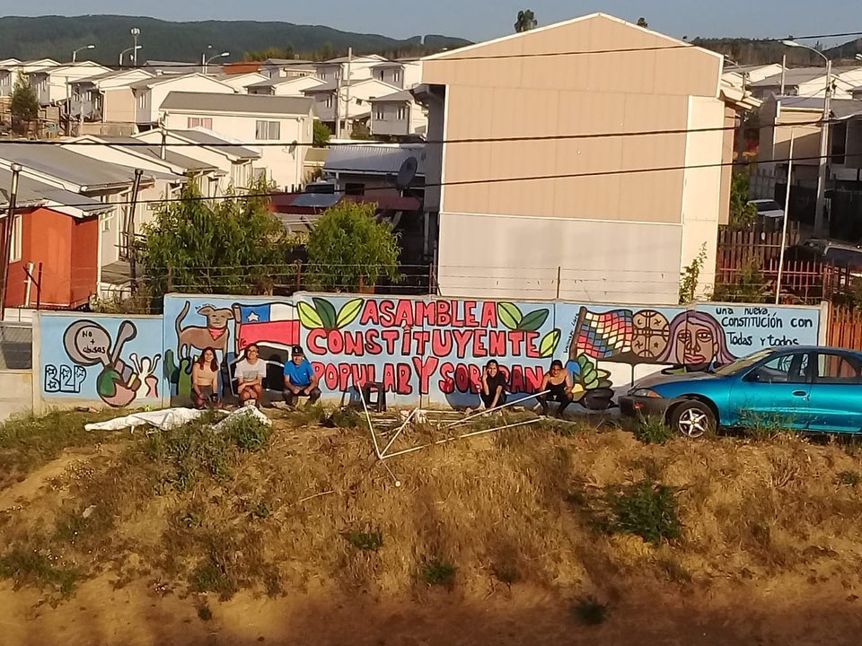
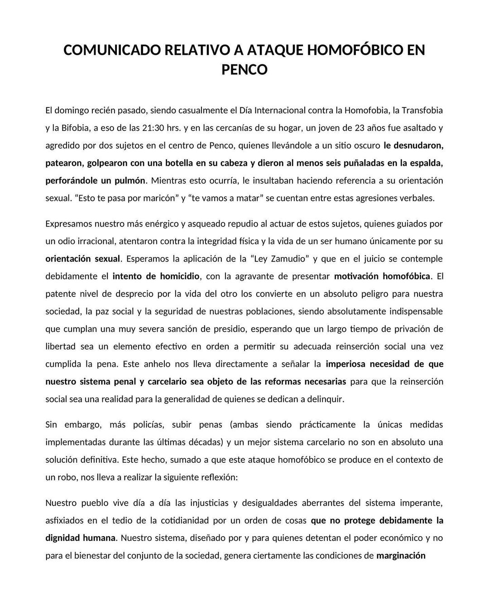
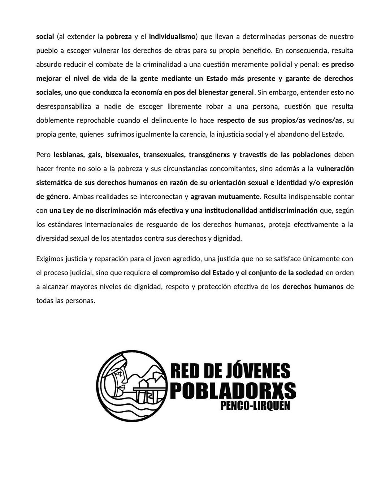

#### FOLIO: PEN02
# Jóvenes Pobladores Penco-Lirquen

[instagram](https://www.instagram.com/jovenespobladores_penco/)
[facebook](https://www.facebook.com/Red-de-Jóvenes-Pobladores-Penco-Lirquén-107700874007706)
[twitter]()
<agrupacionyanequen@gmail.com>
---

### Representantes
#### (Nombres o emails de voceros o representantes).

---
### Interacciones frecuentes
#### (listar otras organizaciones que habitualmente)

### Redes sociales
#### ¿Para qué se utiliza la red social?
| Instagram | Facebook | Twitter | Otra 
|---|---|---|---|
|Difusión y coordinación de actividades|Difusión y coordinación de actividades|0|0|

### **Instagram**
| seguidores | seguidos | publicaciones | hashtag |
|---|---|---|---|
|198|180|46|0|

---

* **Actividad:**  

* Primera Publicación IG 3 de Nov 2019

---
### Frecuencia de publicación.

Publicaciones: Las publicaciones se hacen de manera constante durante el mes, con al menos 3 o 4. Sin embargo, existe un periodo de inactividad durante el mes de abril del 2020

Actividades: Se realizan diferentes actividades durante los meses que van desde noviembre a marzo, principalmente muralismo, talleres de cine y asambleas. Luego de la crisis sanitaria las actividades se focalizan para afrontarla. 

---
### Ubicación
* Sector de la comuna/ciudad: Comuna de Penco. 

---
### Describir temas de interés y/o trabajo

* Proceso constituyente
* Feminismo
* Sistema de seguridad social (pensiones)
* Conflicto Mapuche
* Protección de los DD.HH
* Protección medioambiental

---
### Describir la imagen ideal por la cual se trabaja.
#### (El horizonte hacia el cual se quiere avanzar.)

> Se puede deducir por sus publicaciones una convivencia cooperativa y libre de violencias con un gran foco en la juventud y su desarrollo.

---
### ¿Que se hace?
#### (Manifestaciones, marchas, intervenciones, actividades culturales, conversatorios, intercambio de saberes, actividades solidarias o de apoyo mutuo, abastecimiento, contra información, emplazamiento a autoridades etc.)

* Muralismo
* Actividades deportivas
* Charlas y actividades formativas
* Talleres de cine
* Marchas
* Cacerolazo
* Centro de acopio
* Operativo de salud preventivo
* Velatón 

---
### Describir y distinguir demandas más reivindicativas de espacios sin relación con lo contencioso o con lo político mas prefigurativo
#### (lo contencioso; demanda al Estado, a alguna autoridad, privados, etc), (prefigurativo, transformación desde lo cotidiano, etc.).

---
### Tipo de organización interna.
#### (Vocerías, asambleísmo, horizontalidad, etc.; *se entiende que esta dimensión es más difícil de captar vía análisis de redes sociales, pero quizás se puede vislumbrar a través de roles/cargos*)

---
### Describir los temas / imágenes- iconos / conceptos mas habitualmente presentes en sus publicaciones. Describir cambios/ transformaciones en los contenidos desde Octubre.

**Iconos:**

**Banderas:**

**Diseño estético:**

> 

---
### Percepciones que se tiene del Estado
#### (Aparato burocrático)
> resumen de lo encontrado

| Declaraciones | infografía | 
|---|---|
| | |
| ||

---
### Percepciones que se tiene de las Fuerzas de Orden
#### (Aparato represivo)
> resumen de lo encontrado

| Declaraciones | infografía | 
|---|---|
|Anotar los comunicados |  |

---
### Incorporar aca notas, citas textuales, links, etc. extra a los ya incorporados, que sean de interés para comprender tanto la forma como los contenidos asociados a la organización.
